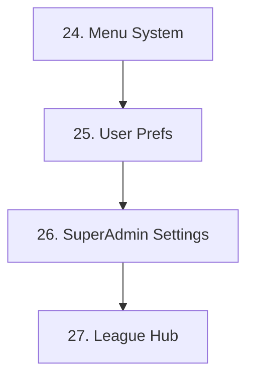

# PRD Creation Skill

## ⚠️ Critical: Always Read AGENTS.md First

Before creating any PRD:

1. **Read [AGENTS.md](../../../AGENTS.md)** - Contains all project patterns
2. **Check existing PRDs** in `docs/prds/` for format reference
3. **Reference relevant skills** in `.agent/skills/`

---

## Core Philosophy: Outcome-Based PRDs

> **THE GOLDEN RULE:** Define **WHAT** to achieve and **WHY** it matters.
> Let the implementing agent decide **HOW** to build it.

**PRDs must be outcome-based, NOT implementation-prescriptive.**

### Why Outcome-Based?

1. **Technology evolves** - By the time we implement, better tools may exist
2. **Flexibility** - Allows the implementing agent to choose optimal solutions
3. **Focus on value** - Keeps attention on what users get, not code details
4. **Reduced maintenance** - Less rewriting when implementation details change
5. **Better AI assistance** - AI can propose innovative solutions you hadn't considered

### ❌ WRONG: Implementation-Prescriptive

```markdown
## Feature: User Notifications
- Create a `notifications` table with columns: id, user_id, message, created_at
- Use React Query for fetching
- Create POST /api/notifications endpoint
- Add NotificationBell component to NavHeader
```

### ✅ CORRECT: Outcome-Based

```markdown
## Feature: User Notifications
**Objective:** Users receive timely, contextual notifications about important events.

| # | Outcome | Success Criteria |
|---|---------|------------------|
| 1 | Users are notified of new league invites | Notification appears within 5s of invite, clickable to accept |
| 2 | Notifications persist until read | Unread count visible, notification history accessible |
| 3 | Non-intrusive UX | No blocking modals, badge/indicator pattern preferred |
```

---

## PRD Location & Structure

### Where PRDs Live

**Primary location:** `docs/prds/admin-feedback-system/`

```
docs/prds/admin-feedback-system/
├── PRD_00_Index.md              # Master index with all PRDs
├── PRD_01_Database_Schema.md
├── PRD_02_Admin_APIs.md
├── PRD_03_Filter_Search.md
├── ...
├── PRD_41_Proxy_Refactor.md
├── PRD_42_Test_Coverage_Expansion.md
└── ... (40+ PRDs)
```

> **Note:** All PRDs should be created in `docs/prds/admin-feedback-system/` and indexed in `PRD_00_Index.md`.

### Naming Convention

| Format | Example |
|--------|---------|
| Single PRD | `PRD_[number]_[Name_With_Underscores].md` |
| PRD folder | `[kebab-case-name]/` with sub-documents |

### Standard PRD Template

```markdown
# PRD [Number]: [Title]

> **Order:** [Number]  
> **Status:** 🟢 Complete | 🟡 Planning | 🔴 Blocked  
> **Type:** Feature | Architecture | Refactor | Bug

---

## 🎯 Objective

One paragraph describing the user-facing goal. What problem does this solve?

---

## ⚠️ Agent Context (Mandatory for Complex PRDs)

Reference files agents should study before implementing.

| File | Purpose |
|------|---------|
| `src/path/to/file.tsx` | Why this file matters |

---

## 🏗️ Detailed Feature Requirements

### Section A: [Area Name] — [N] Items

| # | Outcome | Problem Solved | Success Criteria |
|---|---------|----------------|------------------|
| **A-1** | **[Outcome Title]** | What pain this addresses | How to verify it works |

---

## ✅ Success Criteria

| Metric | Target | Verification Method |
|--------|--------|---------------------|
| [Measurable outcome] | [Target value] | [How to check] |

---

## 📅 Implementation Plan Reference

### Phase A: [Name]
1. High-level step (not code)
2. Another step

---

## 🔗 Related Documents

- [Link to related PRD or doc]

---

## Changelog

| Date | Section | Change |
|------|---------|--------|
| YYYY-MM-DD | Initial | Created PRD |
```

---

## Critical Requirements

### 1. Always Reference AGENTS.md

Before writing a PRD, ensure you understand:

- **Architecture patterns** (Section 7 of AGENTS.md)
- **Critical rules** (no `<Database>` generics, mobile-first, etc.)
- **Related skills** - Check `.agent/skills/` for domain knowledge

### 2. Cross-Reference Other Skills

When your PRD touches specific domains, reference the relevant skills:

| Domain | Skill to Reference |
|--------|-------------------|
| UI/Styling | `design-system` |
| API routes | `api-handler` |
| Database/Auth | `supabase-patterns` |
| Forms | `form-components` |
| Error handling | `error-handling` |
| Architecture | `architecture-philosophy` |

### 3. Use Table Format for Requirements

Tables make PRDs:
- **Scannable** - Quick to understand
- **Trackable** - Each item has a number
- **Testable** - Success criteria are explicit

### 4. Include Agent Context Section

For complex PRDs, tell future agents:
- Which files to study
- Key patterns to follow
- Related documentation

### 5. Add Changelog at Bottom

Every PRD must have a changelog table at the end:

```markdown
## Changelog

| Date | Section | Change |
|------|---------|--------|
| 2026-01-16 | Features | Added notification persistence requirement |
| 2026-01-15 | Initial | Created PRD |
---

## PRD Index Files (IMPORTANT)

### Understanding PRD Index Structure

Each PRD folder contains a `PRD_00_Index.md` that serves as the master registry:

```
docs/prds/admin-feedback-system/
├── PRD_00_Index.md        # Master index with all PRDs
├── PRD_01_Database.md
├── PRD_02_APIs.md
└── ...
```

### Index File Components

The index contains:

1. **Status Table** - Shows status of each PRD
2. **Dependency Graph** - Mermaid diagram showing execution order
3. **Phases** - Grouped by development stage

### Status Icons

| Icon | Meaning |
|------|---------|
| ✅ Complete | PRD fully implemented |
| 🟢 Active | Currently being worked on |
| 📋 Proposed | Not yet started |
| 🔴 Blocked | Waiting on dependency |
| 🔄 Ongoing | Continuous (like Tech Debt) |

---

## Dependency Ordering (CRITICAL)

### Why Dependency Order Matters

PRDs with dependencies MUST be ordered to prevent:
- Blocked work (waiting on incomplete dependencies)
- Rework (building on unstable foundations)
- Wasted effort (implementing features that need prerequisites)

### How to Define Dependencies

1. **In PRD Index** - Use Mermaid dependency graph:



2. **In Individual PRDs** - Reference dependencies in header:

```markdown
> **Dependencies:** PRD 24, PRD 25
> **Blocks:** PRD 28, PRD 29
```

### Restructuring PRDs with Dependencies

When reviewing incomplete PRDs:

1. **Identify dependencies** - What must exist before this PRD can start?
2. **Reorder if needed** - Move dependent PRDs to execute after prerequisites
3. **Update index graph** - Keep Mermaid diagram current
4. **Flag blocked items** - Use 🔴 for items waiting on others

---

## Marking PRDs as Complete (MANDATORY)

### When to Mark Complete

A PRD is complete when:
- All requirements in the table are implemented
- Success criteria are verified
- Code is deployed/merged
- Documentation (changelog, etc.) is updated

### How to Mark Complete

1. **Update PRD Status Header**:

```markdown
> **Status:** 🟢 Complete (was 📋 Proposed)
```

2. **Update PRD Index Table**:

```markdown
| **A-1** | 25 | [User Preferences](./PRD_25_User_Preferences.md) | Modular settings | ✅ Complete |
```

3. **Add Completion Changelog Entry**:

```markdown
## Changelog

| Date | Section | Change |
|------|---------|--------|
| 2026-01-16 | Status | Marked complete - all items implemented |
| 2026-01-15 | Initial | Created PRD |
```

4. **Update Project Roadmap** - Use the `project-updates` skill

### Verification Before Marking Complete

- [ ] All table items implemented
- [ ] Success criteria met
- [ ] Tests passing (if applicable)
- [ ] CHANGELOG.md updated
- [ ] PRD index status updated
- [ ] Dependency graph still accurate

---

## Before Finalizing a PRD

### Checklist

- [ ] Objective is outcome-based (WHAT, not HOW)
- [ ] Requirements use table format with numbers
- [ ] Success criteria are measurable
- [ ] Agent Context section included (for complex PRDs)
- [ ] Related documents linked
- [ ] Changelog section at bottom
- [ ] Reviewed AGENTS.md for relevant patterns
- [ ] Referenced appropriate skills
- [ ] **Dependencies identified and ordered**
- [ ] **Index file updated with new PRD**

### Anti-Patterns to Avoid

| ❌ Don't | ✅ Do |
|----------|-------|
| Specify exact database columns | Describe data requirements |
| Prescribe specific libraries | State capability needs |
| Write implementation code | Define acceptance criteria |
| Assume current tech stack | Focus on outcomes |
| Skip success criteria | Make everything measurable |
| **Start without checking dependencies** | **Order PRDs by dependency graph** |
| **Forget to update index when done** | **Mark completion in PRD and index** |

---

## Related Skills

- `architecture-philosophy` - Core principles for all implementations
- `project-updates` - How to update roadmap when PRD is complete

