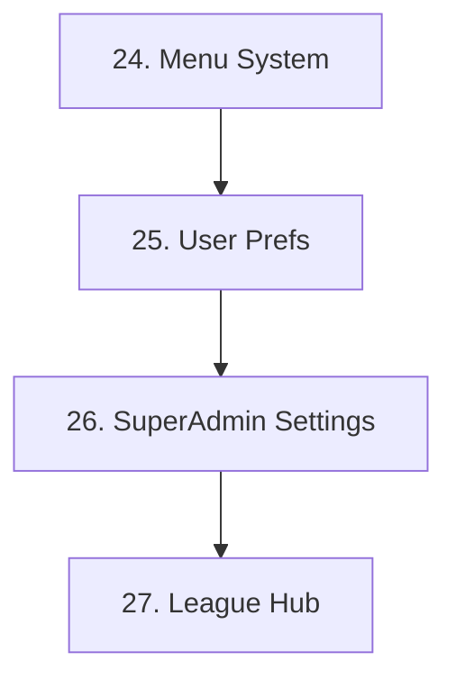

# PRD Creation Skill

## ⚠️ Critical: Always Read AGENTS.md First

Before creating any PRD:

1. **Read [AGENTS.md](../../../AGENTS.md)** - Contains all project patterns
2. **Check existing PRDs** in `docs/prds/` for format reference
3. **Reference relevant skills** in `.agent/skills/`

---

## Core Philosophy: Outcome-Based PRDs

> **THE GOLDEN RULE:** Define **WHAT** to achieve and **WHY** it matters.
> Let the implementing agent decide **HOW** to build it.

**PRDs must be outcome-based, NOT implementation-prescriptive.**

### Why Outcome-Based?

1. **Technology evolves** - By the time we implement, better tools may exist
2. **Flexibility** - Allows the implementing agent to choose optimal solutions
3. **Focus on value** - Keeps attention on what users get, not code details
4. **Reduced maintenance** - Less rewriting when implementation details change
5. **Better AI assistance** - AI can propose innovative solutions you hadn't considered

### ❌ WRONG: Implementation-Prescriptive

```markdown
## Feature: User Notifications
- Create a `notifications` table with columns: id, user_id, message, created_at
- Use React Query for fetching
- Create POST /api/notifications endpoint
- Add NotificationBell component to NavHeader
```

### ✅ CORRECT: Outcome-Based

```markdown
## Feature: User Notifications
**Objective:** Users receive timely, contextual notifications about important events.

| # | Outcome | Success Criteria |
|---|---------|------------------|
| 1 | Users are notified of new league invites | Notification appears within 5s of invite, clickable to accept |
| 2 | Notifications persist until read | Unread count visible, notification history accessible |
| 3 | Non-intrusive UX | No blocking modals, badge/indicator pattern preferred |
```

---

## Claude Code Task-Based Agent System

> **Key concept:** Claude Code uses a task-based agent system where work is parallelized across specialized subagents. PRDs should be structured to maximize this parallelization.

### How Claude Code Agents Work

Claude Code can launch **subagents** (via the `Task` tool) that run autonomously in parallel. Each subagent:
- Gets its own context window (doesn't consume the parent's)
- Can use tools (Read, Write, Edit, Grep, Glob, Bash, etc.)
- Returns a single result to the parent agent
- Works best with a clear, self-contained task description

**Available subagent types:**
| Type | Use Case |
|------|----------|
| `Explore` | Fast codebase search, find files, answer questions about code |
| `Bash` | Run commands, git operations, build/test execution |
| `general-purpose` | Complex multi-step tasks, research, code generation |
| `Plan` | Design implementation strategy, identify files and trade-offs |

### Task-Optimized PRD Structure

PRDs should be structured so implementing agents can **parallelize independent work**:

1. **Mark tasks as `[READ-ONLY]` vs `[WRITE]`**
   - `[READ-ONLY]` = Research, audit, exploration (no file changes)
   - `[WRITE]` = Implementation, creating/editing files

2. **Mark task groups as `[PARALLEL]` vs `[SEQUENTIAL]`**
   - `[PARALLEL]` = Independent tasks that can run simultaneously
   - `[SEQUENTIAL]` = Tasks that depend on prior steps completing

3. **Include self-verifiable success criteria**
   - Agents should be able to check their own work without human review
   - Example: "Run `npx tsc --noEmit` — zero errors" or "Run `npm test -- rate-limiter` — all green"

4. **Reference specific file paths** so agents navigate directly (no searching)

### Example Task-Optimized Structure

```markdown
### Task-Optimized Structure

| Phase | Mode | Task |
|-------|------|------|
| 1 | `[READ-ONLY]` | Audit `withApiHandler` interface for config injection point |
| 2 | `[READ-ONLY]` | Identify priority endpoints across API routes |
| 3 | `[WRITE]` | Create rate limiter utility `[PARALLEL with Phase 4]` |
| 4 | `[WRITE]` | Add `rateLimit` config to `HandlerConfig` `[PARALLEL with Phase 3]` |
| 5 | `[WRITE]` | Apply to priority endpoints `[SEQUENTIAL]` |
| 6 | `[WRITE]` | Write Vitest + Playwright tests `[SEQUENTIAL]` |
```

### Agent Team Patterns

For larger PRDs spanning multiple sessions:

- **Scout Agent** (Explore type): Reads codebase, maps file dependencies, identifies patterns
- **Builder Agent** (general-purpose): Implements features, writes code
- **Validator Agent** (Bash type): Runs tests, type-checks, verifies builds
- **Review Agent** (Plan type): Reviews changes for consistency with AGENTS.md patterns

Each PRD's task structure should make it clear which agent type handles which phase.

---

## MCP Server References (Mandatory)

PRDs must reference which MCP servers are relevant for verification:

| Server | Package/URL | Use For |
|--------|-------------|---------|
| **Supabase MCP** | `mcp.supabase.com` | DB queries, schema verification, RLS testing |
| **GTM Stape MCP** | `gtm-mcp.stape.ai` | Tag/trigger creation, container management |
| **GA4 Stape MCP** | `mcp-ga.stape.ai` | Analytics reports, event verification |
| **PostHog MCP** | `mcp.posthog.com` | Insights, feature flags, event queries |
| **Playwright MCP** | `@executeautomation/playwright-mcp-server` | E2E test automation |

Include only servers relevant to the specific PRD.

---

## Mandatory PRD Standards

Every PRD for incomplete/proposed work MUST include:

### 1. Test Requirements
- **Vitest unit tests** for new logic (hooks, utilities, API routes)
- **Playwright E2E tests** for user-facing behavior
- **Cross-browser** consideration (Chromium + Firefox + WebKit where relevant)

### 2. Documentation Update Checklist
Every PRD must include this checklist:
```markdown
## 📋 Documentation Update Checklist

- [ ] AGENTS.md — Add new patterns to relevant section
- [ ] Relevant skill file — Update if skill patterns change
- [ ] CHANGELOG.md — Log changes
- [ ] PRD_00_Index.md — Update this PRD's status to ✅ Complete
- [ ] **Git commit** — Stage all PRD changes, commit with conventional message: `type(scope): PRD XX — short description`
```

### 3. Best Practice References
Research and cite relevant standards:
- Security: OWASP, NIST guidelines
- Performance: Web Vitals thresholds, Google recommendations
- API design: RFC standards (e.g., RFC 6585 for rate limiting)
- Auth: Supabase PKCE flow documentation

### 4. Self-Verification Commands
Include commands agents can run to verify their work:
```markdown
| Check | Command | Expected |
|-------|---------|----------|
| Types | `npx tsc --noEmit` | Zero errors |
| Tests | `npm test -- [pattern]` | All green |
| Build | `npm run build` | Success |
```

---

## PRD Location & Structure

### Where PRDs Live

**Primary location:** `docs/prds/admin-feedback-system/`

```
docs/prds/admin-feedback-system/
├── PRD_00_Index.md              # Master index with all PRDs
├── PRD_01_Database_Schema.md
├── PRD_02_Admin_APIs.md
├── PRD_03_Filter_Search.md
├── ...
├── PRD_41_Proxy_Refactor.md
├── PRD_42_Test_Coverage_Expansion.md
└── ... (40+ PRDs)
```

> **Note:** All PRDs should be created in `docs/prds/admin-feedback-system/` and indexed in `PRD_00_Index.md`.

### Naming Convention

| Format | Example |
|--------|---------|
| Single PRD | `PRD_[number]_[Name_With_Underscores].md` |
| PRD folder | `[kebab-case-name]/` with sub-documents |

### Standard PRD Template

```markdown
# PRD [Number]: [Title]

> **Order:** [Number]
> **Status:** 📋 Proposed | 🔄 In Progress | 🟨 Partial | ✅ Complete
> **Type:** Feature | Architecture | Refactor | Bug
> **Dependencies:** PRD X, PRD Y (or "None")
> **Blocks:** PRD Z (or "None")

---

## 🎯 Objective

One paragraph describing the user-facing goal. What problem does this solve?

---

## ⚠️ Agent Context

| File | Purpose |
|------|---------|
| `src/path/to/file.tsx` | Why this file matters |
| `.claude/skills/relevant-skill/SKILL.md` | Skill patterns to follow |

### MCP Servers

| Server | Purpose |
|--------|---------|
| **Supabase MCP** | DB queries, schema verification |
| **Playwright MCP** | E2E test automation |
| **PostHog MCP** | Event verification, insights |
| **GA4 Stape MCP** | Analytics report verification |
| **GTM Stape MCP** | Tag/trigger management |

_(Include only relevant servers for this PRD)_

### Task-Optimized Structure

| Phase | Mode | Task |
|-------|------|------|
| 1 | `[READ-ONLY]` | Audit existing code for patterns |
| 2 | `[WRITE]` | Create component A `[PARALLEL with Phase 3]` |
| 3 | `[WRITE]` | Create component B `[PARALLEL with Phase 2]` |
| 4 | `[WRITE]` | Integration and wiring `[SEQUENTIAL]` |
| 5 | `[WRITE]` | Write Vitest + Playwright tests `[SEQUENTIAL]` |

---

## 🏗️ Detailed Feature Requirements

### Section A: [Area Name] — [N] Items

| # | Outcome | Problem Solved | Success Criteria |
|---|---------|----------------|------------------|
| **A-1** | **[Outcome Title]** | What pain this addresses | How to verify it works |

---

## ✅ Success Criteria

| Metric | Target | Verification Method |
|--------|--------|---------------------|
| [Measurable outcome] | [Target value] | [How to check] |

---

## 📅 Implementation Plan Reference

### Phase 1: [Name]
1. High-level step (not code)
2. Another step

---

## 📋 Documentation Update Checklist

- [ ] AGENTS.md — Add new patterns to relevant section
- [ ] Relevant skill file — Update if skill patterns change
- [ ] CHANGELOG.md — Log changes
- [ ] PRD_00_Index.md — Update this PRD's status to ✅ Complete
- [ ] **Git commit** — Stage all PRD changes, commit with conventional message: `type(scope): PRD XX — short description`

## 📚 Best Practice References

- **[Standard/RFC]:** Brief description and relevance
- **[Pattern]:** Why this approach was chosen

## 🔗 Related Documents

- [Link to related PRD or doc]

---

## Changelog

| Date | Section | Change |
|------|---------|--------|
| YYYY-MM-DD | Initial | Created PRD |
```

---

## Critical Requirements

### 1. Always Reference AGENTS.md

Before writing a PRD, ensure you understand:

- **Architecture patterns** (Section 7 of AGENTS.md)
- **Critical rules** (no `<Database>` generics, mobile-first, etc.)
- **Related skills** - Check `.agent/skills/` for domain knowledge

### 2. Cross-Reference Other Skills

When your PRD touches specific domains, reference the relevant skills:

| Domain | Skill to Reference |
|--------|-------------------|
| UI/Styling | `design-system` |
| API routes | `api-handler` |
| Database/Auth | `supabase-patterns` |
| Forms | `form-components` |
| Error handling | `error-handling` |
| Architecture | `architecture-philosophy` |
| Testing | `testing-patterns` |
| React debugging | `react-debugging` |
| TypeScript issues | `typescript-debugging` |
| Auth flows | `auth-patterns` |
| Middleware/Routes | `middleware-patterns` |
| Analytics/Events | `analytics-tracking` |
| MCP configuration | `mcp-setup` |
| Social/Sharing | `social-sharing` |

### 3. Use Table Format for Requirements

Tables make PRDs:
- **Scannable** - Quick to understand
- **Trackable** - Each item has a number
- **Testable** - Success criteria are explicit

### 4. Include Agent Context Section

For all PRDs, tell future agents:
- Which files to study (with full paths)
- Key patterns to follow (skill references)
- Which MCP servers to use for verification
- Task-optimized structure with `[READ-ONLY]`/`[WRITE]` and `[PARALLEL]`/`[SEQUENTIAL]` annotations

### 5. Include Test Requirements

Every PRD must specify:
- **Vitest tests** for new logic (API routes, hooks, utilities)
- **Playwright E2E tests** for user-facing behavior
- **Cross-browser** requirements where relevant (Firefox, WebKit)
- Self-verification commands agents can run

### 6. Include Documentation Update Checklist

Every PRD must list what docs to update on completion:
- AGENTS.md (if new patterns introduced)
- Relevant skill file (if skill patterns change)
- CHANGELOG.md (always)
- PRD_00_Index.md (always — update status to complete)

### 7. Include Best Practice References

Research and cite relevant standards, RFCs, or industry guidelines. This ensures implementing agents can reference authoritative sources.

### 8. Add Changelog at Bottom

Every PRD must have a changelog table at the end:

```markdown
## Changelog

| Date | Section | Change |
|------|---------|--------|
| 2026-01-16 | Features | Added notification persistence requirement |
| 2026-01-15 | Initial | Created PRD |
```

### 9. Git Commit on Completion

Every completed PRD MUST be committed to git with a well-structured conventional commit message. This is the final step after all code, tests, and documentation are done.

**Commit message format:**
```
type(scope): PRD XX — short description

- Bullet point summarizing key change 1
- Bullet point summarizing key change 2
- Tests added (unit count + E2E count)
- Documentation updated (list files)
```

**Rules:**
- `type` = `feat`, `fix`, `refactor`, `test`, `docs`, `chore` (conventional commits)
- `scope` = domain area (e.g., `security`, `auth`, `analytics`, `testing`, `infra`)
- **PRD number MUST appear in the subject line** — `PRD XX`
- Subject line ≤ 72 characters
- Body uses bullet points to describe what changed
- Stage only files related to this PRD (not unrelated changes)
- One commit per PRD (unless the PRD is large enough to warrant multiple logical commits)

**Example:**
```
feat(security): PRD 62 — add OWASP security headers and CSP

- Add 6 OWASP baseline headers via next.config.js headers()
- CSP allows self + *.supabase.co, analytics via first-party proxy
- 14 Vitest unit tests for header config validation
- 3 Playwright E2E tests for header presence
- Update AGENTS.md, CHANGELOG.md, PRD index
```

**Another example:**
```
feat(auth): PRD 57 — password reset flow with PKCE recovery

- Add /reset page with email form and new password form
- Supabase PASSWORD_RECOVERY event handling in AuthProvider
- Rate-limited reset request endpoint
- 8 Vitest unit tests, 2 Playwright E2E tests
- Update AGENTS.md, CHANGELOG.md, PRD index
```
---

## PRD Index Files (IMPORTANT)

### Understanding PRD Index Structure

Each PRD folder contains a `PRD_00_Index.md` that serves as the master registry:

```
docs/prds/admin-feedback-system/
├── PRD_00_Index.md        # Master index with all PRDs
├── PRD_01_Database.md
├── PRD_02_APIs.md
└── ...
```

### Index File Components

The index contains:

1. **Status Table** - Shows status of each PRD
2. **Dependency Graph** - Mermaid diagram showing execution order
3. **Phases** - Grouped by development stage

### Status Icons

| Icon | Meaning |
|------|---------|
| ✅ Complete | PRD fully implemented |
| 🟢 Active | Currently being worked on |
| 📋 Proposed | Not yet started |
| 🔴 Blocked | Waiting on dependency |
| 🔄 Ongoing | Continuous (like Tech Debt) |

---

## Dependency Ordering (CRITICAL)

### Why Dependency Order Matters

PRDs with dependencies MUST be ordered to prevent:
- Blocked work (waiting on incomplete dependencies)
- Rework (building on unstable foundations)
- Wasted effort (implementing features that need prerequisites)

### How to Define Dependencies

1. **In PRD Index** - Use Mermaid dependency graph:


```mermaid
graph TD
    PRD24[24. Menu System] --> PRD25[25. User Prefs]
    PRD25 --> PRD26[26. SuperAdmin Settings]
    PRD26 --> PRD27[27. League Hub]
```

2. **In Individual PRDs** - Reference dependencies in header:

```markdown
> **Dependencies:** PRD 24, PRD 25
> **Blocks:** PRD 28, PRD 29
```

### Restructuring PRDs with Dependencies

When reviewing incomplete PRDs:

1. **Identify dependencies** - What must exist before this PRD can start?
2. **Reorder if needed** - Move dependent PRDs to execute after prerequisites
3. **Update index graph** - Keep Mermaid diagram current
4. **Flag blocked items** - Use 🔴 for items waiting on others

---

## Marking PRDs as Complete (MANDATORY)

### When to Mark Complete

A PRD is complete when:
- All requirements in the table are implemented
- Success criteria are verified
- Code is deployed/merged
- Documentation (changelog, etc.) is updated

### How to Mark Complete

1. **Update PRD Status Header**:

```markdown
> **Status:** 🟢 Complete (was 📋 Proposed)
```

2. **Update PRD Index Table**:

```markdown
| **A-1** | 25 | [User Preferences](./PRD_25_User_Preferences.md) | Modular settings | ✅ Complete |
```

3. **Add Completion Changelog Entry**:

```markdown
## Changelog

| Date | Section | Change |
|------|---------|--------|
| 2026-01-16 | Status | Marked complete - all items implemented |
| 2026-01-15 | Initial | Created PRD |
```

4. **Update Project Roadmap** - Use the `project-updates` skill

### Verification Before Marking Complete

- [ ] All table items implemented
- [ ] Success criteria met
- [ ] Tests passing (if applicable)
- [ ] CHANGELOG.md updated
- [ ] PRD index status updated
- [ ] Dependency graph still accurate
- [ ] **Git commit created** with conventional message referencing PRD number

---

## Before Finalizing a PRD

### Checklist

- [ ] Objective is outcome-based (WHAT, not HOW)
- [ ] Requirements use table format with numbers
- [ ] Success criteria are measurable
- [ ] Agent Context section included (files, skills, MCPs)
- [ ] Task-Optimized Structure with `[READ-ONLY]`/`[WRITE]` and `[PARALLEL]`/`[SEQUENTIAL]`
- [ ] MCP servers listed (only relevant ones)
- [ ] Test requirements specified (Vitest + Playwright)
- [ ] Documentation Update Checklist included (AGENTS.md, skills, CHANGELOG, PRD index)
- [ ] Best Practice References cited
- [ ] Related documents linked
- [ ] Changelog section at bottom
- [ ] Reviewed AGENTS.md for relevant patterns
- [ ] Referenced appropriate skills
- [ ] **Dependencies identified and ordered**
- [ ] **Index file updated with new PRD**
- [ ] **Git commit instructions included** in Documentation Update Checklist

### Anti-Patterns to Avoid

| ❌ Don't | ✅ Do |
|----------|-------|
| Specify exact database columns | Describe data requirements |
| Prescribe specific libraries | State capability needs |
| Write implementation code | Define acceptance criteria |
| Assume current tech stack | Focus on outcomes |
| Skip success criteria | Make everything measurable |
| **Start without checking dependencies** | **Order PRDs by dependency graph** |
| **Forget to update index when done** | **Mark completion in PRD and index** |
| **Skip test requirements** | **Specify Vitest + Playwright tests** |
| **Omit MCP server references** | **List relevant MCPs for verification** |
| **Write monolithic sequential tasks** | **Structure for parallel agent execution** |
| **Skip doc update checklist** | **Always include AGENTS.md, skills, CHANGELOG, index updates** |
| **Skip committing after PRD** | **Commit with conventional message referencing PRD number** |

---

## Sprint Planning in PRD Index

The PRD index (`PRD_00_Index.md`) contains the sprint plan. Sprints should:

1. **Group by dependency** — Dependent PRDs run sequentially within a track
2. **Parallelize independent work** — Use 2+ tracks per sprint
3. **Define gates** — Clear criteria before advancing to next sprint
4. **Keep completed sprints** — Historical reference of what was done and when

### Sprint Structure Example

```markdown
#### Sprint A: [Goal] (~timeframe, N parallel tracks)

**Track 1 — [Theme]** [SEQUENTIAL within track]
| Order | PRD | Title | Effort | Skills |
|-------|-----|-------|--------|--------|
| A1.1 | **57** | Password Reset | 3-4h | `auth-patterns`, `form-components` |
| A1.2 | **58** | Rate Limiting | 2-3h | `api-handler`, `error-handling` |

**Track 2 — [Theme]** [SEQUENTIAL within track, PARALLEL to Track 1]
| Order | PRD | Title | Effort | Skills |
|-------|-----|-------|--------|--------|
| A2.1 | **59** | Analytics Wiring | 3-4h | `analytics-tracking` |
| A2.2 | **61** | Testing Gaps | 3-4h | `testing-patterns` |

**Gate:** [Criteria before next sprint]
```

---

## Related Skills

- `architecture-philosophy` - Core principles for all implementations
- `project-updates` - How to update roadmap when PRD is complete
- `testing-patterns` - Test patterns for Vitest and Playwright
- `analytics-tracking` - Event tracking patterns and MCP server usage
- `mcp-setup` - MCP server configuration and troubleshooting

