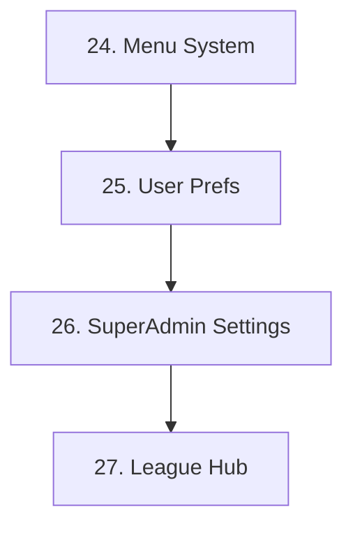

# PRD Template Reference

## Standard PRD Template

```markdown
# PRD [Number]: [Title]

> **Order:** [Number]
> **Status:** 📋 Proposed | 🔄 In Progress | 🟨 Partial | ✅ Complete
> **Type:** Feature | Architecture | Refactor | Bug
> **Dependencies:** PRD X, PRD Y (or "None")
> **Blocks:** PRD Z (or "None")

---

## 🎯 Objective

One paragraph describing the user-facing goal. What problem does this solve?

---

## ⚠️ Agent Context

| File | Purpose |
|------|---------|
| `src/path/to/file.tsx` | Why this file matters |
| `.claude/skills/relevant-skill/SKILL.md` | Skill patterns to follow |

### MCP Servers

| Server | Purpose |
|--------|---------|
| **Supabase MCP** | DB queries, schema verification |
| **Playwright MCP** | E2E test automation |
| **PostHog MCP** | Event verification, insights |
| **GA4 Stape MCP** | Analytics report verification |
| **GTM Stape MCP** | Tag/trigger management |

_(Include only relevant servers for this PRD)_

### Task-Optimized Structure

| Phase | Mode | Task |
|-------|------|------|
| 1 | `[READ-ONLY]` | Audit existing code for patterns |
| 2 | `[WRITE]` | Create component A `[PARALLEL with Phase 3]` |
| 3 | `[WRITE]` | Create component B `[PARALLEL with Phase 2]` |
| 4 | `[WRITE]` | Integration and wiring `[SEQUENTIAL]` |
| 5 | `[WRITE]` | Write Vitest + Playwright tests `[SEQUENTIAL]` |

---

## 🏗️ Detailed Feature Requirements

### Section A: [Area Name] — [N] Items

| # | Outcome | Problem Solved | Success Criteria |
|---|---------|----------------|------------------|
| **A-1** | **[Outcome Title]** | What pain this addresses | How to verify it works |

---

## ✅ Success Criteria

| Metric | Target | Verification Method |
|--------|--------|---------------------|
| [Measurable outcome] | [Target value] | [How to check] |

---

## 📅 Implementation Plan Reference

### Phase 1: [Name]
1. High-level step (not code)
2. Another step

---

## 📋 Documentation Update Checklist

- [ ] AGENTS.md — Add new patterns to relevant section
- [ ] Relevant skill file — Update if skill patterns change
- [ ] CHANGELOG.md — Log changes
- [ ] PRD_00_Index.md — Update this PRD's status to ✅ Complete
- [ ] **Git commit** — Stage all PRD changes, commit with conventional message: `type(scope): PRD XX — short description`

## 📚 Best Practice References

- **[Standard/RFC]:** Brief description and relevance
- **[Pattern]:** Why this approach was chosen

## 🔗 Related Documents

- [Link to related PRD or doc]

---

## Changelog

| Date | Section | Change |
|------|---------|--------|
| YYYY-MM-DD | Initial | Created PRD |
```

---

## Git Commit Format

**Commit message format:**
```
type(scope): PRD XX — short description

- Bullet point summarizing key change 1
- Bullet point summarizing key change 2
- Tests added (unit count + E2E count)
- Documentation updated (list files)
```

**Rules:**
- `type` = `feat`, `fix`, `refactor`, `test`, `docs`, `chore` (conventional commits)
- `scope` = domain area (e.g., `security`, `auth`, `analytics`, `testing`, `infra`)
- **PRD number MUST appear in the subject line** — `PRD XX`
- Subject line ≤ 72 characters
- Body uses bullet points to describe what changed
- Stage only files related to this PRD (not unrelated changes)
- One commit per PRD (unless the PRD is large enough to warrant multiple logical commits)

**Example:**
```
feat(security): PRD 62 — add OWASP security headers and CSP

- Add 6 OWASP baseline headers via next.config.js headers()
- CSP allows self + *.supabase.co, analytics via first-party proxy
- 14 Vitest unit tests for header config validation
- 3 Playwright E2E tests for header presence
- Update AGENTS.md, CHANGELOG.md, PRD index
```

---

## Sprint Planning Structure

```markdown
#### Sprint A: [Goal] (~timeframe, N parallel tracks)

**Track 1 — [Theme]** [SEQUENTIAL within track]
| Order | PRD | Title | Effort | Skills |
|-------|-----|-------|--------|--------|
| A1.1 | **57** | Password Reset | 3-4h | `auth-patterns`, `form-components` |
| A1.2 | **58** | Rate Limiting | 2-3h | `api-handler`, `error-handling` |

**Track 2 — [Theme]** [SEQUENTIAL within track, PARALLEL to Track 1]
| Order | PRD | Title | Effort | Skills |
|-------|-----|-------|--------|--------|
| A2.1 | **59** | Analytics Wiring | 3-4h | `analytics-tracking` |
| A2.2 | **61** | Testing Gaps | 3-4h | `testing-patterns` |

**Gate:** [Criteria before next sprint]
```

---

## PRD Index & Dependencies

### Status Icons

| Icon | Meaning |
|------|---------|
| ✅ Complete | PRD fully implemented |
| 🟢 Active | Currently being worked on |
| 📋 Proposed | Not yet started |
| 🔴 Blocked | Waiting on dependency |
| 🔄 Ongoing | Continuous (like Tech Debt) |

### Dependency Graph (Mermaid)



### Marking PRDs Complete

A PRD is complete when:
- All requirements in the table are implemented
- Success criteria are verified
- Code is deployed/merged
- Documentation (changelog, etc.) is updated

**Verification checklist:**
- [ ] All table items implemented
- [ ] Success criteria met
- [ ] Tests passing (if applicable)
- [ ] CHANGELOG.md updated
- [ ] PRD index status updated
- [ ] Dependency graph still accurate
- [ ] Git commit created with conventional message referencing PRD number
