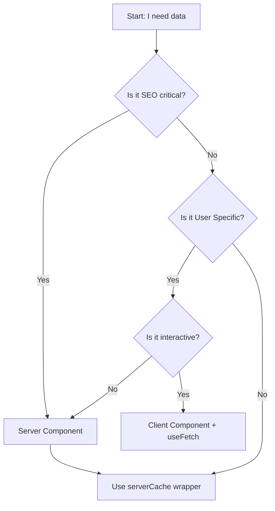
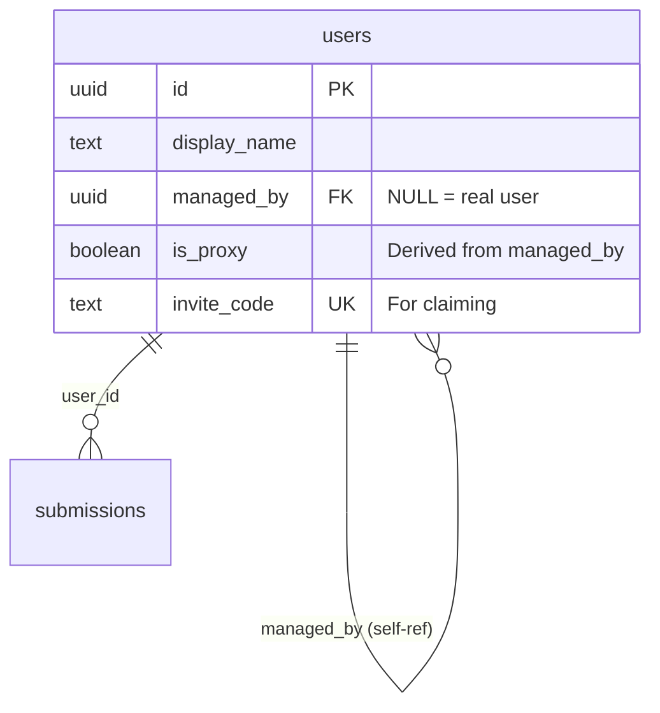
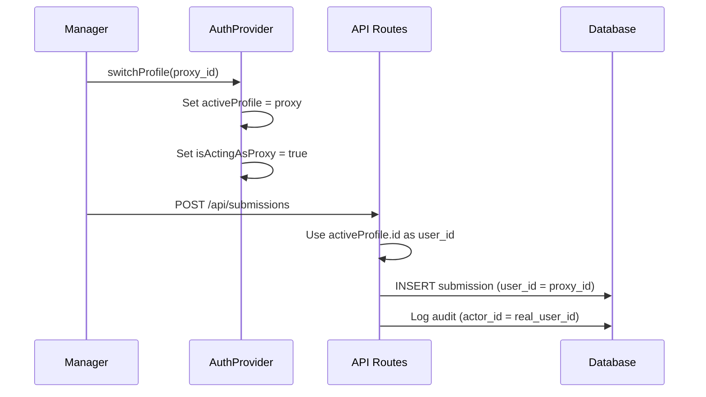

# StepLeague Technical Architecture

> **Status:** Draft (Phase A)
> **Last Updated:** 2026-01-13

This document serves as the "Source of Truth" for the technical architecture of StepLeague. All agents and developers must align their implementation with these patterns.

---

## 1. System Overview

StepLeague is a **Hybrid Next.js Application** that leverages:
*   **Server Components (RSC):** For initial data load and performance (Zero Bundle Size).
*   **Client Components:** For interactivity and real-time feedback.
*   **Offline-First:** Using IndexedDB + Service Workers for robust field usage.

---

## 2. Performance & Caching Architecture

### 2.1 The "Dual-Layer" Cache Strategy

We strictly separate **Server Data** from **Client State** but keep them synchronized.

#### Layer A: Server Cache (`src/lib/cache/serverCache.ts`)
*   **Purpose:** Protect database from spikes and speed up SSR/SSG.
*   **Mechanism:** `unstable_cache` with Tag-based invalidation.
*   **Rule:** NEVER call the database directly in a Server Component without a cache wrapper or a specific reason (e.g., mutation).
*   **Timeouts:** All fetches MUST have a 3000ms timeout fallback.

#### Layer B: Client Cache (`src/lib/cache/menuCache.ts`)
*   **Purpose:** Instant navigation and Offline support.
*   **Mechanism:** `IndexedDB` (Persistent) + `SessionStorage` (Fast).
*   **Sync:** Background revalidation on version mismatch.

### 2.2 Decision Tree: "Where do I fetch?"

---

## 3. Resilience & Error Handling

### 3.1 The "Safe Loading" Pattern

Third-party scripts (GTM, Feedback Widgets) are treated as **Untrusted External Dependencies**.

*   **Pattern:** `SafeLazy` Wrapper.
*   **Behavior:**
    1.  Lazy load the code chunk.
    2.  Wrap in `<ErrorBoundary>`.
    3.  If load fails (Network/AdBlock), silent catch -> Toast only if user triggered it.
    4.  If Offline, DO NOT ATTEMPT load.

### 3.2 Error Hierarchy

1.  **AppError (Domain):** Typed, predictable errors (e.g., `UPLOAD_TOO_LARGE`).
2.  **SystemError (Infra):** Database timeouts, network failures.
3.  **Panic (Critical):** Unrecoverable state (e.g., Auth failure loop).

---

## 4. Code Standards & Registry

### 4.1 The Cache Registry (`src/lib/cache/registry.ts`)
*   **Rule:** No magic strings. All cache tags must be defined here.
*   **Example:** `CacheRegistry.LEAGUES.list(userId)`

### 4.2 API vs Direct
*   **API Routes:** Only for external clients (Mobile App) or Mutations (POST/PUT).
*   **Server Actions:** Preferred for Form submissions.
*   **Direct Lib Calls:** Preferred for Server Components (Reading data).

---

## 5. Unified User Model (PRD 41)

### 5.1 Core Principle: "A Proxy IS a User"

The `users` table uses a **self-referential pattern** for proxy management:

### 5.2 User Types

| Type | `managed_by` | `is_proxy` | Description |
|------|--------------|------------|-------------|
| **Real User** | `NULL` | `false` | Authenticated user with email |
| **Proxy User** | `manager_id` | `true` | Ghost profile managed by another user |
| **Claimed Proxy** | `NULL` | `false` | Was proxy, now independent user |

### 5.3 "Act As" Context Flow

### 5.4 Reference Files

| File | Purpose |
|------|---------|
| `src/components/providers/AuthProvider.tsx` | `switchProfile()`, `activeProfile`, `isActingAsProxy` |
| `src/components/auth/ProfileSwitcher.tsx` | UI for context switching |
| `src/lib/api/handler.ts` | Extract `acting_as_id` from requests |

### 5.5 RLS Visibility Rules

*   **Manager-Only View:** Proxies only visible to their `managed_by` manager
*   **SuperAdmin Override:** SuperAdmins can see all users including proxies
*   **No Public Listing:** Proxies never appear in public leaderboards/lists