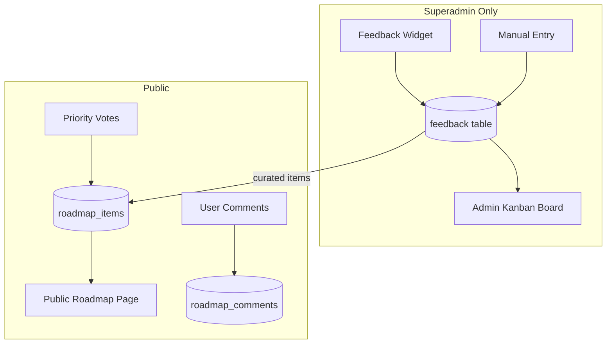
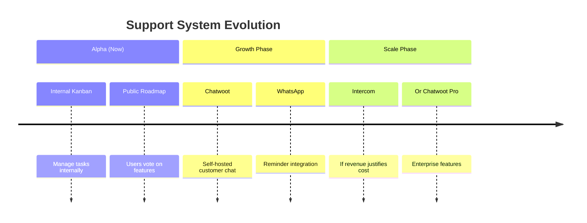

# Decision Document: Internal Kanban & Public Roadmap System

> **Date**: 2025-12-24  
> **Status**: Approved  
> **Category**: Decision / Architecture  
> **Relevance**: Active - implementing this feature  
> **Scope**: StepLeague v3 - Alpha Phase

---

## Executive Summary

This document captures the strategic decision to implement a **lightweight, in-house Kanban and roadmap system** rather than adopting an external all-in-one platform. The decision optimizes for simplicity, modularity, and cost-efficiency during the alpha stage.

---

## The Problem

StepLeague needs:
1. **Internal task tracking** for feature development (superadmin only)
2. **Public roadmap visibility** for users to see upcoming features
3. **User input mechanism** for prioritizing features
4. **Future customer support** (chat, tickets) - but NOT for MVP

---

## Options Considered

### Option A: All-in-One Platform (Intercom, Zendesk)

| Aspect | Assessment |
|--------|------------|
| **Pros** | Everything in one place; professional support features |
| **Cons** | Overkill for alpha; expensive ($65-300/mo); external dependency |
| **Verdict** | ❌ **Rejected** - Too much for current stage |

**Reasoning**: These platforms are designed for companies with active customer support needs. StepLeague is in alpha with friends & family testing - there's no support queue to manage yet.

---

### Option B: Open-Source Helpdesk (Chatwoot, FreeScout)

| Aspect | Assessment |
|--------|------------|
| **Pros** | Free; self-hosted; full-featured support platform |
| **Cons** | Infrastructure overhead; overkill for internal task tracking |
| **Verdict** | ⏳ **Deferred to Phase 2** - Great for later when support is needed |

**Reasoning**: Chatwoot is the recommended choice for when StepLeague needs customer-facing support. It integrates WhatsApp (mentioned in ROADMAP.md), has live chat, and is open-source. But deploying a separate application just for internal to-do lists is unnecessary.

---

### Option C: Standalone Kanban Tool (Trello, Planka, WeKan)

| Aspect | Assessment |
|--------|------------|
| **Pros** | Purpose-built for Kanban; feature-rich |
| **Cons** | Separate system to maintain; no integration with existing feedback |
| **Verdict** | ❌ **Rejected** - Adds complexity without much benefit |

**Reasoning**: These are great tools, but they're separate systems. The feedback system already captures bugs, feature requests, and improvement ideas from users. Adding a disconnected Kanban board means duplicating data and managing two systems.

---

### Option D: Build In-House (Extend Existing Feedback System) ✅ CHOSEN

| Aspect | Assessment |
|--------|------------|
| **Pros** | Leverages existing infrastructure; fully integrated; minimal overhead |
| **Cons** | Development time (~2-3 days) |
| **Verdict** | ✅ **Approved** - Best fit for current needs |

**Reasoning**: StepLeague already has:
- A `feedback` table with types (bug, feature, improvement)
- An admin dashboard at `/admin/feedback`
- RLS policies for superadmin access
- A modern component library

Extending this with Kanban views and a public roadmap is the most efficient path.

---

## Approved Solution Architecture



### Components

| Component | Access | Description |
|-----------|--------|-------------|
| **Admin Kanban** | Superadmin | Drag-and-drop board for managing all feedback + internal tasks |
| **Public Roadmap** | All users | Curated list of planned features with voting |
| **Comments** | Authenticated users | Discuss roadmap items |
| **Priority Rating** | Authenticated users | Vote 1-10 on feature importance |

---

## Why NOT External Tools (For Now)

### Cost Efficiency
- **Intercom**: $65/mo minimum (startup discount)
- **Zendesk**: $55/mo/agent
- **In-house**: $0 (uses existing Supabase/Vercel)

### Simplicity
- No new logins or systems to manage
- Data lives in the same database
- Consistent UI/UX with the rest of StepLeague

### Flexibility
- Full control over the data model
- Can customize to exact needs (e.g., the 1-10 priority rating)
- No vendor lock-in

### Integration
- Feedback from the widget flows directly into the Kanban
- Roadmap items can reference feedback items
- Analytics can track engagement

---

## Launch Strategy Context

> [!IMPORTANT]
> StepLeague is **bootstrapped** (self-funded), **not incorporated**, and planning launches on **Product Hunt, AppSumo, and crowdfunding**.

### Why This Matters for Tooling Decisions

| Factor | Implication |
|--------|-------------|
| **Bootstrapped** | Every dollar counts; avoid recurring SaaS costs until revenue |
| **Not incorporated** | Many startup programs (Intercom, etc.) require incorporation |
| **Crowdfunding** | "We use open-source to keep costs low" resonates with backers |
| **Product Hunt/AppSumo** | Fast iteration matters more than enterprise features |

### Intercom vs Chatwoot for Bootstrappers

| Aspect | Chatwoot (Open Source) | Intercom (Startup Program) |
|--------|----------------------|---------------------------|
| **Cost** | $0 self-hosted | ~$65/mo (90% off Year 1) |
| **After Year 1** | Still $0 | $650+/mo 🚨 |
| **Incorporation** | Not required | Usually required |
| **Crowdfunding angle** | ✅ Great narrative | ⚠️ "SaaS costs" less appealing |

### Phased Rollout Timeline

```
ALPHA (Now)                LAUNCH (PH/AppSumo)         GROWTH ($10k+ MRR)
───────────────────────────────────────────────────────────────────────────
Build Kanban + Roadmap     Deploy Chatwoot             Evaluate Intercom
(internal + public)        (1-2 weeks before launch)   IF revenue justifies
       │                          │                           │
       └── Friends & family ──────┴── Public users ───────────┴── Paying customers
```

### Decision: Stay Lean Until Launch

- **NOW**: Build simple Kanban + Public Roadmap (this implementation)
- **PRE-LAUNCH**: Deploy Chatwoot (~2 hours setup)
- **POST-REVENUE**: Consider Intercom only if specific enterprise features needed

## Future Migration Path

When StepLeague grows and needs **customer support chat** (post-launch):



### Recommended Future Stack
1. **Chatwoot** (open-source, self-hosted)
   - Live chat widget
   - WhatsApp Business integration
   - Email → ticket conversion
   - Knowledge base

2. **Keep internal Kanban** for development tracking
   - OR migrate to Linear/Jira if team grows

---

## Implementation Approach

### Phase 1: Internal Kanban (Admin)
- Kanban board view at `/admin/kanban`
- Columns: Backlog → Todo → In Progress → Review → Done
- Drag-and-drop cards
- Filter by type (bug, feature, etc.)

### Phase 2: Public Roadmap
- Public page at `/roadmap`
- Shows curated "planned" and "in progress" items
- Users can rate priority (1-10 scale)
- Users can comment
- Anonymous viewing, auth required to vote/comment

### Database Changes
```sql
-- Add to existing feedback table or create new
ALTER TABLE feedback ADD COLUMN board_status TEXT DEFAULT 'backlog';
ALTER TABLE feedback ADD COLUMN is_public BOOLEAN DEFAULT FALSE;

-- New table for votes
CREATE TABLE roadmap_votes (
    id UUID PRIMARY KEY,
    feedback_id UUID REFERENCES feedback(id),
    user_id UUID REFERENCES users(id),
    priority INTEGER CHECK (priority >= 1 AND priority <= 10),
    created_at TIMESTAMPTZ DEFAULT NOW(),
    UNIQUE (feedback_id, user_id)
);

-- New table for comments  
CREATE TABLE roadmap_comments (
    id UUID PRIMARY KEY,
    feedback_id UUID REFERENCES feedback(id),
    user_id UUID REFERENCES users(id),
    content TEXT NOT NULL,
    created_at TIMESTAMPTZ DEFAULT NOW()
);
```

---

## Decision Log

| Decision | Choice | Rationale |
|----------|--------|-----------|
| Build vs Buy (Kanban) | **Build** | Extend existing feedback system |
| Build vs Buy (Support) | **Buy later** | Chatwoot when needed |
| Voting mechanism | **1-10 priority** | More granular than upvote/downvote |
| Comments | **Threaded** | Allow discussions |
| Public visibility | **Curated** | Admin chooses what's public |

---

## Risks & Mitigations

| Risk | Mitigation |
|------|------------|
| Scope creep | Keep it simple; no fancy features |
| User doesn't engage | Make voting frictionless; gamify later |
| Migration later | Design with data portability in mind |

---

## Success Criteria

- [ ] Superadmins can manage tasks in Kanban view
- [ ] Users can view planned features on public roadmap
- [ ] Users can rate features 1-10
- [ ] Users can comment on features
- [ ] < 3 days implementation time

---

---

## Research Findings

### Industry Best Practices (2024)

#### Unified vs Separate Tools

Research shows a **strong trend toward unified platforms** in 2024:

| Finding | Source |
|---------|--------|
| Companies using integrated systems **grow 19% faster** | bird.com |
| Unified platforms reduce software costs by **40-60%** | Industry analysis |
| Separate tools lead to "digital chaos" with context switching | Medium |

However, for **early-stage startups**, the recommendation is:
- Start simple and modular
- Avoid over-engineering before product-market fit
- Use low-code/no-code or extend existing systems

#### Kanban for Internal Support

Best practices identified:
1. **Visualize Work** - Each task as a card, moving through columns
2. **Limit Work in Progress (WIP)** - Prevent overload
3. **Manage Flow** - Monitor bottlenecks
4. **Transparency** - Real-time status reflection

---

### Customer Support Platforms Compared

#### Open-Source Options

| Platform | Description | Key Features | Deployment |
|----------|-------------|--------------|------------|
| **Chatwoot** | Modern Intercom alternative | Omnichannel (chat, WhatsApp, email, social), AI Copilot, knowledge base | Self-hosted or cloud |
| **Papercups** | Minimal, API-driven | Live chat focus, Elixir-based, privacy-focused | Self-hosted |
| **FreeScout** | Lightweight helpdesk | Email-based, Kanban extension available, mobile apps | Self-hosted (PHP) |
| **Zammad** | Enterprise helpdesk | Automation, omnichannel, scalable | Self-hosted |
| **OsTicket** | Classic ticketing | Custom fields, SLA management, customer portal | Self-hosted |
| **UVdesk** | E-commerce focused | Multi-channel, automation, e-commerce integrations | Self-hosted or cloud |

#### Chatwoot Deep Dive (Recommended for Future)

**Why Chatwoot is best for StepLeague's future:**

| Feature | Details |
|---------|---------|
| **Channels** | Website chat, Email, WhatsApp, Facebook, Instagram, Twitter, Telegram, Line, SMS |
| **Team Features** | Private notes, @mentions, auto-assignment, agent capacity management |
| **AI** | Copilot for smart replies, translations, past conversation access |
| **Self-hosting** | Full data control, Docker deployment |
| **Cost** | Free (self-hosted) or paid cloud |

**WhatsApp Integration** (mentioned in ROADMAP.md):
- Chatwoot supports WhatsApp Business API
- Can handle reminder notifications
- Unified inbox for all channels

#### Chatwoot vs Crisp vs Papercups

| Feature | Chatwoot | Crisp | Papercups |
|---------|----------|-------|-----------|
| **Open Source** | ✅ Yes | ❌ No (proprietary) | ✅ Yes |
| **Self-hosted** | ✅ Yes | ❌ Cloud only | ✅ Yes |
| **Omnichannel** | ✅ Extensive | ✅ Good | ⚠️ Chat focus |
| **AI Features** | ✅ Copilot | ✅ Chatbots | ❌ Limited |
| **WhatsApp** | ✅ Yes | ✅ Yes | ❌ No |
| **Best For** | Multi-agent teams | Simple chat + bots | Developer privacy focus |
| **Popularity** | ⭐⭐⭐⭐⭐ | ⭐⭐⭐⭐ | ⭐⭐⭐ |

---

### Kanban/Roadmap Tools Compared

#### Open-Source Next.js/React Options

| Project | Stack | Features | Self-host |
|---------|-------|----------|-----------|
| **jonaszb/kanban-next** | Next.js, Supabase | OAuth, drag-drop, CI/CD | ✅ |
| **MuhdHanish/kanban_board** | Next.js, Tailwind, Framer | Responsive, animations | ✅ |
| **Uaghazade1/kanba** | React, Tailwind, Supabase | Trello alternative | ✅ Docker |
| **nareshbhusal/roadmap** | React, Next.js, IndexedDB | Boards + ideas + priority | ✅ |
| **Planka** | React, Redux | Real-time, workgroups | ✅ Docker |
| **WeKan** | Meteor | Privacy-focused, extensive | ✅ |

#### Project Management Tools

| Tool | Type | Best For | Kanban | Roadmap |
|------|------|----------|--------|---------|
| **Taiga** | Open-source | Agile teams | ✅ | ⚠️ |
| **OpenProject** | Open-source | Full PM suite | ✅ | ✅ |
| **Linear** | Proprietary | Dev teams | ✅ | ✅ |
| **Notion** | Proprietary | All-purpose | ✅ | ✅ |

---

### Feature Request/Roadmap Tools

#### Public Roadmap Platforms

| Tool | Type | Features |
|------|------|----------|
| **Canny** | Proprietary | Voting, changelog, integrations |
| **ProductBoard** | Proprietary | Customer insights, prioritization |
| **Fider** | Open-source | Simple voting board |
| **Upvoty** | Proprietary | Feature voting, roadmap |

> **Decision**: Build in-house for tighter integration with existing feedback system and full customization of the 1-10 priority rating.

---

### Startup Programs Available

| Platform | Benefit | Status |
|----------|---------|--------|
| **Intercom Early Stage** | 90% off Year 1 (~$65/mo) | To apply when needed |
| **ElevenLabs Grants** | 12 months free (33M credits) | For AI voice features |
| **Resend** | 3,000 emails/mo free | Already available |
| **Chatwoot Cloud** | Free tier available | For testing |

---

## Appendix: Full Tool Reference

### For Customer Support (Future)

| Tool | Type | Best For | Cost |
|------|------|----------|------|
| **Chatwoot** | Open-source | Self-hosted support + WhatsApp | Free |
| **Crisp** | Proprietary | Simple chat + bots | Freemium |
| **Intercom** | Enterprise | Full-featured, AI | $65/mo+ |
| **FreeScout** | Open-source | Email ticketing | Free |
| **Zammad** | Open-source | Enterprise helpdesk | Free |

### For Kanban (Considered but Rejected)

| Tool | Why Rejected |
|------|--------------|
| **Trello** | Separate system, paid for power-ups |
| **Planka** | Good, but overkill - separate deployment |
| **WeKan** | Heavy, needs dedicated server |
| **Linear** | Paid, designed for larger teams |
| **Notion** | External system, not integrated |

### For Roadmap/Voting (Considered but Rejected)

| Tool | Why Rejected |
|------|--------------|
| **Canny** | Expensive for early stage |
| **Fider** | Separate deployment, limited customization |
| **ProductBoard** | Enterprise-focused, expensive |

---

*This document serves as the authoritative reference for the Kanban/Roadmap feature decisions.*

---

## Changelog

| Date | Section | Change |
|------|---------|--------|
| 2025-12-24 | Launch Strategy Context | Added bootstrap/crowdfunding context, Intercom vs Chatwoot analysis |
| 2025-12-24 | Date fix | Corrected year from 2024 to 2025 |
| 2025-12-24 | Research Findings | Added comprehensive tool comparisons and best practices |
| 2025-12-24 | Initial | Document created with options analysis and architecture |
