# PRD 41: Implementation Plan — Proxy Refactor & Stability Hardening

> **PRD Reference:** [PRD_41_Proxy_Refactor_Stability.md](../prds/PRD_41_Proxy_Refactor_Stability.md)  
> **Created:** 2026-01-13  
> **Status:** In Progress (Phase C-D Complete)

---

## Table of Contents

1. [Executive Summary](#executive-summary)
2. [Current State Analysis](#current-state-analysis)
3. [Target Architecture](#target-architecture)
4. [Data Flow Diagrams](#data-flow-diagrams)
5. [Phase A: Core Schema Refactor](#phase-a-core-schema-refactor)
6. [Phase B: "Act As" System Implementation](#phase-b-act-as-system-implementation)
7. [Phase C: Security & RLS Policies](#phase-c-security--rls-policies)
8. [Phase D: Settings & Quotas](#phase-d-settings--quotas)
9. [Phase E: UX Enhancements](#phase-e-ux-enhancements)
10. [Phase F: Robustness & Cleanup](#phase-f-robustness--cleanup)
11. [Migration Strategy](#migration-strategy)
12. [Testing Plan](#testing-plan)
13. [Rollback Strategy](#rollback-strategy)
14. [File Change Inventory](#file-change-inventory)

---

## Executive Summary

This implementation plan details the **completion** of the unified identity model. The core schema migration has **already been partially completed**:

### Current State (Updated 2026-01-13 21:35)

| Component | Status | Notes |
|-----------|--------|-------|
| `managed_by` column in users | ✅ Done | Self-referential FK exists |
| `is_proxy` column in users | ✅ Done | Boolean flag exists |
| `invite_code` column in users | ✅ Done | For claim links |
| `proxy_members` table | ✅ Dropped | No longer in schema |
| `submissions.proxy_member_id` | ✅ Removed | Uses `user_id` only |
| `claims_remaining` column | ✅ Done | Migration `20260113200000` |
| `is_archived` column | ✅ Done | Migration `20260113200000` |
| `deleted_at` column | ✅ Done | Migration `20260113200000` |
| "Act As" AuthProvider | ✅ Done | `switchProfile`, `activeProfile`, `isActingAsProxy` |
| ProfileSwitcher UI | ✅ Done | Integrated in NavHeader |
| RLS policies for proxies | ✅ Done | Migration `20260113210000` |
| `/api/proxies` unified route | ✅ Done | CRUD for proxy management |
| `/api/proxy-claim` fixed | ✅ Done | Updated to unified model |
| Settings registry | ✅ Done | `max_proxies_per_user`, `feature_proxy_system`, etc. |

### Remaining Work

| Phase | Description | Effort | Status |
|-------|-------------|--------|--------|
| A | Add missing columns + triggers | Small | ✅ Complete |
| B | Implement AuthProvider "Act As" context | Medium | ✅ Complete |
| C | Add RLS policies for visibility | Medium | ✅ Complete |
| D | Settings & quotas | Small | ✅ Complete |
| E | ProfileSwitcher UI + visual indicators | Medium | ✅ Complete |
| F | Robustness triggers & cleanup jobs | Small | 🔲 Pending |

---

## Current State Analysis (Verified 2026-01-13)

### Existing Schema

The unified model is **already partially implemented**:

```sql
-- Current users table (unified model)
users (5 rows)
├── id uuid PK (DEFAULT auth.uid())
├── display_name text
├── units text
├── is_superadmin boolean DEFAULT false
├── nickname varchar
├── managed_by uuid FK→users.id  ✅ UNIFIED MODEL
├── invite_code text              ✅ FOR CLAIMING
├── is_proxy boolean DEFAULT false ✅ PROXY FLAG
└── created_at timestamptz

-- Submissions table (simplified - no proxy_member_id)
submissions (114 rows)
├── id uuid PK
├── league_id uuid FK→leagues.id (nullable for global submissions)
├── user_id uuid FK→users.id     ✅ ALWAYS POINTS TO USERS
├── for_date date
├── steps integer
├── verified boolean
└── ...
```

### What's Already Working

```mermaid
flowchart TB
    subgraph "Current Architecture (Unified - Partial)"
        direction TB
        
        Manager[👤 Manager User]
        UsersTable[(users table)]
        SubmissionsTable[(submissions)]
        
        Manager -->|managed_by| UsersTable
        UsersTable -->|is_proxy=true| Proxy[👻 Proxy User]
        SubmissionsTable -->|user_id| UsersTable
        
        Note[✅ Schema unified<br>❌ No Act As UI yet]
    end
    
    style UsersTable fill:#4a9,stroke:#333,color:#fff
    style Note fill:#fa0,stroke:#333
```



### Remaining Problems to Solve

1. ❌ **No "Act As" Context**: AuthProvider doesn't support profile switching
2. ❌ **No ProfileSwitcher UI**: No way to switch between self and proxies
3. ❌ **No RLS Policies**: Proxies visible to everyone (security risk)
4. ❌ **No Quota System**: No limit on proxy creation
5. ❌ **No Activity Decay**: Stale proxies clutter the UI
6. ❌ **No Soft Delete**: Hard deletes cause orphan issues

---

## Target Architecture

### Unified User Model


### Key Principle: "A Proxy IS a User"

```
┌─────────────────────────────────────────────────────────────────┐
│                        users TABLE                              │
├─────────────────────────────────────────────────────────────────┤
│  id       │ display_name │ managed_by │ is_proxy │ email       │
├───────────┼──────────────┼────────────┼──────────┼─────────────┤
│  user-001 │ "Vasso"      │ NULL       │ false    │ v@x.com     │  ← Real User
│  user-002 │ "Joe Soap"   │ user-001   │ true     │ NULL        │  ← Proxy (managed by Vasso)
│  user-003 │ "Jane Doe"   │ user-001   │ true     │ NULL        │  ← Proxy (managed by Vasso)
│  user-004 │ "Bob"        │ NULL       │ false    │ bob@y.com   │  ← Real User (was proxy, claimed)
└───────────┴──────────────┴────────────┴──────────┴─────────────┘

When user-004 claims: managed_by → NULL, is_proxy → false, email → set
```

---

## Data Flow Diagrams

### 1. Proxy Creation Flow


### 2. "Act As" Context Switch Flow


### 3. Proxy Claim Flow


### 4. Submission Context Flow


---

## Phase A: Complete Schema (MINIMAL - Core Already Done ✅)

> **Status:** The unified model schema is 80% complete. Only 3 columns need to be added.

### A.1 Database Migration (Small)

**File:** `supabase/migrations/20260113200000_complete_proxy_columns.sql`

```sql
-- Phase A.1: Add REMAINING proxy columns to users table
-- =====================================================
-- 
-- ALREADY EXISTS (verified 2026-01-13):
--   ✅ managed_by UUID FK→users.id
--   ✅ is_proxy BOOLEAN DEFAULT false
--   ✅ invite_code TEXT
--
-- MISSING (this migration adds):
--   ❌ claims_remaining INTEGER
--   ❌ is_archived BOOLEAN  
--   ❌ deleted_at TIMESTAMPTZ

-- Step 1: Add ONLY the missing columns
ALTER TABLE users ADD COLUMN IF NOT EXISTS claims_remaining INTEGER DEFAULT 1;
ALTER TABLE users ADD COLUMN IF NOT EXISTS is_archived BOOLEAN DEFAULT false NOT NULL;
ALTER TABLE users ADD COLUMN IF NOT EXISTS deleted_at TIMESTAMPTZ;

-- Step 2: Add performance indexes
CREATE INDEX IF NOT EXISTS idx_users_is_archived ON users(is_archived) WHERE is_archived = false;
CREATE INDEX IF NOT EXISTS idx_users_deleted_at ON users(deleted_at) WHERE deleted_at IS NULL;

-- Step 3: Add trigger to sync is_proxy from managed_by (if not exists)
CREATE OR REPLACE FUNCTION sync_is_proxy()
RETURNS TRIGGER AS $$
BEGIN
    NEW.is_proxy := (NEW.managed_by IS NOT NULL);
    RETURN NEW;
END;
$$ LANGUAGE plpgsql;

DROP TRIGGER IF EXISTS trg_sync_is_proxy ON users;
CREATE TRIGGER trg_sync_is_proxy
    BEFORE INSERT OR UPDATE OF managed_by ON users
    FOR EACH ROW
    EXECUTE FUNCTION sync_is_proxy();

-- Step 4: Documentation
COMMENT ON COLUMN users.claims_remaining IS 'Number of times this proxy can be claimed (default 1)';
COMMENT ON COLUMN users.is_archived IS 'Hidden from UI due to inactivity (activity decay)';
COMMENT ON COLUMN users.deleted_at IS 'Soft delete timestamp - NULL means active';
COMMENT ON COLUMN users.invite_code IS 'Unique claim code for proxy users';
COMMENT ON COLUMN users.claims_remaining IS 'How many times this proxy can be claimed (default 1)';
COMMENT ON COLUMN users.is_archived IS 'Hidden from UI but not deleted (activity decay)';
```

### A.2 TypeScript Types Update

**File:** `src/types/database.ts`

```typescript
// Add to users type
export interface User {
  id: string;
  display_name: string | null;
  nickname: string | null;
  email?: string | null;
  units: "metric" | "imperial";
  is_superadmin: boolean;
  
  // NEW: Proxy fields
  managed_by: string | null;     // FK to manager's user.id
  is_proxy: boolean;             // Derived from managed_by IS NOT NULL
  invite_code: string | null;    // For claim links
  claims_remaining: number;      // Default 1
  is_archived: boolean;          // Activity decay
  deleted_at: string | null;     // Soft delete
  
  created_at: string;
}

// NEW: Active profile context
export interface ActiveProfile {
  id: string;
  display_name: string | null;
  is_proxy: boolean;
  managed_by: string | null;
}

// NEW: Proxy creation payload
export interface CreateProxyPayload {
  display_name: string;
}

// NEW: Claim payload
export interface ClaimProxyPayload {
  merge_strategy: 'keep_proxy_profile' | 'keep_my_profile';
}
```

---

## Phase B: "Act As" System Implementation

### B.1 AuthProvider Enhancement

**File:** `src/components/providers/AuthProvider.tsx`

```typescript
interface AuthContextValue {
  // Existing
  user: User | null;
  session: Session | null;
  loading: boolean;
  signOut: (redirectTo?: string) => Promise<void>;
  
  // NEW: "Act As" context
  activeProfile: ActiveProfile | null;      // Currently acting as (user or proxy)
  isActingAsProxy: boolean;                 // Quick check
  managedProxies: ActiveProfile[];          // List of proxies this user manages
  switchProfile: (profileId: string | null) => Promise<void>;  // Switch context
  refreshProxies: () => Promise<void>;      // Reload proxy list
}
```

### B.2 ProfileSwitcher Component

**File:** `src/components/auth/ProfileSwitcher.tsx`

```tsx
"use client";

import { useAuth } from "@/components/providers/AuthProvider";
import { DropdownMenu, DropdownMenuTrigger, DropdownMenuContent, DropdownMenuItem } from "@/components/ui/dropdown-menu";
import { Badge } from "@/components/ui/badge";

export function ProfileSwitcher() {
  const { 
    user, 
    activeProfile, 
    isActingAsProxy, 
    managedProxies, 
    switchProfile 
  } = useAuth();
  
  if (!user || managedProxies.length === 0) return null;
  
  return (
    <DropdownMenu>
      <DropdownMenuTrigger className="flex items-center gap-2">
        <span>{activeProfile?.display_name || user.display_name}</span>
        {isActingAsProxy && (
          <Badge variant="outline" className="bg-amber-500/20 text-amber-400 border-amber-500/50">
            Acting As
          </Badge>
        )}
      </DropdownMenuTrigger>
      
      <DropdownMenuContent>
        {/* Switch back to self */}
        <DropdownMenuItem onClick={() => switchProfile(null)}>
          <span>👤 {user.display_name}</span>
          {!isActingAsProxy && <span className="ml-2 text-xs">(current)</span>}
        </DropdownMenuItem>
        
        <div className="h-px bg-border my-1" />
        
        {/* Managed proxies */}
        {managedProxies.map((proxy) => (
          <DropdownMenuItem 
            key={proxy.id} 
            onClick={() => switchProfile(proxy.id)}
          >
            <span>👻 {proxy.display_name}</span>
            {activeProfile?.id === proxy.id && <span className="ml-2 text-xs">(current)</span>}
          </DropdownMenuItem>
        ))}
      </DropdownMenuContent>
    </DropdownMenu>
  );
}
```

### B.3 Context Persistence

**Flow: Page Load → Restore Active Profile**


---

## Phase C: Security & RLS Policies

### C.1 RLS Policy Design

**File:** `supabase/migrations/20260113201000_proxy_rls_policies.sql`

```sql
-- ===========================================
-- RLS Policies for Unified Proxy Model
-- ===========================================

-- Enable RLS on users if not already
ALTER TABLE users ENABLE ROW LEVEL SECURITY;

-- Policy 1: Users can see themselves
CREATE POLICY "users_select_self" ON users
    FOR SELECT
    USING (auth.uid() = id);

-- Policy 2: Users can see their managed proxies
CREATE POLICY "users_select_managed_proxies" ON users
    FOR SELECT
    USING (managed_by = auth.uid());

-- Policy 3: SuperAdmins can see all users
CREATE POLICY "users_select_superadmin" ON users
    FOR SELECT
    USING (
        EXISTS (
            SELECT 1 FROM users u 
            WHERE u.id = auth.uid() 
            AND u.is_superadmin = true
        )
    );

-- Policy 4: League members can see other members' basic info
-- (But NOT proxy users unless they manage them)
CREATE POLICY "users_select_league_members" ON users
    FOR SELECT
    USING (
        is_proxy = false  -- Only real users
        AND EXISTS (
            SELECT 1 FROM memberships m1
            JOIN memberships m2 ON m1.league_id = m2.league_id
            WHERE m1.user_id = auth.uid()
            AND m2.user_id = users.id
        )
    );

-- Policy 5: Users can update their own record
CREATE POLICY "users_update_self" ON users
    FOR UPDATE
    USING (auth.uid() = id);

-- Policy 6: Users can update their managed proxies
CREATE POLICY "users_update_managed_proxies" ON users
    FOR UPDATE
    USING (managed_by = auth.uid());

-- Policy 7: Users can create proxy users (managed_by = themselves)
CREATE POLICY "users_insert_proxy" ON users
    FOR INSERT
    WITH CHECK (managed_by = auth.uid() AND is_proxy = true);

-- ===========================================
-- Submissions RLS (updated for "Act As")
-- ===========================================

-- Users can see submissions for themselves OR their proxies
CREATE POLICY "submissions_select_own_and_proxies" ON submissions
    FOR SELECT
    USING (
        user_id = auth.uid()
        OR EXISTS (
            SELECT 1 FROM users u 
            WHERE u.id = submissions.user_id 
            AND u.managed_by = auth.uid()
        )
    );

-- Users can insert submissions for themselves OR their proxies
CREATE POLICY "submissions_insert_own_and_proxies" ON submissions
    FOR INSERT
    WITH CHECK (
        user_id = auth.uid()
        OR EXISTS (
            SELECT 1 FROM users u 
            WHERE u.id = user_id 
            AND u.managed_by = auth.uid()
        )
    );
```

### C.2 Visibility Matrix

| Actor | Can See Self | Can See Own Proxies | Can See Others' Proxies | Can See Real Users |
|-------|--------------|---------------------|-------------------------|-------------------|
| Regular User | ✅ | ✅ | ❌ | ✅ (in same leagues) |
| SuperAdmin | ✅ | ✅ | ✅ | ✅ |
| Anonymous | ❌ | ❌ | ❌ | ❌ |

---

## Phase D: Settings & Quotas

### D.1 Settings Registry Updates

**File:** `src/lib/settings/registry.ts`

```typescript
// Add to settings registry
export const PROXY_SETTINGS = {
  max_proxies_per_user: {
    key: 'max_proxies_per_user',
    defaultValue: 50,
    type: 'number',
    category: 'limits',
    description: 'Maximum number of proxy users a single user can manage',
    visibility: 'superadmin',
  },
  
  proxy_max_claims: {
    key: 'proxy_max_claims',
    defaultValue: 1,
    type: 'number',
    category: 'features',
    description: 'How many times a proxy can be claimed (usually 1)',
    visibility: 'superadmin',
  },
  
  proxy_creation_roles: {
    key: 'proxy_creation_roles',
    defaultValue: ['authenticated'],
    type: 'array',
    category: 'features',
    description: 'Which roles can create proxies. Default: all authenticated users.',
    visibility: 'superadmin',
  },
  
  proxy_activity_decay_days: {
    key: 'proxy_activity_decay_days',
    defaultValue: 180, // 6 months
    type: 'number',
    category: 'features',
    description: 'Days of inactivity before proxy is auto-archived',
    visibility: 'superadmin',
  },
};
```

### D.2 Quota Validation Flow

```mermaid
flowchart TB
    subgraph "POST /api/proxies"
        Start([Create Proxy Request])
        
        Start --> GetUser[Get authenticated user]
        GetUser --> GetSettings[Fetch max_proxies_per_user]
        GetSettings --> CountProxies[SELECT COUNT(*) FROM users WHERE managed_by = user.id AND deleted_at IS NULL]
        
        CountProxies --> CheckQuota{count < max?}
        
        CheckQuota -->|No| QuotaError[403: Proxy quota exceeded]
        CheckQuota -->|Yes| CreateProxy[INSERT INTO users with managed_by]
        
        CreateProxy --> Success([Return new proxy])
    end
    
    style QuotaError fill:#f66,stroke:#333,color:#fff
    style Success fill:#4a9,stroke:#333,color:#fff
```

---

## Phase E: UX Enhancements

### E.1 Sortable Submissions Table

**File:** `src/components/tables/SubmissionTable.tsx`

```tsx
interface SortConfig {
  column: 'for_date' | 'steps' | 'verified' | 'created_at';
  direction: 'asc' | 'desc';
}

// Add sorting state and handlers
const [sortConfig, setSortConfig] = useState<SortConfig>({
  column: 'created_at',
  direction: 'desc',
});

// Column header component
function SortableHeader({ column, label }: { column: SortConfig['column']; label: string }) {
  const isActive = sortConfig.column === column;
  
  return (
    <th 
      className="cursor-pointer hover:bg-muted/50"
      onClick={() => setSortConfig({
        column,
        direction: isActive && sortConfig.direction === 'asc' ? 'desc' : 'asc',
      })}
    >
      {label}
      {isActive && (
        <span className="ml-1">
          {sortConfig.direction === 'asc' ? '↑' : '↓'}
        </span>
      )}
    </th>
  );
}
```

### E.2 "Act As" Visual Indicator


### E.3 Smart Merge UI (Claim Flow)

**File:** `src/app/(auth)/claim/[code]/page.tsx`

```tsx
export default function ClaimPage() {
  const [mergeStrategy, setMergeStrategy] = useState<'keep_proxy' | 'keep_mine'>('keep_proxy');
  
  return (
    <div className="claim-container">
      <h1>Claim Profile: {proxy.display_name}</h1>
      
      <div className="merge-options">
        <label className="option">
          <input 
            type="radio" 
            checked={mergeStrategy === 'keep_proxy'}
            onChange={() => setMergeStrategy('keep_proxy')}
          />
          <div className="option-content">
            <h3>Use "{proxy.display_name}" profile</h3>
            <p>Keep the proxy's display name and any avatar</p>
          </div>
        </label>
        
        <label className="option">
          <input 
            type="radio" 
            checked={mergeStrategy === 'keep_mine'}
            onChange={() => setMergeStrategy('keep_mine')}
          />
          <div className="option-content">
            <h3>Keep my current profile</h3>
            <p>Use your existing display name: {user.display_name}</p>
          </div>
        </label>
      </div>
      
      <div className="transfer-preview">
        <h3>What will be transferred:</h3>
        <ul>
          <li>✓ {proxy.submission_count} step submissions</li>
          <li>✓ League memberships (if any)</li>
          <li>✓ Historical data and achievements</li>
        </ul>
      </div>
      
      <button onClick={handleClaim}>
        Claim This Profile
      </button>
    </div>
  );
}
```

---

## Phase F: Robustness & Cleanup

### F.1 Orphan Cleanup Trigger

```sql
-- When a manager is soft-deleted, soft-delete their unclaimed proxies
CREATE OR REPLACE FUNCTION cascade_manager_delete()
RETURNS TRIGGER AS $$
BEGIN
    IF NEW.deleted_at IS NOT NULL AND OLD.deleted_at IS NULL THEN
        -- Soft delete all proxies managed by this user
        UPDATE users
        SET deleted_at = NEW.deleted_at
        WHERE managed_by = NEW.id
          AND deleted_at IS NULL;
    END IF;
    RETURN NEW;
END;
$$ LANGUAGE plpgsql;

CREATE TRIGGER trg_cascade_manager_delete
    AFTER UPDATE ON users
    FOR EACH ROW
    EXECUTE FUNCTION cascade_manager_delete();
```

### F.2 Activity Decay Job

**File:** `supabase/functions/cleanup-stale-proxies/index.ts`

```typescript
// Cron job: Archive proxies inactive for 6 months
export async function cleanupStaleProxies() {
  const { data: settings } = await supabase
    .from('site_settings')
    .select('value')
    .eq('key', 'proxy_activity_decay_days')
    .single();
  
  const decayDays = settings?.value ? parseInt(settings.value) : 180;
  const cutoffDate = new Date();
  cutoffDate.setDate(cutoffDate.getDate() - decayDays);
  
  // Find proxies with no submissions in decay period
  const { data: staleProxies } = await supabase
    .from('users')
    .select('id')
    .eq('is_proxy', true)
    .eq('is_archived', false)
    .not('managed_by', 'is', null)
    .filter('id', 'not in', `(
      SELECT DISTINCT user_id 
      FROM submissions 
      WHERE created_at > '${cutoffDate.toISOString()}'
    )`);
  
  if (staleProxies?.length) {
    await supabase
      .from('users')
      .update({ is_archived: true })
      .in('id', staleProxies.map(p => p.id));
  }
  
  return { archived: staleProxies?.length || 0 };
}
```

### F.3 Cascading Accountability

```sql
-- When a proxy is banned, check if manager should be warned
CREATE OR REPLACE FUNCTION check_cascading_ban()
RETURNS TRIGGER AS $$
DECLARE
    proxy_ban_count INTEGER;
    manager_id UUID;
BEGIN
    -- Only trigger if proxy is being banned
    IF NEW.is_banned = true AND OLD.is_banned = false AND NEW.is_proxy = true THEN
        manager_id := NEW.managed_by;
        
        -- Count how many of this manager's proxies are banned
        SELECT COUNT(*) INTO proxy_ban_count
        FROM users
        WHERE managed_by = manager_id
          AND is_banned = true;
        
        -- If 3+ proxies banned, flag the manager
        IF proxy_ban_count >= 3 THEN
            UPDATE users
            SET ban_warning_count = COALESCE(ban_warning_count, 0) + 1
            WHERE id = manager_id;
            
            -- Insert audit log
            INSERT INTO audit_log (action, actor_id, target_id, details)
            VALUES ('cascading_ban_warning', NULL, manager_id, 
                    jsonb_build_object('proxy_ban_count', proxy_ban_count));
        END IF;
    END IF;
    
    RETURN NEW;
END;
$$ LANGUAGE plpgsql;

CREATE TRIGGER trg_check_cascading_ban
    AFTER UPDATE ON users
    FOR EACH ROW
    EXECUTE FUNCTION check_cascading_ban();
```

### F.4 Claim Rate Limiting

**File:** `src/app/api/proxy-claim/[code]/route.ts`

```typescript
import { Ratelimit } from "@upstash/ratelimit";
import { Redis } from "@upstash/redis";

const ratelimit = new Ratelimit({
  redis: Redis.fromEnv(),
  limiter: Ratelimit.slidingWindow(5, "1 h"), // 5 attempts per hour
});

export const POST = withApiHandler({
  auth: 'required',
}, async ({ user, params, request, adminClient }) => {
  // Rate limit by IP
  const ip = request.headers.get('x-forwarded-for') || 'unknown';
  const { success, remaining } = await ratelimit.limit(`claim:${ip}`);
  
  if (!success) {
    return { error: 'Too many claim attempts. Please try again later.', status: 429 };
  }
  
  // ... rest of claim logic
});
```

---

## Migration Strategy

### Step-by-Step Migration


### Rollback Strategy

1. **Schema Rollback**: Keep `proxy_members` table until Phase F is verified
2. **Code Rollback**: Feature flag `use_unified_proxy_model` can disable new code
3. **Data Rollback**: Migration script includes reverse migration SQL

---

## Testing Plan

### Unit Tests

| Component | Test Cases |
|-----------|------------|
| AuthProvider | switchProfile(), isActingAsProxy state |
| ProfileSwitcher | Render proxies, switch behavior |
| Quota validation | Count check, quota exceeded error |
| RLS policies | Visibility matrix verification |

### Integration Tests

| Flow | Steps |
|------|-------|
| Create Proxy | Auth → API → DB → Response |
| Switch Context | UI → Provider → Persistence |
| Claim Proxy | Rate limit → Validate → Transfer → Cleanup |
| Submit as Proxy | Context → API → Audit log |

### E2E Tests (Browser)

1. Create proxy as authenticated user
2. Switch to proxy context
3. Submit steps (verify audit shows real user)
4. Switch back to self
5. Verify submissions show correct context
6. Claim proxy with new user
7. Verify quota freed for original manager

---

## File Change Inventory

### New Files (Created)

| Path | Purpose | Status |
|------|---------|--------|
| `supabase/migrations/20260113200000_complete_proxy_columns.sql` | Schema columns + triggers | ✅ Done |
| `supabase/migrations/20260113210000_proxy_rls_policies.sql` | RLS policies for proxy visibility | ✅ Done |
| `src/components/auth/ProfileSwitcher.tsx` | Context switcher UI | ✅ Done |
| `src/app/api/proxies/route.ts` | Unified proxy CRUD API | ✅ Done |
| `src/app/(auth)/claim/[code]/page.tsx` | Claim flow page | 🔲 Pending |
| `supabase/functions/cleanup-stale-proxies/index.ts` | Activity decay job | 🔲 Pending (Phase F) |
| `docs/artifacts/plan_prd41_proxy_refactor.md` | This document | ✅ Done |

### Modified Files

| Path | Changes | Status |
|------|---------|--------|
| `src/components/providers/AuthProvider.tsx` | Add "Act As" context | ✅ Done |
| `src/types/database.ts` | Update User type with proxy fields | ✅ Done |
| `src/components/navigation/NavHeader.tsx` | Integrate ProfileSwitcher | ✅ Done |
| `src/app/api/proxy-claim/[code]/route.ts` | Fixed to use unified model | ✅ Done |
| `src/lib/settings/appSettings.ts` | Add proxy settings | ✅ Done |
| `src/lib/settings/appSettingsTypes.ts` | Add proxy setting keys | ✅ Done |
| `AGENTS.md` | Document "Act As" pattern | ✅ Done |

### Pending Cleanup (Phase F)

| Path | Reason | Status |
|------|--------|--------|
| `src/app/api/leagues/[id]/proxy-members/route.ts` | Deprecate in favor of /api/proxies | 🔲 Pending |
| Old proxy member components | Audit & remove unused | 🔲 Pending |

---

## Changelog

| Date | Section | Change |
|------|---------|--------|
| 2026-01-13 | Phase C-D | Completed: RLS policies, proxy-claim fix, /api/proxies route, settings registry |
| 2026-01-13 | Status | Updated status table to reflect completed phases A-E |
| 2026-01-13 | Initial | Created comprehensive implementation plan |
| 2026-01-13 | Diagrams | Added Mermaid flow diagrams for all major flows |
| 2026-01-13 | Schema | Detailed migration SQL with data transfer logic |
| 2026-01-13 | Testing | Added testing plan and E2E scenarios |
