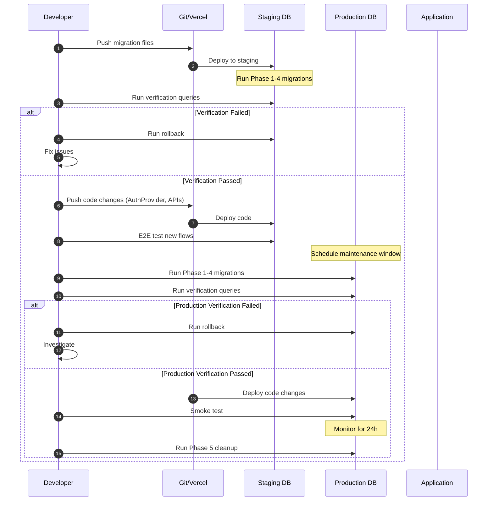

# PRD 41: Schema Migration Strategy

> **PRD Reference:** [PRD_41_Proxy_Refactor_Stability.md](../prds/PRD_41_Proxy_Refactor_Stability.md)  
> **Created:** 2026-01-13  
> **Risk Level:** 🟢 Low (Core migration already complete)
> **Status:** Schema 80% complete - only 3 columns to add

---

## Overview

This document details the **database schema completion** for PRD 41. The core migration from `proxy_members` to unified `users` table **has already been completed**.

### What's Already Done ✅

1. `managed_by` column added to `users` (FK to self)
2. `is_proxy` column added to `users`
3. `invite_code` column added to `users`
4. `proxy_members` table dropped
5. `submissions.proxy_member_id` column removed

### What's Remaining ❌

Only 3 columns need to be added:
1. `claims_remaining INTEGER DEFAULT 1`
2. `is_archived BOOLEAN DEFAULT false`
3. `deleted_at TIMESTAMPTZ`

---

## Current Schema Analysis

### Existing Tables Affected

```
┌─────────────────────────────────────────────────────────────────────────┐
│                          CURRENT STATE                                  │
├─────────────────────────────────────────────────────────────────────────┤
│                                                                         │
│  users                        proxy_members                             │
│  ─────                        ─────────────                             │
│  id (PK)                      id (PK)                                   │
│  display_name                 league_id (FK → leagues)  ← PROBLEM!      │
│  nickname                     display_name                              │
│  email                        created_by (FK → users)                   │
│  units                        created_at                                │
│  is_superadmin                invite_code                               │
│  created_at                                                             │
│                                                                         │
│  submissions                                                            │
│  ───────────                                                            │
│  id (PK)                                                                │
│  user_id (FK → users)                                                   │
│  proxy_member_id (FK → proxy_members)  ← REDUNDANT!                     │
│  league_id (FK → leagues)                                               │
│  for_date                                                               │
│  steps                                                                  │
│  ...                                                                    │
│                                                                         │
└─────────────────────────────────────────────────────────────────────────┘
```

### Data Volume Estimate

| Table | Estimated Rows | Migration Risk |
|-------|----------------|----------------|
| `users` | ~500 | Low (adding columns) |
| `proxy_members` | ~50 | Medium (moving data) |
| `submissions` | ~10,000 | High (FK update) |

---

## Target Schema

```
┌─────────────────────────────────────────────────────────────────────────┐
│                          TARGET STATE                                   │
├─────────────────────────────────────────────────────────────────────────┤
│                                                                         │
│  users (UNIFIED)                                                        │
│  ───────────────                                                        │
│  id (PK)                                                                │
│  display_name                                                           │
│  nickname                                                               │
│  email                           ← NULL for proxies                     │
│  units                                                                  │
│  is_superadmin                                                          │
│  managed_by (FK → users.id)      ← NEW: Self-referential                │
│  is_proxy (BOOLEAN)              ← NEW: Derived from managed_by         │
│  invite_code (UNIQUE)            ← NEW: For claim links                 │
│  claims_remaining (INT)          ← NEW: Default 1                       │
│  is_archived (BOOLEAN)           ← NEW: Activity decay                  │
│  deleted_at (TIMESTAMPTZ)        ← NEW: Soft delete                     │
│  created_at                                                             │
│                                                                         │
│  submissions (SIMPLIFIED)                                               │
│  ────────────────────────                                               │
│  id (PK)                                                                │
│  user_id (FK → users)            ← Always points to users.id            │
│  league_id (FK → leagues)                                               │
│  for_date                                                               │
│  steps                                                                  │
│  ... (proxy_member_id DROPPED)                                          │
│                                                                         │
│  proxy_members → DROPPED                                                │
│                                                                         │
└─────────────────────────────────────────────────────────────────────────┘
```

---

## Migration Steps

### Phase 1: Add Columns (Non-Breaking)

```sql
-- Migration: 20260113200001_add_proxy_columns.sql
-- This migration is SAFE - only adds columns, doesn't modify existing data

-- Step 1.1: Add new columns to users table
ALTER TABLE users ADD COLUMN IF NOT EXISTS managed_by UUID;
ALTER TABLE users ADD COLUMN IF NOT EXISTS is_proxy BOOLEAN DEFAULT false NOT NULL;
ALTER TABLE users ADD COLUMN IF NOT EXISTS invite_code TEXT;
ALTER TABLE users ADD COLUMN IF NOT EXISTS claims_remaining INTEGER DEFAULT 1;
ALTER TABLE users ADD COLUMN IF NOT EXISTS is_archived BOOLEAN DEFAULT false NOT NULL;
ALTER TABLE users ADD COLUMN IF NOT EXISTS deleted_at TIMESTAMPTZ;

-- Step 1.2: Add foreign key constraint (deferred for data migration)
-- NOT YET: ALTER TABLE users ADD CONSTRAINT users_managed_by_fkey 
--          FOREIGN KEY (managed_by) REFERENCES users(id) ON DELETE SET NULL;

-- Step 1.3: Add indexes
CREATE INDEX IF NOT EXISTS idx_users_managed_by ON users(managed_by) WHERE managed_by IS NOT NULL;
CREATE UNIQUE INDEX IF NOT EXISTS idx_users_invite_code ON users(invite_code) WHERE invite_code IS NOT NULL;
```

### Phase 2: Data Migration (Critical)

```sql
-- Migration: 20260113200002_migrate_proxy_data.sql
-- This migration MOVES data from proxy_members to users

-- Step 2.1: Insert proxy_members as users
-- We keep the same ID to maintain FK references
INSERT INTO users (
    id,
    display_name,
    managed_by,
    is_proxy,
    invite_code,
    claims_remaining,
    created_at,
    units,
    is_superadmin
)
SELECT 
    pm.id,
    pm.display_name,
    pm.created_by,     -- This becomes managed_by
    true,              -- is_proxy = true
    pm.invite_code,
    1,                 -- Default claims_remaining
    pm.created_at,
    'metric',          -- Default units for proxies
    false              -- Proxies are not superadmins
FROM proxy_members pm
WHERE NOT EXISTS (
    SELECT 1 FROM users u WHERE u.id = pm.id
);

-- Step 2.2: Handle ID collision (if proxy_member.id already exists in users)
-- This shouldn't happen normally, but handle gracefully
DO $$
DECLARE
    collision_record RECORD;
    new_id UUID;
BEGIN
    FOR collision_record IN 
        SELECT pm.* FROM proxy_members pm 
        JOIN users u ON pm.id = u.id
    LOOP
        -- Generate new UUID
        new_id := gen_random_uuid();
        
        -- Insert with new ID
        INSERT INTO users (id, display_name, managed_by, is_proxy, invite_code, claims_remaining, created_at, units, is_superadmin)
        VALUES (
            new_id,
            collision_record.display_name,
            collision_record.created_by,
            true,
            collision_record.invite_code,
            1,
            collision_record.created_at,
            'metric',
            false
        );
        
        -- Update submissions to point to new ID
        UPDATE submissions 
        SET proxy_member_id = NULL  -- Will be updated in next step
        WHERE proxy_member_id = collision_record.id;
        
        -- Create mapping for later reference
        INSERT INTO _migration_id_map (old_id, new_id, table_name)
        VALUES (collision_record.id, new_id, 'proxy_members');
    END LOOP;
END $$;
```

### Phase 3: Update Submissions FK

```sql
-- Migration: 20260113200003_update_submissions_fk.sql
-- Update submissions to use user_id instead of proxy_member_id

-- Step 3.1: For submissions with proxy_member_id, update user_id
-- The proxy now exists in users table with same ID
UPDATE submissions s
SET user_id = s.proxy_member_id
WHERE s.proxy_member_id IS NOT NULL
  AND s.user_id != s.proxy_member_id  -- Don't update if already correct
  AND EXISTS (SELECT 1 FROM users u WHERE u.id = s.proxy_member_id);

-- Step 3.2: Verify all submissions now have valid user_id
DO $$
DECLARE
    invalid_count INTEGER;
BEGIN
    SELECT COUNT(*) INTO invalid_count
    FROM submissions s
    WHERE s.proxy_member_id IS NOT NULL
      AND NOT EXISTS (SELECT 1 FROM users u WHERE u.id = s.user_id);
    
    IF invalid_count > 0 THEN
        RAISE EXCEPTION 'Migration failed: % submissions have invalid user_id', invalid_count;
    END IF;
END $$;
```

### Phase 4: Add Constraints & Triggers

```sql
-- Migration: 20260113200004_add_constraints.sql
-- Add FK constraint and sync trigger

-- Step 4.1: Add FK constraint for managed_by
ALTER TABLE users ADD CONSTRAINT users_managed_by_fkey 
    FOREIGN KEY (managed_by) REFERENCES users(id) ON DELETE SET NULL;

-- Step 4.2: Create trigger to sync is_proxy from managed_by
CREATE OR REPLACE FUNCTION sync_is_proxy()
RETURNS TRIGGER AS $$
BEGIN
    NEW.is_proxy := (NEW.managed_by IS NOT NULL);
    RETURN NEW;
END;
$$ LANGUAGE plpgsql;

DROP TRIGGER IF EXISTS trg_sync_is_proxy ON users;
CREATE TRIGGER trg_sync_is_proxy
    BEFORE INSERT OR UPDATE OF managed_by ON users
    FOR EACH ROW
    EXECUTE FUNCTION sync_is_proxy();

-- Step 4.3: Create orphan cleanup trigger
CREATE OR REPLACE FUNCTION cascade_manager_delete()
RETURNS TRIGGER AS $$
BEGIN
    IF NEW.deleted_at IS NOT NULL AND OLD.deleted_at IS NULL THEN
        UPDATE users
        SET deleted_at = NEW.deleted_at
        WHERE managed_by = NEW.id
          AND deleted_at IS NULL;
    END IF;
    RETURN NEW;
END;
$$ LANGUAGE plpgsql;

DROP TRIGGER IF EXISTS trg_cascade_manager_delete ON users;
CREATE TRIGGER trg_cascade_manager_delete
    AFTER UPDATE OF deleted_at ON users
    FOR EACH ROW
    EXECUTE FUNCTION cascade_manager_delete();
```

### Phase 5: Cleanup (Deferred)

```sql
-- Migration: 20260113200005_cleanup.sql
-- ONLY RUN AFTER VERIFYING ALL DATA IS CORRECT IN PRODUCTION

-- Step 5.1: Drop proxy_member_id column from submissions
ALTER TABLE submissions DROP COLUMN IF EXISTS proxy_member_id;

-- Step 5.2: Drop proxy_members table
DROP TABLE IF EXISTS proxy_members;

-- Step 5.3: Drop migration helper table
DROP TABLE IF EXISTS _migration_id_map;
```

---

## Rollback Plan

### Immediate Rollback (Before Cleanup)

If issues are found before Phase 5:

```sql
-- Rollback: Restore proxy_member_id references
UPDATE submissions s
SET proxy_member_id = s.user_id
FROM users u
WHERE u.id = s.user_id
  AND u.is_proxy = true
  AND u.managed_by IS NOT NULL;

-- Rollback: Delete proxy users from users table
DELETE FROM users WHERE is_proxy = true;

-- Rollback: Drop new columns
ALTER TABLE users DROP COLUMN IF EXISTS managed_by;
ALTER TABLE users DROP COLUMN IF EXISTS is_proxy;
ALTER TABLE users DROP COLUMN IF EXISTS invite_code;
ALTER TABLE users DROP COLUMN IF EXISTS claims_remaining;
ALTER TABLE users DROP COLUMN IF EXISTS is_archived;
ALTER TABLE users DROP COLUMN IF EXISTS deleted_at;
```

### Data Recovery (After Cleanup)

If cleanup has been run, restore from backup:

```sql
-- Restore proxy_members from backup
-- This requires having a backup of proxy_members table

-- Re-create table
CREATE TABLE proxy_members (
  id UUID PRIMARY KEY DEFAULT gen_random_uuid(),
  league_id UUID NOT NULL REFERENCES leagues(id) ON DELETE CASCADE,
  display_name TEXT NOT NULL,
  created_by UUID NOT NULL REFERENCES users(id),
  created_at TIMESTAMPTZ NOT NULL DEFAULT now(),
  invite_code TEXT UNIQUE
);

-- Restore data from backup
INSERT INTO proxy_members SELECT * FROM backup_proxy_members;

-- Re-add proxy_member_id column
ALTER TABLE submissions ADD COLUMN proxy_member_id UUID REFERENCES proxy_members(id);

-- Restore FK references
-- (Would need mapping table from migration)
```

---

## Verification Queries

### Pre-Migration Checks

```sql
-- Count current proxy_members
SELECT COUNT(*) as proxy_count FROM proxy_members;

-- Count submissions with proxy_member_id
SELECT COUNT(*) as proxy_submissions 
FROM submissions 
WHERE proxy_member_id IS NOT NULL;

-- Check for orphaned proxy submissions
SELECT COUNT(*) as orphaned 
FROM submissions s
LEFT JOIN proxy_members pm ON s.proxy_member_id = pm.id
WHERE s.proxy_member_id IS NOT NULL
  AND pm.id IS NULL;
```

### Post-Migration Checks

```sql
-- Verify all proxies migrated
SELECT 
    (SELECT COUNT(*) FROM users WHERE is_proxy = true) as user_proxies,
    (SELECT COUNT(*) FROM proxy_members) as old_proxies;

-- Verify submissions integrity
SELECT 
    COUNT(*) as total_submissions,
    SUM(CASE WHEN user_id IS NOT NULL AND EXISTS (SELECT 1 FROM users WHERE id = submissions.user_id) THEN 1 ELSE 0 END) as valid_submissions
FROM submissions;

-- Verify proxy visibility (only manager can see)
SELECT 
    u.id,
    u.display_name,
    u.managed_by,
    m.display_name as manager_name
FROM users u
JOIN users m ON u.managed_by = m.id
WHERE u.is_proxy = true;
```

---

## Risk Assessment

| Risk | Likelihood | Impact | Mitigation |
|------|------------|--------|------------|
| Data loss during migration | Low | Critical | Backup + Verify queries |
| FK constraint violation | Medium | High | Phased approach with validation |
| ID collision | Very Low | Medium | Collision handler in migration |
| Performance during migration | Low | Medium | Run during low-traffic window |
| Application errors | Medium | High | Feature flag + code deployment timing |

---

## Deployment Sequence



---

## Timeline

| Phase | Duration | Dependencies |
|-------|----------|--------------|
| Phase 1: Add Columns | 5 min | None |
| Phase 2: Data Migration | 10 min | Phase 1 |
| Phase 3: Update Submissions | 15 min | Phase 2 |
| Phase 4: Constraints | 5 min | Phase 3 |
| Verification | 30 min | Phase 4 |
| Code Deployment | 10 min | Verification |
| Phase 5: Cleanup | 5 min | 24h monitoring |

**Total Estimated Time:** ~1.5 hours (excluding monitoring period)

---

## Changelog

| Date | Section | Change |
|------|---------|--------|
| 2026-01-13 | Initial | Created schema migration strategy |
| 2026-01-13 | Rollback | Added detailed rollback procedures |
| 2026-01-13 | Verification | Added pre/post migration queries |
