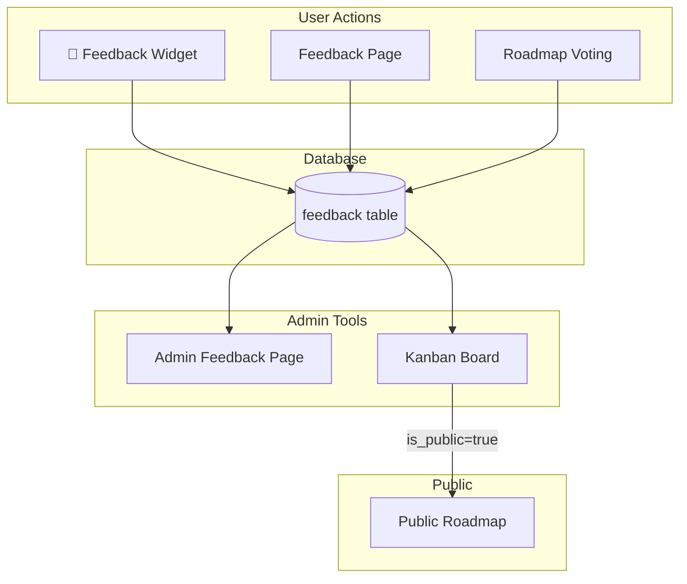

```mermaid
graph TB
    subgraph "User Actions"
        FeedbackWidget[💬 Feedback Widget]
        FeedbackPage[Feedback Page]
        RoadmapVote[Roadmap Voting]
    end
    
    subgraph "Database"
        FeedbackTable[(feedback table)]
    end
    
    subgraph "Admin Tools"
        AdminFeedback[Admin Feedback Page]
        Kanban[Kanban Board]
    end
    
    subgraph "Public"
        Roadmap[Public Roadmap]
    end
    
    FeedbackWidget --> FeedbackTable
    FeedbackPage --> FeedbackTable
    FeedbackTable --> AdminFeedback
    FeedbackTable --> Kanban
    Kanban -->|is_public=true| Roadmap
    RoadmapVote --> FeedbackTable
```
