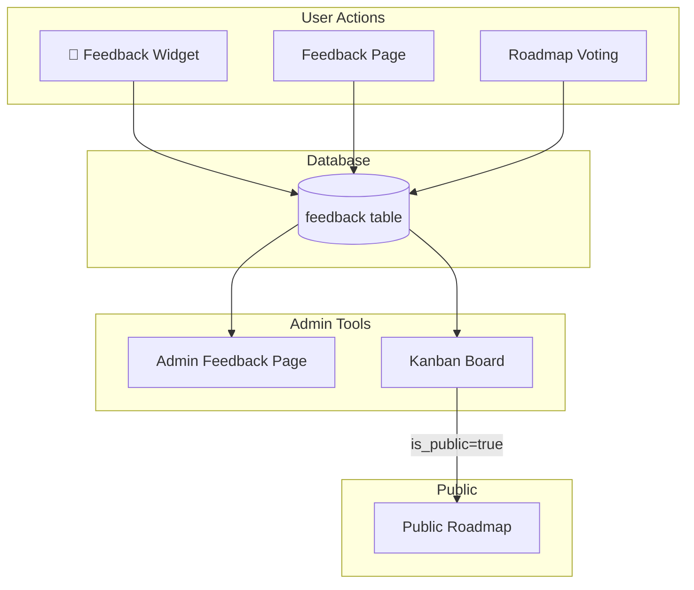

---
## Document Context
**What**: Mermaid diagram showing the feedback system data flow — from user-facing widget/page/roadmap voting through the feedback DB table to admin tools and public roadmap
**Why**: Quick visual reference for understanding how feedback submissions flow through the system
**Status**: Current
**Last verified**: 2026-03-29
**Agent note**: This summary should be sufficient to assess relevance. Only read further if this document matches your current task.
---

