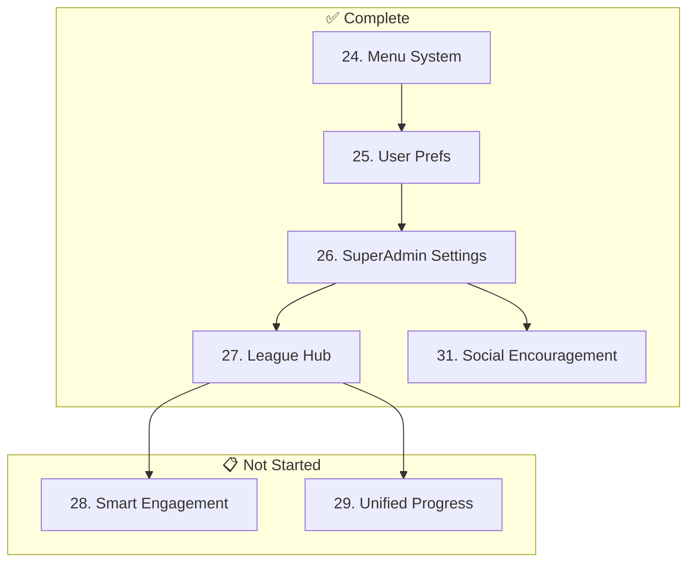

# Admin Feedback & Roadmap System - PRD Index

> **Purpose:** Re-implement and enhance the admin feedback management system.
>
> These PRDs describe WHAT is needed, not HOW to implement. The implementing agent decides the best approach.
>
> **Last Updated:** 2026-01-17

---

## ⚠️ Agent Instructions (MANDATORY)

**Before starting ANY PRD, the implementing agent MUST:**

1. Read `AGENTS.md` for critical rules and documentation requirements
2. Read `README.md` for project overview
3. Check completed PRDs for context
4. Follow all documentation update rules

---

## Completed Phases

### Foundation (PRDs 1-23) ✅
| # | PRD | Status |
|---|-----|--------|
| 1-3 | Database, APIs, Search | ✅ Complete |
| 4-6 | API Handler, Data Fetching, Badges | ✅ Complete |
| 7-9 | Navigation, Homepage, Feedback Page | ✅ Complete |
| 10-13 | Bulk Actions, Saved Views | ✅ Complete |
| 14-15 | Analytics, Page Layout | ✅ Complete |
| 16-18 | Import/Export, Roadmap, Docs | ✅ Complete |
| 19-20 | League Start, Cards | ✅ Complete |
| 21 | shadcn/ui Integration | ✅ Complete |
| 22 | PWA & Offline Support | ✅ Complete |
| 23 | Global Leaderboard | ✅ Complete |

### Alpha Stage (PRDs 24-31) ✅
| # | PRD Title | Outcome | Status |
|---|-----------|---------|--------|
| 24 | [Menu Backend System](./PRD_24_Menu_Backend.md) | Database-backed menu management | ✅ Complete |
| 25 | [User Preferences](./PRD_25_User_Preferences.md) | Modular settings architecture | ✅ Complete |
| 26 | [SuperAdmin Settings](./PRD_26_SuperAdmin_Settings.md) | App-wide config & feature flags | ✅ Complete |
| 27 | [League Hub Redesign](./PRD_27_League_Hub.md) | New league landing experience | ✅ Complete |
| 30 | [Duplicate Resolution](./PRD_30_Duplicate_Resolution.md) | Smart conflict handling UI | ✅ Complete |
| 31 | [Social Encouragement](./PRD_31_Social_Encouragement.md) | High-fives & cheer prompts | ✅ Complete |
| 33 | [Pricing & How It Works](./PRD_33_Pricing_HowItWorks.md) | Freemium model explanation | ✅ Complete |

### Infrastructure (PRDs 38-39, 41, Branding) ✅
| # | PRD Title | Outcome | Status |
|---|-----------|---------|--------|
| 38 | [Notification Infrastructure](./PRD_38_Notification_Infrastructure.md) | Database schema for notifications | ✅ Complete (Schema) |
| 39 | [Performance Architecture](./PRD_39_Performance_Architecture.md) | Server Components, Hybrid Caching | ✅ Complete |
| 41 | [Proxy Refactor Stability](../PRD_41_Proxy_Refactor_Stability.md) | Robust proxy claim process | ✅ Complete |
| — | [Modular Branding System](../PRD_Modular_Branding_System.md) | Custom logos, favicons, PWA icons | ✅ Complete |

---

## Not Started (Remaining Work)

### Core UX - High Priority
| # | PRD Title | Outcome | Status |
|---|-----------|---------|--------|
| 28 | [Smart Engagement](./PRD_28_Smart_Engagement.md) | Missed day prompt & streak warnings | 📋 Proposed |
| 29 | [Unified Progress](./PRD_29_Unified_Progress.md) | Merged analytics/leaderboard view | 📋 Proposed |

### Growth & Marketing
| # | PRD Title | Outcome | Status |
|---|-----------|---------|--------|
| 32 | [Admin Analytics](./PRD_32_Admin_Analytics.md) | Business KPI dashboard | 📋 Proposed |
| 34 | [B2B Landing Pages](./PRD_34_B2B_Landing.md) | Corporate team sales funnel | 📋 Proposed |
| 35 | [SEO Comparison Pages](./PRD_35_SEO_Comparison.md) | "StepLeague vs X" pages | 📋 Proposed |

### Ongoing Maintenance
| # | PRD | Outcome | Status |
|---|-----|---------|--------|
| 36 | [Technical Debt](./PRD_36_Technical_Debt.md) | Cleanup, Refactoring & Optimization | 🔄 Ongoing |
| 42 | [Test Coverage Expansion](./PRD_42_Test_Coverage_Expansion.md) | Expand test coverage from ~6% to 70% | 📋 Proposed |

### Future Foundation (Schema Now, Features Later)
| # | PRD | Outcome | Status |
|---|-----|---------|--------|
| 37 | [In-App Chat](./PRD_37_In_App_Chat.md) | Database schema for future chat/messaging | 📋 Proposed |
| 40 | [Submission Audit](./PRD_40_Submission_Audit.md) | Abuse detection & audit logs | 📋 Proposed |

---

## Summary

| Category | Count |
|----------|-------|
| ✅ Complete | 35 PRDs |
| 📋 Proposed | 7 PRDs |
| 🔄 Ongoing | 1 PRD |

---

## Dependency Graph

