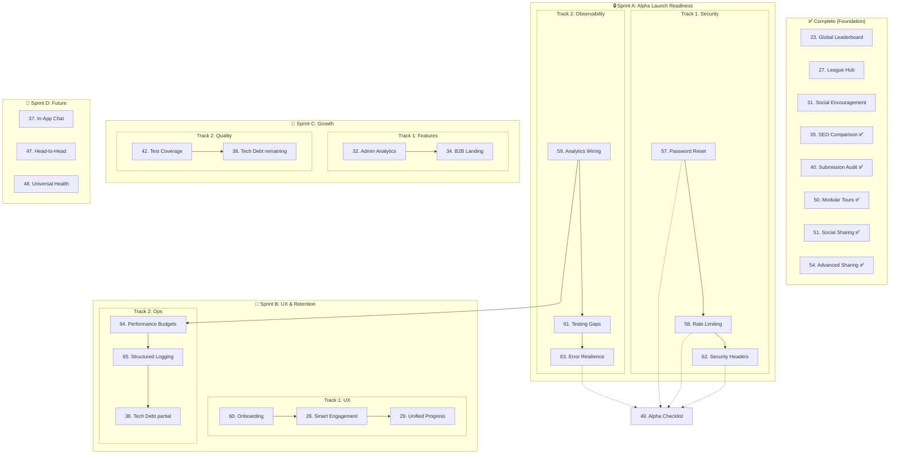

# StepLeague PRD Index

> **Purpose:** Master index of all Product Requirement Documents. Tracks status, dependencies, and sprint execution order.
>
> These PRDs describe WHAT is needed, not HOW to implement. The implementing agent decides the best approach.
>
> **Last Updated:** 2026-02-27
> **Total PRDs:** 66 (47 complete, 2 partial, 2 in-progress, 15 proposed)

---

## ⚠️ Agent Instructions (MANDATORY)

**Before starting ANY PRD, the implementing agent MUST:**

1. Read `AGENTS.md` for critical rules and documentation requirements
2. Read `.agent/skills/prd-creation/SKILL.md` for PRD standards
3. Read all skills referenced in the specific PRD's Agent Context section
4. Check completed PRDs for context and patterns
5. Follow all documentation update rules

---

## Standard PRD Requirements

All implementing agents MUST follow these standards:

### Before Starting
- Read `AGENTS.md` and all referenced skills
- Read the specific PRD's Agent Context section for key files and patterns

### During Implementation
- Use `withApiHandler` for all API routes
- Use `adminClient` for all database operations in API routes
- No `<Database>` generics on Supabase clients
- Mobile-first styling (base = mobile, add `md:`, `lg:` for larger screens)
- Use shadcn/ui components and CSS variables
- Use MCP servers listed in the PRD for verification

### Testing
- Include **Vitest unit tests** for new logic (hooks, utilities, API routes)
- Include **Playwright E2E tests** for user-facing behavior
- Run `npx tsc --noEmit` — zero type errors
- Run `npm test` — all tests pass

### After Completion
- Update `CHANGELOG.md` with changes
- Update `AGENTS.md` if new patterns introduced
- Update relevant skill file if skill patterns change
- **Update this file (`PRD_00_Index.md`)** — change PRD status to ✅ Complete
- **Git commit** — Stage all PRD changes and commit with conventional message: `type(scope): PRD XX — short description`

---

## Task-Optimized PRD Structure

PRDs are structured for Claude Code's task-based agent system:

- **`[READ-ONLY]`** tasks = Research, audit, exploration (no file changes)
- **`[WRITE]`** tasks = Implementation, creating/editing files
- **`[PARALLEL]`** = Independent tasks that can run simultaneously via subagents
- **`[SEQUENTIAL]`** = Tasks that depend on prior steps completing

See `.agent/skills/prd-creation/SKILL.md` for full details on agent types, task structures, and sprint patterns.

---

## Completed Phases (Historical Reference)

### Foundation (PRDs 1-23) ✅
| # | PRD | Status |
|---|-----|--------|
| 1-3 | Database, APIs, Search | ✅ Complete |
| 4-6 | API Handler, Data Fetching, Badges | ✅ Complete |
| 7-9 | Navigation, Homepage, Feedback Page | ✅ Complete |
| 10-13 | Bulk Actions, Saved Views | ✅ Complete |
| 14-15 | Analytics, Page Layout | ✅ Complete |
| 16-18 | Import/Export, Roadmap, Docs | ✅ Complete |
| 19-20 | League Start, Cards | ✅ Complete |
| 21 | shadcn/ui Integration | ✅ Complete |
| 22 | PWA & Offline Support | ✅ Complete |
| 23 | Global Leaderboard | ✅ Complete |

### Alpha Stage (PRDs 24-31) ✅
| # | PRD Title | Outcome | Status |
|---|-----------|---------|--------|
| 24 | [Menu Backend System](./PRD_24_Menu_Backend.md) | Database-backed menu management | ✅ Complete |
| 25 | [User Preferences](./PRD_25_User_Preferences.md) | Modular settings architecture | ✅ Complete |
| 26 | [SuperAdmin Settings](./PRD_26_SuperAdmin_Settings.md) | App-wide config & feature flags | ✅ Complete |
| 27 | [League Hub Redesign](./PRD_27_League_Hub.md) | New league landing experience | ✅ Complete |
| 30 | [Duplicate Resolution](./PRD_30_Duplicate_Resolution.md) | Smart conflict handling UI | ✅ Complete |
| 31 | [Social Encouragement](./PRD_31_Social_Encouragement.md) | High-fives & cheer prompts | ✅ Complete |
| 33 | [Pricing & How It Works](./PRD_33_Pricing_HowItWorks.md) | Freemium model explanation | ✅ Complete |

### Infrastructure (PRDs 38-39, 41, Branding) ✅
| # | PRD Title | Outcome | Status |
|---|-----------|---------|--------|
| 38 | [Notification Infrastructure](./PRD_38_Notification_Infrastructure.md) | Database schema for notifications | ✅ Complete (Schema) |
| 39 | [Performance Architecture](./PRD_39_Performance_Architecture.md) | Server Components, Hybrid Caching | ✅ Complete |
| 41 | [Proxy Refactor Stability](../PRD_41_Proxy_Refactor_Stability.md) | Robust proxy claim process | ✅ Complete |
| — | [Modular Branding System](../PRD_Modular_Branding_System.md) | Custom logos, favicons, PWA icons | ✅ Complete |

### Sprint 1: Alpha Launch (PRDs 43-50) ✅
*Goal: Get first 5-50 users testing. Core value prop must work.*

| Order | PRD | Why This Order | Status |
|-------|-----|----------------|--------|
| 1 | **[PRD 43] Nickname Identity** | Cannot have public World League without privacy-safe display names | ✅ Complete |
| 2 | **[PRD 44] Auto-Enroll World League** | Solves "empty state" — new users have leaderboard immediately | ✅ Complete |
| 3 | **[PRD 45] Why Upload Daily** | Explains manual screenshot value prop (privacy, anti-cheat) | ✅ Complete |
| 4 | **[PRD 46] Points System (Design)** | Document scoring rules so users understand rankings | ✅ Complete |
| 5 | **[PRD 50] Modular Tour System** | Rebuild onboarding for new user experience | ✅ Complete |
| 6 | **[PRD 49] Alpha Checklist** | Verify all flows work before inviting users | 🔄 In Progress |

**Sprint 1 Gate:** ✅ New user can sign up → see nickname on World League → complete onboarding tour → understand why uploading matters

### Sprint 2: Social Sharing & Virality (PRDs 51-56) ✅
*Goal: Make it easy and appealing to share achievements. Drive organic growth through WhatsApp groups.*

| Order | PRD | Why This Order | Status |
|-------|-----|----------------|--------|
| 7 | **[PRD 51] Social Sharing & Stats Hub** | Core sharing infrastructure — generates beautiful cards | ✅ Complete |
| 8 | **[PRD 52] Sharing Tour** | Teach users how to share (depends on PRD 51) | ✅ Complete |
| 9 | **[PRD 53] Sharing Marketing Page** | SEO page for /how-to-share | ✅ Complete |
| 10 | **[PRD 54] Advanced Sharing Features** | Custom date ranges, friend challenges, trend visualization | ✅ Complete |
| 11 | **[PRD 55] Navigation Menu Consistency** | Fix public menu on marketing pages for guests | ✅ Complete |
| 12 | **[PRD 56] Sharing Encouragement** | Share streaks, insights, nudges, analytics | ✅ Complete |

**Sprint 2 Gate:** ✅ Users can share achievements as beautiful cards → New users discover app via shared links → Sharing tour teaches the feature

### Completed Between Sprints
| # | PRD Title | Outcome | Status |
|---|-----------|---------|--------|
| 35 | [SEO Comparison Pages](./PRD_35_SEO_Comparison.md) | "StepLeague vs X" pages with SSG, JSON-LD, modular registry | ✅ Complete |
| 40 | [Submission Audit](./PRD_40_Submission_Audit.md) | `submission_changes` table, audit logging in bulk/[id] routes | ✅ Complete |

---

## Current Work (Incomplete PRDs)

### Partially Complete
| # | PRD Title | Done | Remaining | Status |
|---|-----------|------|-----------|--------|
| 28 | [Smart Engagement](./PRD_28_Smart_Engagement.md) | Streak freeze (in `appSettings.ts` + `user_preferences`) | Missed-day UI, streak warning components | 🟨 Partial |
| 32 | [Admin Analytics](./PRD_32_Admin_Analytics.md) | UI scaffold at `/admin/analytics`, tour analytics sub-module | KPI data integration, trend charts, export | 🟨 Partial |

### In Progress
| # | PRD Title | Status |
|---|-----------|--------|
| 36 | [Technical Debt](./PRD_36_Technical_Debt.md) | 🔄 In Progress |
| 49 | [Alpha Launch Checklist](./PRD_49_Alpha_Launch_Checklist.md) | 🔄 In Progress |

### Proposed
| # | PRD Title | Outcome | Status |
|---|-----------|---------|--------|
| 29 | [Unified Progress](./PRD_29_Unified_Progress.md) | Merged analytics/leaderboard view | 📋 Proposed |
| 34 | [B2B Landing Pages](./PRD_34_B2B_Landing.md) | Corporate team sales funnel | 📋 Proposed |
| 37 | [In-App Chat](./PRD_37_In_App_Chat.md) | Database schema for future chat | 📋 Proposed |
| 42 | [Test Coverage Expansion](./PRD_42_Test_Coverage_Expansion.md) | Expand test coverage to 70% | 📋 Proposed |
| 47 | [Head-to-Head Leagues](./PRD_47_Head_To_Head_Leagues.md) | FPL-style weekly matchups (Design) | 📋 Proposed |
| 48 | [Universal Health Measurement](./PRD_48_Universal_Health_Measurement.md) | Multi-activity SLP conversion (Vision) | 📋 Proposed |
| 57 | [Password Reset Flow](./PRD_57_Password_Reset_Flow.md) | Users can recover forgotten passwords | ✅ Complete |
| 58 | [API Rate Limiting](./PRD_58_Rate_Limiting.md) | Endpoints protected from abuse and spam | ✅ Complete |
| 59 | [Analytics Implementation](./PRD_59_Analytics_Implementation.md) | Wire up page views, error tracking, performance | 📋 Proposed |
| 60 | [UX Onboarding](./PRD_60_UX_Onboarding.md) | First 5 minutes guided experience | ✅ Complete |
| 61 | [Testing Gaps](./PRD_61_Testing_Gaps.md) | January regression prevention tests | 📋 Proposed |
| 62 | [Security Headers & CSP](./PRD_62_Security_Headers.md) | OWASP security headers baseline | ✅ Complete |
| 63 | [Client Error Resilience](./PRD_63_Client_Error_Resilience.md) | AbortController + timeouts for SA users | 📋 Proposed |
| 64 | [Performance Budgets & RUM](./PRD_64_Performance_Budgets.md) | Web Vitals + real user monitoring | 📋 Proposed |
| 65 | [Structured Logging & Health Check](./PRD_65_Structured_Logging.md) | JSON structured logging + `/api/health` | 📋 Proposed |
| 66 | [Fix Broken Tests](./PRD_66_Fix_Broken_Tests.md) | Fix 40 pre-existing test failures (env mocks) | 📋 Proposed |

---

## 🏃 Sprint Planning (Execution Order)

> **Principle:** Sprints use 2 parallel tracks to maximize throughput. Within each track, tasks are sequential. Tracks run in parallel.

### Sprint A: Alpha Launch Readiness (~1 week, 2 parallel tracks)
*Goal: Eliminate all blockers. After this sprint, first 5-10 users can be invited safely.*

**Track 1 — Security & Auth** [SEQUENTIAL within track]
| Order | PRD | Title | Effort | Skills |
|-------|-----|-------|--------|--------|
| A1.1 | **57** | [Password Reset Flow](./PRD_57_Password_Reset_Flow.md) | 3-4h | `auth-patterns`, `form-components`, `supabase-patterns` |
| A1.2 | **58** | [API Rate Limiting](./PRD_58_Rate_Limiting.md) | 2-3h | `api-handler`, `error-handling` |
| A1.3 | **62** | [Security Headers & CSP](./PRD_62_Security_Headers.md) | 1-2h | `middleware-patterns` |

**Track 2 — Observability & Quality** [SEQUENTIAL within track, PARALLEL to Track 1]
| Order | PRD | Title | Effort | Skills |
|-------|-----|-------|--------|--------|
| A2.1 | **59** | [Analytics Implementation](./PRD_59_Analytics_Implementation.md) | 3-4h | `analytics-tracking`, `error-handling` |
| A2.1b | **66** | [Fix Broken Tests](./PRD_66_Fix_Broken_Tests.md) | 1-2h | `testing-patterns`, `react-debugging` |
| A2.2 | **61** | [Testing Gaps](./PRD_61_Testing_Gaps.md) | 3-4h | `testing-patterns`, `react-debugging`, `auth-patterns` |
| A2.3 | **63** | [Client Error Resilience](./PRD_63_Client_Error_Resilience.md) | 3-4h | `error-handling`, `react-debugging` |

**Gate:** PRD 49 updated. Password reset works E2E. Rate limits active. Security headers present. Analytics on key pages. Firefox/WebKit E2E pass.

---

### Sprint B: UX & Retention (~1.5 weeks, 2 parallel tracks)
*Goal: First 5 minutes delightful. Users come back daily. Operational visibility.*

**Track 1 — User Experience** [SEQUENTIAL]
| Order | PRD | Title | Effort | Skills |
|-------|-----|-------|--------|--------|
| B1.1 | **60** | [UX Onboarding (First 5 Min)](./PRD_60_UX_Onboarding.md) | 4-6h | `design-system`, `form-components`, `analytics-tracking` |
| B1.2 | **28** | [Smart Engagement (remaining)](./PRD_28_Smart_Engagement.md) | 3-4h | `design-system`, `supabase-patterns`, `analytics-tracking` |
| B1.3 | **29** | [Unified Progress](./PRD_29_Unified_Progress.md) | 4-6h | `design-system`, `architecture-philosophy`, `analytics-tracking` |

**Track 2 — Operational Readiness** [SEQUENTIAL, PARALLEL to Track 1]
| Order | PRD | Title | Effort | Skills |
|-------|-----|-------|--------|--------|
| B2.1 | **64** | [Performance Budgets & RUM](./PRD_64_Performance_Budgets.md) | 3-4h | `analytics-tracking`, `architecture-philosophy` |
| B2.2 | **65** | [Structured Logging & Health Check](./PRD_65_Structured_Logging.md) | 2-3h | `api-handler`, `error-handling` |
| B2.3 | **36** | [Technical Debt (partial)](./PRD_36_Technical_Debt.md) | 3-4h | `architecture-philosophy`, `typescript-debugging` |

**Gate:** New user first submission <3 min. Missed-day prompts work. Web Vitals reported. `/api/health` live.

---

### Sprint C: Growth Preparation (~1.5 weeks, 2 parallel tracks)
*Goal: Product Hunt readiness. SEO indexed. Admin metrics. Test confidence.*

**Track 1 — Growth Features** [SEQUENTIAL]
| Order | PRD | Title | Effort | Skills |
|-------|-----|-------|--------|--------|
| C1.1 | **32** | [Admin Analytics (remaining: KPI data)](./PRD_32_Admin_Analytics.md) | 4-6h | `supabase-patterns`, `design-system`, `api-handler` |
| C1.2 | **34** | [B2B Landing Pages](./PRD_34_B2B_Landing.md) | 4-6h | `design-system`, `form-components` |

**Track 2 — Quality & Stability** [SEQUENTIAL, PARALLEL to Track 1]
| Order | PRD | Title | Effort | Skills |
|-------|-----|-------|--------|--------|
| C2.1 | **42** | [Test Coverage Expansion](./PRD_42_Test_Coverage_Expansion.md) | 6-8h | `testing-patterns`, `api-handler` |
| C2.2 | **36** | [Technical Debt (remaining parts)](./PRD_36_Technical_Debt.md) | 3-4h | `architecture-philosophy` |

**Gate:** Test coverage >40% critical paths. Admin dashboard shows live data. B2B pages exist.

---

### Sprint D: Future Vision (ongoing, trigger-based)
| PRD | Title | Trigger |
|-----|-------|---------|
| **37** | [In-App Chat (schema only)](./PRD_37_In_App_Chat.md) | When users request messaging |
| **47** | [Head-to-Head Leagues](./PRD_47_Head_To_Head_Leagues.md) | When user demand exists (>100 users) |
| **48** | [Universal Health Measurement](./PRD_48_Universal_Health_Measurement.md) | Long-term vision |

---

## MCP Servers

Available MCP servers for PRD verification:

| Server | URL/Package | Auth | Use For |
|--------|-------------|------|---------|
| Supabase | `mcp.supabase.com` | Bearer token | DB queries, schema verification |
| GTM Stape | `gtm-mcp.stape.ai` | OAuth browser | Tag/trigger creation, container management |
| GA4 Stape | `mcp-ga.stape.ai` | OAuth browser | Reports, verify tracking |
| PostHog | `mcp.posthog.com` | OAuth browser | Insights, flags, events |
| Playwright | `@executeautomation/playwright-mcp-server` | None | E2E automation |

---

## Summary

| Category | Count | PRDs |
|----------|-------|------|
| ✅ Complete | 47 | 1-27, 30-31, 33, 35, 38-41, 43-46, 50-58, 62 |
| 🟨 Partial | 2 | 28, 32 |
| 🔄 In Progress | 2 | 36, 49 |
| 📋 Proposed | 15 | 29, 34, 37, 42, 47, 48, 59-61, 63-66 |
| **Total** | **66** | |

---

## Dependency Graph

```mermaid
graph TD
    subgraph "✅ Complete (Foundation)"
        PRD23[23. Global Leaderboard]
        PRD27[27. League Hub]
        PRD31[31. Social Encouragement]
        PRD35[35. SEO Comparison ✅]
        PRD40[40. Submission Audit ✅]
        PRD50[50. Modular Tours ✅]
        PRD51[51. Social Sharing ✅]
        PRD54[54. Advanced Sharing ✅]
    end

    subgraph "🔒 Sprint A: Alpha Launch Readiness"
        direction TB
        subgraph "Track 1: Security"
            PRD57[57. Password Reset]
            PRD58[58. Rate Limiting]
            PRD62[62. Security Headers]
            PRD57 --> PRD58 --> PRD62
        end
        subgraph "Track 2: Observability"
            PRD59[59. Analytics Wiring]
            PRD61[61. Testing Gaps]
            PRD63[63. Error Resilience]
            PRD59 --> PRD61 --> PRD63
        end
    end

    subgraph "🎯 Sprint B: UX & Retention"
        direction TB
        subgraph "Track 1: UX"
            PRD60[60. Onboarding]
            PRD28[28. Smart Engagement]
            PRD29[29. Unified Progress]
            PRD60 --> PRD28 --> PRD29
        end
        subgraph "Track 2: Ops"
            PRD64[64. Performance Budgets]
            PRD65[65. Structured Logging]
            PRD36a[36. Tech Debt partial]
            PRD64 --> PRD65 --> PRD36a
        end
    end

    subgraph "🚀 Sprint C: Growth"
        direction TB
        subgraph "Track 1: Features"
            PRD32[32. Admin Analytics]
            PRD34[34. B2B Landing]
            PRD32 --> PRD34
        end
        subgraph "Track 2: Quality"
            PRD42[42. Test Coverage]
            PRD36b[36. Tech Debt remaining]
            PRD42 --> PRD36b
        end
    end

    subgraph "🔮 Sprint D: Future"
        PRD37[37. In-App Chat]
        PRD47[47. Head-to-Head]
        PRD48[48. Universal Health]
    end

    %% Cross-sprint dependencies
    PRD59 --> PRD64
    PRD62 -.-> PRD49[49. Alpha Checklist]
    PRD63 -.-> PRD49
    PRD57 -.-> PRD49
    PRD58 -.-> PRD49
```

**Legend:**
- `-->` = Hard dependency (must complete first)
- `-.->` = Soft dependency (sprint gate / contributes to)

---

## Best Practice References

| Area | Standard | Notes |
|------|----------|-------|
| Password Reset | NIST 800-63B | Min 8 chars, no forced complexity, never reveal if email exists |
| Rate Limiting | RFC 6585 | 429 + `Retry-After` header, sliding window algorithm |
| Security Headers | OWASP Secure Headers Project | CSP, HSTS, X-Frame-Options, Referrer-Policy |
| Web Vitals | Google Thresholds | LCP <2.5s, INP <200ms, CLS <0.1 (SA mobile: LCP 3.5s allowance) |
| Structured Logging | 12-Factor App | JSON format, Vercel Log Drain compatible |
| Analytics | Client-side only | `useEffect` for page views (not SSR), fire-and-forget |
| Auth | Supabase PKCE | `resetPasswordForEmail()` + `PASSWORD_RECOVERY` event |
| Serverless Caveat | Vercel | In-memory state resets on cold start. Upstash Redis for production rate limiting. |

---

## Changelog

| Date | Change |
|------|--------|
| 2026-01-20 | Added Sprint Planning section with prioritized execution order |
| 2026-01-20 | Updated Dependency Graph to show Sprint 1/2/3 structure |
| 2026-01-20 | Added PRDs 43-49 for Alpha Launch preparation |
| 2026-01-20 | Enhanced PRDs 43-49 with Systems/Design Considerations and Proactive items |
| 2026-01-29 | Added PRD-56 (Sharing Encouragement) extracted from PRD-54 Phase 4 |
| 2026-01-29 | Added PRD-56 to Sprint 3 (Retention & Engagement) |
| 2026-02-27 | Added PRDs 57-61 from Alpha Readiness Audit |
| 2026-02-27 | Created PRDs 62-65 (Security Headers, Client Error Resilience, Performance Budgets, Structured Logging) |
| 2026-02-27 | **Major reorganization:** Corrected stale statuses (PRDs 35, 40, 53, 54 → Complete; 28, 32 → Partial) |
| 2026-02-27 | Restructured sprints into parallel tracks (Sprint A/B/C/D) with dependency ordering |
| 2026-02-27 | Added Standard PRD Requirements, Task-Optimized Structure, MCP Servers, Best Practice References |
| 2026-02-27 | Updated all incomplete PRDs to new standard (Agent Context, MCPs, task structure, test requirements, doc checklist) |
| 2026-02-27 | Updated `prd-creation` skill v2.0 with Claude Code task system, MCP references, mandatory standards |
| 2026-02-27 | PRD 57 (Password Reset Flow) → ✅ Complete. Supabase PKCE recovery with NIST 800-63B compliance. |
| 2026-02-27 | Created PRD 66 (Fix Broken Tests) — 40 pre-existing test failures from missing env mocks. Added to Sprint A Track 2. |
| 2026-02-27 | PRD 58 (API Rate Limiting) → ✅ Complete. In-memory sliding window via `withApiHandler` config. 7 endpoints protected. 14 unit tests + E2E. |
| 2026-02-27 | PRD 62 (Security Headers & CSP) → ✅ Complete. OWASP baseline headers via `next.config.js` `headers()`. 14 unit tests + E2E. |
