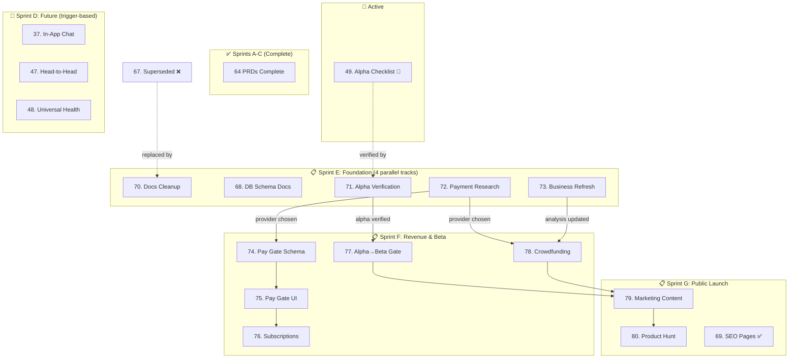

# StepLeague PRD Index

> **Purpose:** Master index of all Product Requirement Documents. Tracks status, dependencies, and sprint execution order.
>
> These PRDs describe WHAT is needed, not HOW to implement. The implementing agent decides the best approach.
>
> **Last Updated:** 2026-03-29
> **Total PRDs:** 80 (65 complete, 0 partial, 1 in-progress, 14 proposed, 1 superseded)

---

## ⚠️ Agent Instructions (MANDATORY)

**Before starting ANY PRD, the implementing agent MUST:**

1. Read `AGENTS.md` for critical rules and documentation requirements
2. Read `.agent/skills/prd-creation/SKILL.md` for PRD standards
3. Read all skills referenced in the specific PRD's Agent Context section
4. Check completed PRDs for context and patterns
5. Follow all documentation update rules

---

## Standard PRD Requirements

All implementing agents MUST follow these standards:

### Before Starting
- Read `AGENTS.md` and all referenced skills
- Read the specific PRD's Agent Context section for key files and patterns

### During Implementation
- Use `withApiHandler` for all API routes
- Use `adminClient` for all database operations in API routes
- No `<Database>` generics on Supabase clients
- Mobile-first styling (base = mobile, add `md:`, `lg:` for larger screens)
- Use shadcn/ui components and CSS variables
- Use MCP servers listed in the PRD for verification

### Testing
- Include **Vitest unit tests** for new logic (hooks, utilities, API routes)
- Include **Playwright E2E tests** for user-facing behavior
- Run `npx tsc --noEmit` — zero type errors
- Run `npm test` — all tests pass

### After Completion
- Update `CHANGELOG.md` with changes
- Update `AGENTS.md` if new patterns introduced
- Update relevant skill file if skill patterns change
- **Update this file (`PRD_00_Index.md`)** — change PRD status to ✅ Complete
- **Git commit** — Stage all PRD changes and commit with conventional message: `type(scope): PRD XX — short description`

---

## Task-Optimized PRD Structure

PRDs are structured for Claude Code's task-based agent system:

- **`[READ-ONLY]`** tasks = Research, audit, exploration (no file changes)
- **`[WRITE]`** tasks = Implementation, creating/editing files
- **`[PARALLEL]`** = Independent tasks that can run simultaneously via subagents
- **`[SEQUENTIAL]`** = Tasks that depend on prior steps completing

See `.agent/skills/prd-creation/SKILL.md` for full details on agent types, task structures, and sprint patterns.

---

## Completed Phases (Historical Reference)

### Foundation (PRDs 1-23) ✅
| # | PRD | Status |
|---|-----|--------|
| 1-3 | Database, APIs, Search | ✅ Complete |
| 4-6 | API Handler, Data Fetching, Badges | ✅ Complete |
| 7-9 | Navigation, Homepage, Feedback Page | ✅ Complete |
| 10-13 | Bulk Actions, Saved Views | ✅ Complete |
| 14-15 | Analytics, Page Layout | ✅ Complete |
| 16-18 | Import/Export, Roadmap, Docs | ✅ Complete |
| 19-20 | League Start, Cards | ✅ Complete |
| 21 | shadcn/ui Integration | ✅ Complete |
| 22 | PWA & Offline Support | ✅ Complete |
| 23 | Global Leaderboard | ✅ Complete |

### Alpha Stage (PRDs 24-31) ✅
| # | PRD Title | Outcome | Status |
|---|-----------|---------|--------|
| 24 | [Menu Backend System](./PRD_24_Menu_Backend.md) | Database-backed menu management | ✅ Complete |
| 25 | [User Preferences](./PRD_25_User_Preferences.md) | Modular settings architecture | ✅ Complete |
| 26 | [SuperAdmin Settings](./PRD_26_SuperAdmin_Settings.md) | App-wide config & feature flags | ✅ Complete |
| 27 | [League Hub Redesign](./PRD_27_League_Hub.md) | New league landing experience | ✅ Complete |
| 30 | [Duplicate Resolution](./PRD_30_Duplicate_Resolution.md) | Smart conflict handling UI | ✅ Complete |
| 31 | [Social Encouragement](./PRD_31_Social_Encouragement.md) | High-fives & cheer prompts | ✅ Complete |
| 33 | [Pricing & How It Works](./PRD_33_Pricing_HowItWorks.md) | Freemium model explanation | ✅ Complete |

### Infrastructure (PRDs 38-39, 41, Branding) ✅
| # | PRD Title | Outcome | Status |
|---|-----------|---------|--------|
| 38 | [Notification Infrastructure](./PRD_38_Notification_Infrastructure.md) | Database schema for notifications | ✅ Complete (Schema) |
| 39 | [Performance Architecture](./PRD_39_Performance_Architecture.md) | Server Components, Hybrid Caching | ✅ Complete |
| 41 | [Proxy Refactor Stability](../PRD_41_Proxy_Refactor_Stability.md) | Robust proxy claim process | ✅ Complete |
| — | [Modular Branding System](../PRD_Modular_Branding_System.md) | Custom logos, favicons, PWA icons | ✅ Complete |

### Sprint 1: Alpha Launch (PRDs 43-50) ✅
*Goal: Get first 5-50 users testing. Core value prop must work.*

| Order | PRD | Why This Order | Status |
|-------|-----|----------------|--------|
| 1 | **[PRD 43] Nickname Identity** | Cannot have public World League without privacy-safe display names | ✅ Complete |
| 2 | **[PRD 44] Auto-Enroll World League** | Solves "empty state" — new users have leaderboard immediately | ✅ Complete |
| 3 | **[PRD 45] Why Upload Daily** | Explains manual screenshot value prop (privacy, anti-cheat) | ✅ Complete |
| 4 | **[PRD 46] Points System (Design)** | Document scoring rules so users understand rankings | ✅ Complete |
| 5 | **[PRD 50] Modular Tour System** | Rebuild onboarding for new user experience | ✅ Complete |
| 6 | **[PRD 49] Alpha Checklist** | Verify all flows work before inviting users | 🔄 In Progress |

**Sprint 1 Gate:** ✅ New user can sign up → see nickname on World League → complete onboarding tour → understand why uploading matters

### Sprint 2: Social Sharing & Virality (PRDs 51-56) ✅
*Goal: Make it easy and appealing to share achievements. Drive organic growth through WhatsApp groups.*

| Order | PRD | Why This Order | Status |
|-------|-----|----------------|--------|
| 7 | **[PRD 51] Social Sharing & Stats Hub** | Core sharing infrastructure — generates beautiful cards | ✅ Complete |
| 8 | **[PRD 52] Sharing Tour** | Teach users how to share (depends on PRD 51) | ✅ Complete |
| 9 | **[PRD 53] Sharing Marketing Page** | SEO page for /how-to-share | ✅ Complete |
| 10 | **[PRD 54] Advanced Sharing Features** | Custom date ranges, friend challenges, trend visualization | ✅ Complete |
| 11 | **[PRD 55] Navigation Menu Consistency** | Fix public menu on marketing pages for guests | ✅ Complete |
| 12 | **[PRD 56] Sharing Encouragement** | Share streaks, insights, nudges, analytics | ✅ Complete |

**Sprint 2 Gate:** ✅ Users can share achievements as beautiful cards → New users discover app via shared links → Sharing tour teaches the feature

### Completed Between Sprints
| # | PRD Title | Outcome | Status |
|---|-----------|---------|--------|
| 35 | [SEO Comparison Pages](./PRD_35_SEO_Comparison.md) | "StepLeague vs X" pages with SSG, JSON-LD, modular registry | ✅ Complete |
| 40 | [Submission Audit](./PRD_40_Submission_Audit.md) | `submission_changes` table, audit logging in bulk/[id] routes | ✅ Complete |

---

## Current Work (Incomplete PRDs)

### Partially Complete
| # | PRD Title | Done | Remaining | Status |
|---|-----------|------|-----------|--------|
| 28 | [Smart Engagement](./PRD_28_Smart_Engagement.md) | Streak freeze + Missed-day prompt + Streak warning + ?date= param | — | ✅ Complete |
| 32 | [Admin Analytics](./PRD_32_Admin_Analytics.md) | KPI data, trend charts, league table, CSV export, period filters | — | ✅ Complete |

### In Progress
| # | PRD Title | Status |
|---|-----------|--------|
| 36 | [Technical Debt](./PRD_36_Technical_Debt.md) | ✅ Complete |
| 49 | [Alpha Launch Checklist](./PRD_49_Alpha_Launch_Checklist.md) | 🔄 In Progress |

### Proposed
| # | PRD Title | Outcome | Status |
|---|-----------|---------|--------|
| 29 | [Unified Progress](./PRD_29_Unified_Progress.md) | Merged analytics/leaderboard view | ✅ Complete |
| 34 | [B2B Landing Pages](./PRD_34_B2B_Landing.md) | Corporate team sales funnel | ✅ Complete |
| 37 | [In-App Chat](./PRD_37_In_App_Chat.md) | Database schema for future chat | ✅ Complete (Schema) |
| 42 | [Test Coverage Expansion](./PRD_42_Test_Coverage_Expansion.md) | Expand test coverage to 70% | ✅ Complete |
| 47 | [Head-to-Head Leagues](./PRD_47_Head_To_Head_Leagues.md) | FPL-style weekly matchups (Design) | ✅ Complete (Schema) |
| 48 | [Universal Health Measurement](./PRD_48_Universal_Health_Measurement.md) | Multi-activity SLP conversion (Vision) | ✅ Complete (Architecture) |
| 57 | [Password Reset Flow](./PRD_57_Password_Reset_Flow.md) | Users can recover forgotten passwords | ✅ Complete |
| 58 | [API Rate Limiting](./PRD_58_Rate_Limiting.md) | Endpoints protected from abuse and spam | ✅ Complete |
| 59 | [Analytics Implementation](./PRD_59_Analytics_Implementation.md) | Wire up page views, error tracking, performance | ✅ Complete |
| 60 | [UX Onboarding](./PRD_60_UX_Onboarding.md) | First 5 minutes guided experience | ✅ Complete |
| 61 | [Testing Gaps](./PRD_61_Testing_Gaps.md) | January regression prevention tests | ✅ Complete |
| 62 | [Security Headers & CSP](./PRD_62_Security_Headers.md) | OWASP security headers baseline | ✅ Complete |
| 63 | [Client Error Resilience](./PRD_63_Client_Error_Resilience.md) | AbortController + timeouts for SA users | ✅ Complete |
| 64 | [Performance Budgets & RUM](./PRD_64_Performance_Budgets.md) | Web Vitals + real user monitoring | ✅ Complete |
| 65 | [Structured Logging & Health Check](./PRD_65_Structured_Logging.md) | JSON structured logging + `/api/health` | ✅ Complete |
| 66 | [Fix Broken Tests](./PRD_66_Fix_Broken_Tests.md) | Fix 40 pre-existing test failures (env mocks) | ✅ Complete |
| 67 | [Artifacts Cleanup](../prd-67-artifacts-cleanup.md) | ~~Organize docs/artifacts/~~ Superseded by PRD 70 | 📋 Superseded |
| 68 | [Database Schema Docs](../prd-68-database-schema-docs.md) | Comprehensive schema documentation from Supabase MCP | 📋 Proposed |
| 69 | [SEO Content Pages](./PRD_69_SEO_Content_Pages.md) | SEO content marketing pages for organic growth (3 keyword angles) | ✅ Complete |
| 70 | [Docs Cleanup & Context Headers](./PRD_70_Docs_Cleanup_Context_Headers.md) | Context headers on all docs, archive stale files, delete ephemeral artifacts | 📋 Proposed |
| 71 | [Alpha Verification Gate](./PRD_71_Alpha_Verification_Gate.md) | Verify all PRD 49 unchecked items, close or document blockers | 📋 Proposed |
| 72 | [Payment Provider Research](./PRD_72_Payment_Provider_Research.md) | Research & select payment provider for Vietnam dev / SA bank / per-league billing | 📋 Proposed |
| 73 | [Business Analysis Refresh](./PRD_73_Business_Analysis_Refresh.md) | Update Dec 2025 business analysis with current pricing, channels, projections | 📋 Proposed |
| 74 | [Pay Gate Schema & Config](./PRD_74_Pay_Gate_Schema_Config.md) | SuperAdmin-configurable tier system, subscription DB schema, pay gate toggle | 📋 Proposed |
| 75 | [Pay Gate UI & Enforcement](./PRD_75_Pay_Gate_UI_Enforcement.md) | User-facing paywall, payment flow, webhook handling, league flow integration | 📋 Proposed |
| 76 | [Subscription & Grandfathering](./PRD_76_Subscription_Grandfathering.md) | Subscription lifecycle, grandfathering, billing history, cancellation | 📋 Proposed |
| 77 | [Alpha→Beta Gate Criteria](./PRD_77_Alpha_Beta_Gate_Criteria.md) | Measurable criteria for transitioning from alpha to public beta | 📋 Proposed |
| 78 | [Crowdfunding Campaign Prep](./PRD_78_Crowdfunding_Campaign_Prep.md) | Platform comparison, campaign content, tier structure, timeline | 📋 Proposed |
| 79 | [Launch Marketing Content](./PRD_79_Launch_Marketing_Content.md) | LinkedIn, Reddit, content calendar, build-in-public narrative | 📋 Proposed |
| 80 | [Product Hunt Launch Plan](./PRD_80_Product_Hunt_Launch.md) | Launch day checklist, maker story, follow-up plan, metrics | 📋 Proposed |

---

## 🏃 Sprint Planning (Execution Order)

> **Principle:** Sprints use 2 parallel tracks to maximize throughput. Within each track, tasks are sequential. Tracks run in parallel.

### Sprint A: Alpha Launch Readiness ✅ COMPLETE
*Goal: Eliminate all blockers. After this sprint, first 5-10 users can be invited safely.*

**Track 1 — Security & Auth** ✅
| Order | PRD | Title | Status |
|-------|-----|-------|--------|
| A1.1 | **57** | [Password Reset Flow](./PRD_57_Password_Reset_Flow.md) | ✅ Complete |
| A1.2 | **58** | [API Rate Limiting](./PRD_58_Rate_Limiting.md) | ✅ Complete |
| A1.3 | **62** | [Security Headers & CSP](./PRD_62_Security_Headers.md) | ✅ Complete |

**Track 2 — Observability & Quality** ✅
| Order | PRD | Title | Status |
|-------|-----|-------|--------|
| A2.1 | **59** | [Analytics Implementation](./PRD_59_Analytics_Implementation.md) | ✅ Complete |
| A2.1b | **66** | [Fix Broken Tests](./PRD_66_Fix_Broken_Tests.md) | ✅ Complete |
| A2.2 | **61** | [Testing Gaps](./PRD_61_Testing_Gaps.md) | ✅ Complete |
| A2.3 | **63** | [Client Error Resilience](./PRD_63_Client_Error_Resilience.md) | ✅ Complete |

**Gate:** ✅ Password reset works. Rate limits active. Security headers present. Analytics on key pages. Regression tests added. Fetch timeouts for SA users.

---

### Sprint B: UX & Retention ✅ COMPLETE
*Goal: First 5 minutes delightful. Users come back daily. Operational visibility.*

**Track 1 — User Experience** ✅
| Order | PRD | Title | Status |
|-------|-----|-------|--------|
| B1.1 | **60** | [UX Onboarding (First 5 Min)](./PRD_60_UX_Onboarding.md) | ✅ Complete |
| B1.2 | **28** | [Smart Engagement](./PRD_28_Smart_Engagement.md) | ✅ Complete |
| B1.3 | **29** | [Unified Progress](./PRD_29_Unified_Progress.md) | ✅ Complete |

**Track 2 — Operational Readiness** ✅
| Order | PRD | Title | Status |
|-------|-----|-------|--------|
| B2.1 | **64** | [Performance Budgets & RUM](./PRD_64_Performance_Budgets.md) | ✅ Complete |
| B2.2 | **65** | [Structured Logging & Health Check](./PRD_65_Structured_Logging.md) | ✅ Complete |
| B2.3 | **36** | [Technical Debt](./PRD_36_Technical_Debt.md) | ✅ Complete |

**Gate:** ✅ Onboarding flow works. Missed-day prompts work. Web Vitals reported. `/api/health` live.

---

### Sprint C: Growth Preparation ✅ COMPLETE
*Goal: Product Hunt readiness. SEO indexed. Admin metrics. Test confidence.*

**Track 1 — Growth Features** ✅
| Order | PRD | Title | Status |
|-------|-----|-------|--------|
| C1.1 | **32** | [Admin Analytics](./PRD_32_Admin_Analytics.md) | ✅ Complete |
| C1.2 | **34** | [B2B Landing Pages](./PRD_34_B2B_Landing.md) | ✅ Complete |

**Track 2 — Quality & Stability** ✅
| Order | PRD | Title | Status |
|-------|-----|-------|--------|
| C2.1 | **42** | [Test Coverage Expansion](./PRD_42_Test_Coverage_Expansion.md) | ✅ Complete |
| C2.2 | **36** | [Technical Debt (remaining)](./PRD_36_Technical_Debt.md) | ✅ Complete |

**Gate:** ✅ Test coverage expanded. Admin dashboard shows live data. B2B pages exist.

---

### Sprint D: Future Vision (ongoing, trigger-based)
| PRD | Title | Trigger |
|-----|-------|---------|
| **37** | [In-App Chat (schema only)](./PRD_37_In_App_Chat.md) | When users request messaging |
| **47** | [Head-to-Head Leagues](./PRD_47_Head_To_Head_Leagues.md) | When user demand exists (>100 users) |
| **48** | [Universal Health Measurement](./PRD_48_Universal_Health_Measurement.md) | Long-term vision |

---

### Sprint E: Foundation & Cleanup (4 parallel tracks)
*Goal: Clean house, verify alpha readiness, research revenue infrastructure. All independent — maximum parallelization.*
*Shared context: `docs/prds/SPRINT_EFG_CONTEXT.md`*

**Track 1 — Documentation**
| Order | PRD | Title | Dependencies | Status |
|-------|-----|-------|--------------|--------|
| E1.1 | **70** | [Docs Cleanup & Context Headers](./PRD_70_Docs_Cleanup_Context_Headers.md) | None | 📋 Proposed |
| E1.2 | **68** | [Database Schema Docs](../prd-68-database-schema-docs.md) | None | 📋 Proposed |

**Track 2 — Alpha Verification**
| Order | PRD | Title | Dependencies | Status |
|-------|-----|-------|--------------|--------|
| E2.1 | **71** | [Alpha Verification Gate](./PRD_71_Alpha_Verification_Gate.md) | None | 📋 Proposed |

**Track 3 — Revenue Research**
| Order | PRD | Title | Dependencies | Status |
|-------|-----|-------|--------------|--------|
| E3.1 | **72** | [Payment Provider Research](./PRD_72_Payment_Provider_Research.md) | None | 📋 Proposed |

**Track 4 — Strategy Refresh**
| Order | PRD | Title | Dependencies | Status |
|-------|-----|-------|--------------|--------|
| E4.1 | **73** | [Business Analysis Refresh](./PRD_73_Business_Analysis_Refresh.md) | None | 📋 Proposed |

**Gate:** Docs cleaned with context headers. Alpha items verified. Payment provider chosen. Business analysis current.

---

### Sprint F: Revenue & Beta Prep (2 parallel tracks)
*Goal: Build payment infrastructure and define beta transition. Pay gate track is sequential (schema → UI → subscriptions). Beta track runs in parallel.*
*Shared context: `docs/prds/SPRINT_EFG_CONTEXT.md`*

**Track 1 — Pay Gate (Sequential)**
| Order | PRD | Title | Dependencies | Status |
|-------|-----|-------|--------------|--------|
| F1.1 | **74** | [Pay Gate Schema & Config](./PRD_74_Pay_Gate_Schema_Config.md) | PRD 72 | 📋 Proposed |
| F1.2 | **75** | [Pay Gate UI & Enforcement](./PRD_75_Pay_Gate_UI_Enforcement.md) | PRD 74 | 📋 Proposed |
| F1.3 | **76** | [Subscription & Grandfathering](./PRD_76_Subscription_Grandfathering.md) | PRDs 74, 75 | 📋 Proposed |

**Track 2 — Beta Readiness (Sequential)**
| Order | PRD | Title | Dependencies | Status |
|-------|-----|-------|--------------|--------|
| F2.1 | **77** | [Alpha→Beta Gate Criteria](./PRD_77_Alpha_Beta_Gate_Criteria.md) | PRD 71 | 📋 Proposed |
| F2.2 | **78** | [Crowdfunding Campaign Prep](./PRD_78_Crowdfunding_Campaign_Prep.md) | PRDs 72, 73 | 📋 Proposed |

**Gate:** Payment works end-to-end. Free tier (≤3 members) enforced. Paid tiers purchasable. Alpha→beta criteria defined. Crowdfunding campaign drafted.

---

### Sprint G: Public Launch
*Goal: Go public. Product Hunt, LinkedIn, Reddit. First paying user.*
*Shared context: `docs/prds/SPRINT_EFG_CONTEXT.md`*

**Track 1 — Content & Launch (Sequential)**
| Order | PRD | Title | Dependencies | Status |
|-------|-----|-------|--------------|--------|
| G1.1 | **79** | [Launch Marketing Content](./PRD_79_Launch_Marketing_Content.md) | PRDs 77, 78 | 📋 Proposed |
| G1.2 | **80** | [Product Hunt Launch Plan](./PRD_80_Product_Hunt_Launch.md) | PRD 79 | 📋 Proposed |

**Also completed:** PRD 69 (SEO Content Pages) — ✅ Complete (3 pages deployed to production)

**Gate:** First paying user acquired. At least one public channel driving signups.

---

## MCP Servers

Available MCP servers for PRD verification:

| Server | URL/Package | Auth | Use For |
|--------|-------------|------|---------|
| Supabase | `mcp.supabase.com` | Bearer token | DB queries, schema verification |
| GTM Stape | `gtm-mcp.stape.ai` | OAuth browser | Tag/trigger creation, container management |
| GA4 Stape | `mcp-ga.stape.ai` | OAuth browser | Reports, verify tracking |
| PostHog | `mcp.posthog.com` | OAuth browser | Insights, flags, events |
| Playwright | `@executeautomation/playwright-mcp-server` | None | E2E automation |

---

## Summary

| Category | Count | PRDs |
|----------|-------|------|
| ✅ Complete | 65 | 1-38, 40-48, 50-58, 59-66, 69 |
| 🔄 In Progress | 1 | 49 |
| 📋 Proposed | 13 | 68, 70, 71, 72, 73, 74, 75, 76, 77, 78, 79, 80 |
| ❌ Superseded | 1 | 67 |
| **Total** | **80** | |

---

## Dependency Graph

```mermaid
graph TD
    subgraph "✅ Sprints A-C (Complete)"
        DONE[64 PRDs Complete]
    end

    subgraph "🔄 Active"
        PRD49[49. Alpha Checklist 🔄]
    end

    subgraph "🔮 Sprint D: Future (trigger-based)"
        PRD37[37. In-App Chat]
        PRD47[47. Head-to-Head]
        PRD48[48. Universal Health]
    end

    subgraph "📋 Sprint E: Foundation (4 parallel tracks)"
        PRD70[70. Docs Cleanup]
        PRD68[68. DB Schema Docs]
        PRD71[71. Alpha Verification]
        PRD72[72. Payment Research]
        PRD73[73. Business Refresh]
    end

    subgraph "📋 Sprint F: Revenue & Beta"
        PRD74[74. Pay Gate Schema]
        PRD75[75. Pay Gate UI]
        PRD76[76. Subscriptions]
        PRD77[77. Alpha→Beta Gate]
        PRD78[78. Crowdfunding]
    end

    subgraph "📋 Sprint G: Public Launch"
        PRD79[79. Marketing Content]
        PRD80[80. Product Hunt]
        PRD69[69. SEO Pages ✅]
    end

    %% Sprint E → F dependencies
    PRD49 -.->|verified by| PRD71
    PRD72 -->|provider chosen| PRD74
    PRD72 -->|provider chosen| PRD78
    PRD73 -->|analysis updated| PRD78
    PRD71 -->|alpha verified| PRD77

    %% Sprint F internal
    PRD74 --> PRD75
    PRD75 --> PRD76

    %% Sprint F → G dependencies
    PRD77 --> PRD79
    PRD78 --> PRD79
    PRD79 --> PRD80

    %% Superseded
    PRD67[67. Superseded ❌] -.->|replaced by| PRD70
```

---

## Best Practice References

| Area | Standard | Notes |
|------|----------|-------|
| Password Reset | NIST 800-63B | Min 8 chars, no forced complexity, never reveal if email exists |
| Rate Limiting | RFC 6585 | 429 + `Retry-After` header, sliding window algorithm |
| Security Headers | OWASP Secure Headers Project | CSP, HSTS, X-Frame-Options, Referrer-Policy |
| Web Vitals | Google Thresholds | LCP <2.5s, INP <200ms, CLS <0.1 (SA mobile: LCP 3.5s allowance) |
| Structured Logging | 12-Factor App | JSON format, Vercel Log Drain compatible |
| Analytics | Client-side only | `useEffect` for page views (not SSR), fire-and-forget |
| Auth | Supabase PKCE | `resetPasswordForEmail()` + `PASSWORD_RECOVERY` event |
| Serverless Caveat | Vercel | In-memory state resets on cold start. Upstash Redis for production rate limiting. |

---

## Changelog

| Date | Change |
|------|--------|
| 2026-01-20 | Added Sprint Planning section with prioritized execution order |
| 2026-01-20 | Updated Dependency Graph to show Sprint 1/2/3 structure |
| 2026-01-20 | Added PRDs 43-49 for Alpha Launch preparation |
| 2026-01-20 | Enhanced PRDs 43-49 with Systems/Design Considerations and Proactive items |
| 2026-01-29 | Added PRD-56 (Sharing Encouragement) extracted from PRD-54 Phase 4 |
| 2026-01-29 | Added PRD-56 to Sprint 3 (Retention & Engagement) |
| 2026-02-27 | Added PRDs 57-61 from Alpha Readiness Audit |
| 2026-02-27 | Created PRDs 62-65 (Security Headers, Client Error Resilience, Performance Budgets, Structured Logging) |
| 2026-02-27 | **Major reorganization:** Corrected stale statuses (PRDs 35, 40, 53, 54 → Complete; 28, 32 → Partial) |
| 2026-02-27 | Restructured sprints into parallel tracks (Sprint A/B/C/D) with dependency ordering |
| 2026-02-27 | Added Standard PRD Requirements, Task-Optimized Structure, MCP Servers, Best Practice References |
| 2026-02-27 | Updated all incomplete PRDs to new standard (Agent Context, MCPs, task structure, test requirements, doc checklist) |
| 2026-02-27 | Updated `prd-creation` skill v2.0 with Claude Code task system, MCP references, mandatory standards |
| 2026-02-27 | PRD 57 (Password Reset Flow) → ✅ Complete. Supabase PKCE recovery with NIST 800-63B compliance. |
| 2026-02-27 | Created PRD 66 (Fix Broken Tests) — 40 pre-existing test failures from missing env mocks. Added to Sprint A Track 2. |
| 2026-02-27 | PRD 58 (API Rate Limiting) → ✅ Complete. In-memory sliding window via `withApiHandler` config. 7 endpoints protected. 14 unit tests + E2E. |
| 2026-02-27 | PRD 62 (Security Headers & CSP) → ✅ Complete. OWASP baseline headers via `next.config.js` `headers()`. 14 unit tests + E2E. |
| 2026-03-14 | Added PRD 67 (Artifacts Cleanup) and PRD 68 (Database Schema Docs) from context engineering audit |
| 2026-03-14 | **Major status correction:** PRDs 59, 61, 63, 66 marked ✅ Complete (code committed but index was stale). Sprints A, B, C all marked complete. Updated counts: 64 complete, 1 in-progress, 3 proposed. |
| 2026-03-23 | Added PRD 69 (SEO Content Pages) — 3 keyword-angle content marketing pages for organic growth. Updated counts: 4 proposed, 69 total. |
| 2026-03-29 | Added PRD 70 (Docs Cleanup & Context Headers) — supersedes PRD 67, expands scope to all docs/. Updated counts: 5 proposed, 70 total. |
| 2026-03-29 | Added PRD 72 (Payment Provider Research) — evaluate 6 providers for Vietnam dev / SA bank / per-league billing. Blocks PRD 74 (Pay Gate Schema) and PRD 78 (Crowdfunding). Sprint E, Track 3. Updated counts: 7 proposed, 72 total. |
| 2026-03-29 | Added PRD 71 (Alpha Verification Gate) — verify all unchecked PRD 49 items, close or document blockers. Sprint E, Track 2 (E2.1). Blocks PRD 77. |
| 2026-03-29 | **Revenue & Launch Strategy**: Added PRDs 73-80 (Business Refresh, Pay Gate Schema/UI/Subscriptions, Alpha→Beta Gate, Crowdfunding, Marketing Content, Product Hunt Launch). Created Sprints E (4 parallel tracks), F (2 tracks: Pay Gate + Beta Readiness), G (Public Launch). Total: 80 PRDs (64 complete, 1 in-progress, 14 proposed, 1 superseded). |
| 2026-03-29 | Created `docs/prds/SPRINT_EFG_CONTEXT.md` — shared context for PRDs 70-80 with business decisions, orchestrator/worker protocol, conflict prevention rules. All PRDs 70-80 reference this file. |
| 2026-03-29 | Created `docs/prds/PRD_BACKLOG.md` — emergent PRD tracking for items discovered during implementation. |
| 2026-03-29 | Created `docs/artifacts/paperclip_assessment.md` — Paperclip (AI agent orchestration) assessed and deferred with agent triggers for future adoption. |
| 2026-03-29 | PRD 69 (SEO Content Pages) → ✅ Complete. All 3 SEO pages implemented and deployed (`/step-challenge-app`, `/walking-challenge-with-friends`, `/workplace-step-challenge`). Updated counts: 65 complete, 13 proposed. |
