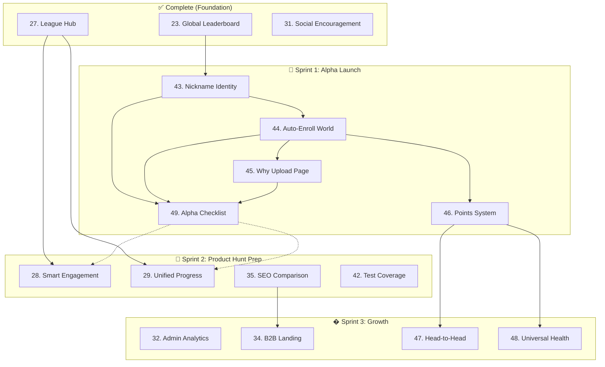

# Admin Feedback & Roadmap System - PRD Index

> **Purpose:** Re-implement and enhance the admin feedback management system.
>
> These PRDs describe WHAT is needed, not HOW to implement. The implementing agent decides the best approach.
>
> **Last Updated:** 2026-01-29

---

## ⚠️ Agent Instructions (MANDATORY)

**Before starting ANY PRD, the implementing agent MUST:**

1. Read `AGENTS.md` for critical rules and documentation requirements
2. Read `README.md` for project overview
3. Check completed PRDs for context
4. Follow all documentation update rules

---

## Completed Phases

### Foundation (PRDs 1-23) ✅
| # | PRD | Status |
|---|-----|--------|
| 1-3 | Database, APIs, Search | ✅ Complete |
| 4-6 | API Handler, Data Fetching, Badges | ✅ Complete |
| 7-9 | Navigation, Homepage, Feedback Page | ✅ Complete |
| 10-13 | Bulk Actions, Saved Views | ✅ Complete |
| 14-15 | Analytics, Page Layout | ✅ Complete |
| 16-18 | Import/Export, Roadmap, Docs | ✅ Complete |
| 19-20 | League Start, Cards | ✅ Complete |
| 21 | shadcn/ui Integration | ✅ Complete |
| 22 | PWA & Offline Support | ✅ Complete |
| 23 | Global Leaderboard | ✅ Complete |

### Alpha Stage (PRDs 24-31) ✅
| # | PRD Title | Outcome | Status |
|---|-----------|---------|--------|
| 24 | [Menu Backend System](./PRD_24_Menu_Backend.md) | Database-backed menu management | ✅ Complete |
| 25 | [User Preferences](./PRD_25_User_Preferences.md) | Modular settings architecture | ✅ Complete |
| 26 | [SuperAdmin Settings](./PRD_26_SuperAdmin_Settings.md) | App-wide config & feature flags | ✅ Complete |
| 27 | [League Hub Redesign](./PRD_27_League_Hub.md) | New league landing experience | ✅ Complete |
| 30 | [Duplicate Resolution](./PRD_30_Duplicate_Resolution.md) | Smart conflict handling UI | ✅ Complete |
| 31 | [Social Encouragement](./PRD_31_Social_Encouragement.md) | High-fives & cheer prompts | ✅ Complete |
| 33 | [Pricing & How It Works](./PRD_33_Pricing_HowItWorks.md) | Freemium model explanation | ✅ Complete |

### Infrastructure (PRDs 38-39, 41, Branding) ✅
| # | PRD Title | Outcome | Status |
|---|-----------|---------|--------|
| 38 | [Notification Infrastructure](./PRD_38_Notification_Infrastructure.md) | Database schema for notifications | ✅ Complete (Schema) |
| 39 | [Performance Architecture](./PRD_39_Performance_Architecture.md) | Server Components, Hybrid Caching | ✅ Complete |
| 41 | [Proxy Refactor Stability](../PRD_41_Proxy_Refactor_Stability.md) | Robust proxy claim process | ✅ Complete |
| — | [Modular Branding System](../PRD_Modular_Branding_System.md) | Custom logos, favicons, PWA icons | ✅ Complete |

---

## Not Started (Remaining Work)

### Core UX - High Priority
| # | PRD Title | Outcome | Status |
|---|-----------|---------|--------|
| 28 | [Smart Engagement](./PRD_28_Smart_Engagement.md) | Missed day prompt & streak warnings | 📋 Proposed |
| 29 | [Unified Progress](./PRD_29_Unified_Progress.md) | Merged analytics/leaderboard view | 📋 Proposed |

### Growth & Marketing
| # | PRD Title | Outcome | Status |
|---|-----------|---------|--------|
| 32 | [Admin Analytics](./PRD_32_Admin_Analytics.md) | Business KPI dashboard | 📋 Proposed |
| 34 | [B2B Landing Pages](./PRD_34_B2B_Landing.md) | Corporate team sales funnel | 📋 Proposed |
| 35 | [SEO Comparison Pages](./PRD_35_SEO_Comparison.md) | "StepLeague vs X" pages | 📋 Proposed |

### Ongoing Maintenance
| # | PRD | Outcome | Status |
|---|-----|---------|--------|
| 36 | [Technical Debt](./PRD_36_Technical_Debt.md) | Cleanup, Refactoring & Optimization | 🔄 Ongoing |
| 42 | [Test Coverage Expansion](./PRD_42_Test_Coverage_Expansion.md) | Expand test coverage from ~6% to 70% | 📋 Proposed |

### Future Foundation (Schema Now, Features Later)
| # | PRD | Outcome | Status |
|---|-----|---------|--------|
| 37 | [In-App Chat](./PRD_37_In_App_Chat.md) | Database schema for future chat/messaging | 📋 Proposed |
| 40 | [Submission Audit](./PRD_40_Submission_Audit.md) | Abuse detection & audit logs | 📋 Proposed |

### Alpha Launch (PRDs 43-50) 🚀
| # | PRD Title | Outcome | Status |
|---|-----------|---------|--------|
| 43 | [Nickname Primary Identity](./PRD_43_Nickname_Primary_Identity.md) | Repurpose display_name for leaderboards | ✅ Complete |
| 44 | [Auto-Enroll World League](./PRD_44_Auto_Enroll_World_League.md) | New users auto-join global league | ✅ Complete |
| 45 | [Why Upload Daily](./PRD_45_Why_Upload_Daily.md) | Public value proposition page | ✅ Complete |
| 46 | [Points Scoring System](./PRD_46_Points_Scoring_System.md) | Comprehensive points-based ranking (Design) | ✅ Complete |
| 47 | [Head-to-Head Leagues](./PRD_47_Head_To_Head_Leagues.md) | FPL-style weekly matchups (Design) | 📋 Proposed |
| 48 | [Universal Health Measurement](./PRD_48_Universal_Health_Measurement.md) | Multi-activity SLP conversion (Vision) | 📋 Proposed |
| 49 | [Alpha Launch Checklist](./PRD_49_Alpha_Launch_Checklist.md) | Launch readiness tracking | 🔄 In Progress |
| 50 | [Modular Tour System](./PRD_50_Modular_Tour_System.md) | Joyride onboarding rebuild | ✅ Complete |

### Social & Growth (PRDs 51-55) 📢
| # | PRD Title | Outcome | Status |
|---|-----------|---------|--------|
| 51 | [Social Sharing & Stats Hub](./PRD_51_Social_Sharing_Stats_Hub.md) | Beautiful shareable achievement cards for WhatsApp | ✅ Complete |
| 52 | [Sharing Tour](./PRD_52_Sharing_Tour.md) | Joyride onboarding for sharing features | ✅ Complete |
| 53 | [Sharing Marketing Page](./PRD_53_Sharing_Marketing_Page.md) | Public /how-to-share page for SEO | ✅ Complete |
| 54 | [Advanced Sharing Features](./PRD_54_Advanced_Sharing_Features.md) | Custom date ranges, friend challenges, trend visualization | 📋 Proposed |
| 55 | [Navigation Menu Consistency](./PRD_55_Navigation_Menu_Consistency.md) | Fix public menu on marketing pages for guests | ✅ Complete |
| 56 | [Sharing Encouragement](./PRD_56_Sharing_Encouragement.md) | Share streaks, insights, nudges, analytics | ✅ Complete |

### Alpha Readiness (PRDs 57-61) 🔒
| # | PRD Title | Outcome | Status |
|---|-----------|---------|--------|
| 57 | [Password Reset Flow](./PRD_57_Password_Reset_Flow.md) | Users can recover forgotten passwords | 📋 Proposed |
| 58 | [API Rate Limiting](./PRD_58_Rate_Limiting.md) | Endpoints protected from abuse and spam | 📋 Proposed |
| 59 | [Analytics Implementation](./PRD_59_Analytics_Implementation.md) | Wire up page views, error tracking, performance | 📋 Proposed |
| 60 | [UX Onboarding](./PRD_60_UX_Onboarding.md) | First 5 minutes guided experience | 📋 Proposed |
| 61 | [Testing Gaps](./PRD_61_Testing_Gaps.md) | January regression prevention tests | 📋 Proposed |

---

## 🏃 Sprint Planning (Execution Order)

> **Why this order?** Based on dependency analysis and business viability research. Each sprint has a clear gate before proceeding.

### Sprint 1: Alpha Launch (Friends & Family) ✅ COMPLETE
*Goal: Get first 5-50 users testing. Core value prop must work.*

| Order | PRD | Why This Order | Status |
|-------|-----|----------------|--------|
| 1 | **[PRD 43] Nickname Identity** | Cannot have public World League without privacy-safe display names | ✅ Complete |
| 2 | **[PRD 44] Auto-Enroll World League** | Solves "empty state" - new users have leaderboard immediately | ✅ Complete |
| 3 | **[PRD 45] Why Upload Daily** | Explains manual screenshot value prop (privacy, anti-cheat) | ✅ Complete |
| 4 | **[PRD 46] Points System (Design)** | Document scoring rules so users understand rankings | ✅ Complete |
| 5 | **[PRD 50] Modular Tour System** | Rebuild onboarding for new user experience | ✅ Complete |
| 6 | **[PRD 49] Alpha Checklist** | Verify all flows work before inviting users | 🔄 In Progress |

**Sprint 1 Gate:** ✅ New user can sign up → see nickname on World League → complete onboarding tour → understand why uploading matters

---

### Sprint 2: Social Sharing & Virality 📢 ← **CURRENT**
*Goal: Make it easy and appealing to share achievements. Drive organic growth through WhatsApp groups.*

**Why Social Sharing Now?**
- Alpha users are already sharing screenshots in WhatsApp groups
- Beautiful share cards will differentiate StepLeague from raw screenshots
- Viral sharing is the most cost-effective growth channel
- Foundation for word-of-mouth before Product Hunt launch

| Order | PRD | Why This Order | Status |
|-------|-----|----------------|--------|
| 7 | **[PRD 51] Social Sharing & Stats Hub** | Core sharing infrastructure - generates beautiful cards | ✅ Complete |
| 8 | **[PRD 52] Sharing Tour** | Teach users how to share (depends on PRD 51) | ✅ Complete |
| 9 | **[PRD 53] Sharing Marketing Page** | SEO page for /how-to-share (depends on PRD 51) | 📋 Proposed |

**Sprint 2 Gate:** ✅ Users can share achievements as beautiful cards → New users discover app via shared links → Sharing tour teaches the feature

---

### Sprint 3: Retention & Engagement 🎯
*Goal: Prevent churn, keep users coming back daily.*

| Order | PRD | Why This Order | Status |
|-------|-----|----------------|--------|
| 10 | **[PRD 28] Smart Engagement** | "Missed yesterday" prompts prevent D1/D7 churn | 📋 Proposed |
| 11 | **[PRD 29] Unified Progress** | Compelling personal stats page to share | 📋 Proposed |
| 12 | **[PRD 56] Sharing Encouragement** | Share streaks incentivize regular sharing (depends on PRD-51) | ✅ Complete |

**Sprint 3 Gate:** ✅ Users get nudged if inactive → Progress page provides shareable stats → Share streaks drive consistency

---

### Sprint 4: Product Hunt Prep 🚀
*Goal: Polish and stability before public launch. You only get one launch day.*

| Order | PRD | Why This Order | Status |
|-------|-----|----------------|--------|
| 12 | **[PRD 35] SEO Comparison Pages** | "StepLeague vs Fitbit" captures high-intent search traffic | 📋 Proposed |
| 13 | **[PRD 42] Test Coverage** | Stability before public launch | 📋 Proposed |

**Sprint 4 Gate:** ✅ SEO pages indexed → Test coverage at 70% → Ready for Product Hunt

---

### Sprint 5: Growth & Expansion 📈
*Goal: Scale to 500+ users, explore B2B pivot option.*

| Order | PRD | Why This Order | Status |
|-------|-----|----------------|--------|
| 14 | **[PRD 34] B2B Landing Pages** | Corporate wellness funnel (optional pivot) | 📋 Proposed |
| 15 | **[PRD 32] Admin Analytics** | Internal KPI dashboard for tracking growth | 📋 Proposed |

---

### Future Vision (Design Docs)
*Goal: Document future direction for user feedback and planning.*

| Order | PRD | Notes | Status |
|-------|-----|-------|--------|
| — | **[PRD 47] Head-to-Head Leagues** | FPL-style matchups (implement when user demand exists) | 📋 Proposed |
| — | **[PRD 48] Universal Health Measurement** | Multi-activity SLP conversion (long-term vision) | 📋 Proposed |

---

### Ongoing (Any Sprint)
| PRD | Notes |
|-----|-------|
| **[PRD 36] Technical Debt** | Tackle as needed between features |
| **[PRD 37] In-App Chat** | Schema only - implement when user demand exists |
| **[PRD 40] Submission Audit** | Add when abuse becomes a concern |

---

## Summary

| Category | Count |
|----------|-------|
| ✅ Complete | 40 PRDs |
| 📋 Proposed | 19 PRDs |
| 🔄 Ongoing/In Progress | 2 PRDs |

---

## Dependency Graph

```mermaid
graph TD
    subgraph "✅ Complete (Foundation)"
        PRD23[23. Global Leaderboard]
        PRD27[27. League Hub]
        PRD31[31. Social Encouragement]
    end

    subgraph "🎯 Sprint 1: Alpha Launch"
        PRD43[43. Nickname Identity]
        PRD44[44. Auto-Enroll World]
        PRD45[45. Why Upload Page]
        PRD46[46. Points System]
        PRD49[49. Alpha Checklist]
    end

    subgraph "🚀 Sprint 2: Product Hunt Prep"
        PRD28[28. Smart Engagement]
        PRD29[29. Unified Progress]
        PRD35[35. SEO Comparison]
        PRD42[42. Test Coverage]
    end

    subgraph "� Sprint 3: Growth"
        PRD32[32. Admin Analytics]
        PRD34[34. B2B Landing]
        PRD47[47. Head-to-Head]
        PRD48[48. Universal Health]
    end

    %% Sprint 1 Dependencies
    PRD23 --> PRD43
    PRD43 --> PRD44
    PRD44 --> PRD45
    PRD44 --> PRD46
    PRD43 --> PRD49
    PRD44 --> PRD49
    PRD45 --> PRD49

    %% Sprint 2 Dependencies
    PRD27 --> PRD28
    PRD27 --> PRD29
    PRD49 -.-> PRD28
    PRD49 -.-> PRD29

    %% Sprint 3 Dependencies
    PRD46 --> PRD47
    PRD46 --> PRD48
    PRD35 --> PRD34
```

**Legend:**
- `-->` = Hard dependency (must complete first)
- `-.->` = Soft dependency (Sprint gate)

---

## Changelog

| Date | Change |
|------|--------|
| 2026-01-20 | Added Sprint Planning section with prioritized execution order |
| 2026-01-20 | Updated Dependency Graph to show Sprint 1/2/3 structure |
| 2026-01-20 | Added PRDs 43-49 for Alpha Launch preparation |
| 2026-01-20 | Enhanced PRDs 43-49 with Systems/Design Considerations and Proactive items |
| 2026-01-29 | Added PRD-56 (Sharing Encouragement) extracted from PRD-54 Phase 4 |
| 2026-01-29 | Added PRD-56 to Sprint 3 (Retention & Engagement) |
| 2026-02-27 | Added PRDs 57-61 from Alpha Readiness Audit (password reset, rate limiting, analytics, onboarding, testing) |

