# PRD 18: Documentation

> **Order:** 18 of 20  
> **Previous:** [PRD 17: Public Roadmap Polish](./PRD_17_Public_Roadmap_Polish.md)  
> **Next:** [PRD 19: League Start Date](./PRD_19_League_Start_Date.md)

---

## ⚠️ Agent Instructions (MANDATORY)

Before starting work on this PRD, the implementing agent MUST:

1. **Read these files for context:**
   - `AGENTS.md` - Critical rules, patterns, and documentation requirements
   - `README.md` - Current project documentation
   - `docs/` folder - Existing documentation
   - All completed PRDs in this series

2. **Follow documentation rules:**
   - Update `CHANGELOG.md` with all changes
   - Use date format `YYYY-MM-DD` (current year is 2026)
   - Store artifacts in `docs/artifacts/`
   - Update roadmap when complete

3. **After completion:**
   - Commit with message format: `feat(PRD-XX): Brief description`
   - Mark this PRD as done on the Kanban board
   - This completes the entire PRD series!

---

## Outcome

Clear, comprehensive documentation that explains the feedback and roadmap system for future developers and AI agents.

---

## What is Needed

### 1. System Overview Document

Create `docs/feedback-roadmap-system.md`:

- What the system does
- Key components and their relationships
- User flow: feedback → admin triage → roadmap
- Link to all related PRDs

### 2. Architecture Diagram

```mermaid
graph TB
    subgraph "User Actions"
        FeedbackWidget[💬 Feedback Widget]
        FeedbackPage[Feedback Page]
        RoadmapVote[Roadmap Voting]
    end
    
    subgraph "Database"
        FeedbackTable[(feedback table)]
    end
    
    subgraph "Admin Tools"
        AdminFeedback[Admin Feedback Page]
        Kanban[Kanban Board]
    end
    
    subgraph "Public"
        Roadmap[Public Roadmap]
    end
    
    FeedbackWidget --> FeedbackTable
    FeedbackPage --> FeedbackTable
    FeedbackTable --> AdminFeedback
    FeedbackTable --> Kanban
    Kanban -->|is_public=true| Roadmap
    RoadmapVote --> FeedbackTable
```

### 3. Component Reference

| Component | File | Purpose |
|-----------|------|---------|
| UniversalFilters | `components/shared/UniversalFilters.tsx` | Configurable filters |
| FeedbackList | `components/admin/FeedbackList.tsx` | List view |
| KanbanBoard | `components/admin/KanbanBoard.tsx` | Kanban view |
| RoadmapView | `components/roadmap/RoadmapView.tsx` | Public roadmap |

### 4. API Reference

| Endpoint | Method | Purpose |
|----------|--------|---------|
| `/api/feedback` | POST | Submit feedback |
| `/api/admin/kanban` | GET/PUT | Kanban operations |
| `/api/admin/feedback/bulk` | PATCH | Bulk updates |
| `/api/roadmap/vote` | POST | Priority voting |

### 5. Link from AGENTS.md

Add reference in AGENTS.md to the new documentation.

---

## Files to Create/Modify

| File | Action |
|------|--------|
| `docs/feedback-roadmap-system.md` | CREATE |
| `docs/diagrams/feedback-flow.md` | CREATE - Mermaid diagrams |
| `AGENTS.md` | MODIFY - Add link to docs |
| `README.md` | MODIFY - Add link to docs |

---

## Success Criteria

- [ ] Overview document explains the full system
- [ ] Diagrams clearly show architecture
- [ ] All major components are documented
- [ ] New developer can understand system in < 30 minutes
- [ ] Documentation linked from project root
- [ ] Build passes (`npm run build`)

---

## Changelog

| Date | Section | Change |
|------|---------|--------|
| 2025-12-26 | Initial | Created PRD for documentation |
