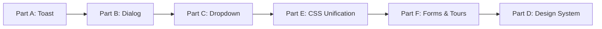

# PRD 21: shadcn/ui Integration & Toast System

> **Order:** 21 of 30  
> **Previous:** [PRD 20: Expandable Cards](./PRD_20_Expandable_Cards_Image_Paste.md)  
> **Next:** [PRD 22: User Preferences](./PRD_22_User_Preferences.md)  
> **Status:** 🟡 In Progress (Foundation complete)

> [!CAUTION]
> **CRITICAL DEPENDENCY**: This PRD blocks all PRDs 22-30. Complete Parts E (CSS Variables) and G (Theme Toggle) before proceeding to other PRDs.

> [!WARNING]
> **Risk Mitigation**:
> - Theme toggle may break existing styles → Test thoroughly in both light/dark modes
> - CSS variable conflicts → Prioritize Part E unification before Part F expansion

---

## ⚠️ Agent Instructions (MANDATORY)

Before starting work on this PRD, the implementing agent MUST:

1. **Read these files for context:**
   - `AGENTS.md` - Critical rules, patterns, and documentation requirements
   - `src/components/ui/*.tsx` - Existing shadcn components
   - `src/hooks/use-toast.ts` - Toast hook
   - `components.json` - shadcn configuration
   - `CHANGELOG.md [2026-01-04]` - What was already done

2. **Follow documentation rules:**
   - Update `CHANGELOG.md` with all changes
   - Use date format `YYYY-MM-DD` (current year is 2026)
   - Store artifacts in `docs/artifacts/`
   - Update roadmap when complete

3. **After completion:**
   - Commit with message format: `feat(PRD-21): Brief description`
   - Mark this PRD as done on the Kanban board

---

## Outcome

A unified, accessible notification and dialog system throughout the app, replacing ad-hoc `alert()` calls with shadcn toast and dialog components.

---

## What Has Been Done (Foundation)

✅ **[2026-01-04] shadcn/ui initialized:**
- `components.json` configuration
- New York style, neutral base color, CSS variables
- Dark mode as default (matching app theme)

✅ **Components added:**
- `toast.tsx` + `toaster.tsx` + `use-toast.ts` - Toast system
- `sonner.tsx` - Alternative toast (simpler API)
- `dialog.tsx` - Modal dialogs
- `dropdown-menu.tsx` - Accessible dropdown menus

✅ **Compatibility fixes:**
- Dark mode default in `:root` CSS variables
- Light mode via `[data-theme="light"]`
- Body style override removed
- Date utilities restored in `utils.ts`

---

## What is Needed (Remaining Work)

### Part A: Toast System Integration

| Task | Description |
|------|-------------|
| Add `<Toaster />` to layout | Add component to `src/app/layout.tsx` |
| Replace `alert()` calls | Find all `alert()` and replace with `toast()` |
| Success notifications | Submission success, settings saved, etc. |
| Error notifications | API errors, validation errors |
| Add to Design System | Document toast variants on `/admin/design-system` |

**Files to search for `alert()`:**
```bash
grep -r "alert(" src/ --include="*.tsx" --include="*.ts"
```

### Part B: Dialog Integration  

| Task | Description |
|------|-------------|
| Confirmation dialogs | Replace `confirm()` with shadcn Dialog |
| Delete confirmations | League delete, feedback archive, etc. |
| Modal standardization | Use Dialog as base for existing modals |

### Part C: Dropdown Migration (REQUIRED)

> **Decision Update:** The custom `MenuRenderer` caused navigation and accessibility issues (INP blocking, click handling conflicts). We are now migrating fully to shadcn `DropdownMenu`.

| Task | Description |
|------|-------------|
| Create `ShadcnMenuRenderer` | New component mapping `menuConfig` to shadcn components |
| Implement Nested Menus | Use `DropdownMenuSub` for recursive items |
| Migrate `NavHeader` | Replace old renderer with new one |
| Verify Accessibility | Ensure keyboard nav and screen readers work |
| Remove legacy code | Delete old `MenuRenderer` once replaced |

### Part D: Design System Update

| Task | Description |
|------|-------------|
| Add shadcn section | New section on `/admin/design-system` |
| Document Toast variants | Success, error, warning, info |
| Document Dialog patterns | Confirmation, alert, form |
| Document DropdownMenu | Basic, with icons, nested |

### Part E: CSS Variable Unification (IMPORTANT)

> **Why this matters:** The app currently has TWO CSS variable systems - the original RGB-based tokens and shadcn's HSL-based tokens. This creates maintenance burden and confusion.

| Current (App) | shadcn Equivalent | Notes |
|---------------|-------------------|-------|
| `--bg-base` | `--background` | Page background |
| `--bg-card` | `--card` | Card backgrounds |
| `--text-primary` | `--foreground` | Primary text |
| `--text-secondary` | `--muted-foreground` | Secondary text |
| `--text-muted` | `--muted-foreground` | Muted text |
| `--border-subtle` | `--border` | Borders |
| `--border-default` | `--border` | Default borders |
| `--brand-primary` | `--primary` | Brand color (needs customization) |
| `--success`, `--warning`, `--error` | (keep) | Status colors not in shadcn |

**Tasks:**

| Task | Description |
|------|-------------|
| Audit `globals.css` | List all custom CSS variables |
| Map to shadcn equivalents | Create mapping table above |
| Update utility classes | `.glass-card`, `.btn-primary`, `.btn-ghost`, etc. |
| Keep brand colors | `--brand-primary`, `--brand-accent` for brand identity |
| Keep status colors | `--success`, `--warning`, `--error` (shadcn uses `--destructive` only) |
| Update AGENTS.md | Document the unified system |
| Test both themes | Verify light/dark mode still works |

**Files to modify:**

| File | Changes |
|------|---------|
| `src/app/globals.css` | Refactor utility classes to use shadcn vars |
| `AGENTS.md` | Update Theme section to reference unified system |
| `src/app/admin/design-system/page.tsx` | Update token documentation |

### Part F: Form Components, Tooltip & Guided Tours

> **Goal:** Expand shadcn usage to standardize forms and integrate with existing Joyride onboarding.

#### Form Components to Add

| Component | Use Case |
|-----------|----------|
| `input.tsx` | All text inputs (login, settings, forms) |
| `select.tsx` | Dropdowns in forms |
| `checkbox.tsx` | Settings toggles |
| `label.tsx` | Form field labels |
| `textarea.tsx` | Feedback forms, comments |

#### Tooltip Component

| Task | Description |
|------|-------------|
| Add `tooltip.tsx` | Install via `npx shadcn@latest add tooltip` |
| Replace title attributes | Migrate from native `title` to Tooltip component |
| Use in complex UI | Leaderboard icons, settings, analytics |

#### Joyride Integration (Existing System)

> **Current Implementation:** `src/components/providers/OnboardingProvider.tsx`  
> **Package:** `react-joyride@2.9.3`

**Existing Tours:**

| Tour Name | Target | Description |
|-----------|--------|-------------|
| `new-user` | `/dashboard` | Welcome tour for new users (5 steps) |
| `member` | `/league/[id]` | Submission modes tutorial (6 steps) |
| `leaderboard` | `/league/[id]/leaderboard` | Filters and ranking features (5 steps) |
| `admin` | League pages | Owner-only features (4 steps) |
| `navigation` | Any page | Menu system orientation (6 steps) |

**Current Hardcoded Styles (Lines 509-556 in OnboardingProvider.tsx):**

```tsx
// BEFORE: Hardcoded hex colors
styles={{
  options: {
    arrowColor: "#1e293b",        // → hsl(var(--card))
    backgroundColor: "#1e293b",   // → hsl(var(--card))
    overlayColor: "rgba(0,0,0,0.75)",
    primaryColor: "#0ea5e9",      // → hsl(var(--primary))
    textColor: "#f1f5f9",         // → hsl(var(--foreground))
  },
  buttonNext: {
    backgroundColor: "#0ea5e9",   // → hsl(var(--primary))
    color: "#0f172a",             // → hsl(var(--primary-foreground))
  },
  buttonBack: {
    color: "#94a3b8",             // → hsl(var(--muted-foreground))
  },
  buttonSkip: {
    color: "#64748b",             // → hsl(var(--muted-foreground))
  },
}}
```

**Migration Tasks:**

| Task | Description |
|------|-------------|
| Create CSS variables | Add Joyride-specific vars derived from shadcn tokens |
| Update OnboardingProvider | Replace hardcoded hex with CSS variables |
| Update feedback modal | Use shadcn Dialog or at minimum CSS vars (lines 567-634) |
| Test all 5 tours | Verify styling after migration |
| Document tour system | Add to Design System with trigger examples |

**Files to Modify:**

| File | Changes |
|------|---------|
| `src/components/ui/input.tsx` | NEW - shadcn input |
| `src/components/ui/select.tsx` | NEW - shadcn select |
| `src/components/ui/tooltip.tsx` | NEW - shadcn tooltip |
| `src/components/forms/*.tsx` | MODIFY - Use shadcn form components |
| `src/components/providers/OnboardingProvider.tsx` | MODIFY - Use CSS vars for Joyride styles |
| `src/app/globals.css` | ADD - Joyride CSS variable mappings |
| `AGENTS.md` | UPDATE - Document form and tour patterns |

---

## Implementation Order



**Recommended flow:**
1. **Part A: Toast** - Highest impact, easiest
2. **Part B: Dialog** - Needed for confirmations
3. **Part C: Dropdown** - Optional, evaluate only
4. **Part E: CSS Unification** - Establish unified foundation BEFORE adding more components
5. **Part F: Forms & Tours** - Now uses unified CSS from the start
6. **Part D: Design System** - Document everything LAST when all components stable

---

## Success Criteria

### Part A (Toast)
- [ ] `<Toaster />` added to root layout
- [ ] No `alert()` calls in codebase
- [ ] Toast shown on submission success
- [ ] Toast shown on API errors
- [ ] Toast variants documented

### Part B (Dialog)
- [ ] No `confirm()` calls in codebase  
- [ ] Delete actions use Dialog confirmation
- [ ] Dialog patterns documented

### Part C (Dropdown - Optional)
- [ ] Evaluated existing dropdowns
- [ ] Migration decision documented
- [ ] If migrated: accessibility verified

### Part D (Design System)
- [ ] shadcn section added
- [ ] All new components documented
- [ ] Code examples included

### Part E (CSS Unification)
- [ ] Only ONE CSS variable system (shadcn-based)
- [ ] Original RGB tokens removed or mapped
- [ ] Utility classes updated (`.glass-card`, `.btn-primary`, etc.)
- [ ] Brand colors preserved (`--brand-primary`, `--brand-accent`)
- [ ] Status colors preserved (`--success`, `--warning`, `--error`)
- [ ] Light/dark mode verified working
- [ ] AGENTS.md updated with unified system docs

### Part F (Forms, Tooltip, Tours)
- [ ] Form components installed (`input`, `select`, `checkbox`, `label`, `textarea`)
- [ ] Existing forms migrated to shadcn components
- [ ] Tooltip component installed and used
- [ ] Joyride styles migrated to CSS variables
- [ ] Joyride feedback modal updated (Dialog or CSS vars)
- [ ] All 5 tours tested after migration
- [ ] Form and tour patterns documented in Design System
- [ ] AGENTS.md updated with form/tour guidance

---

## Files to Create/Modify

| File | Action |
|------|--------|
| `src/app/layout.tsx` | MODIFY - Add `<Toaster />` |
| `src/app/admin/design-system/page.tsx` | MODIFY - Add shadcn section |
| Various `*.tsx` files | MODIFY - Replace alert/confirm |
| `src/app/globals.css` | MODIFY - Unify CSS variables (Part E) |
| `src/components/ui/*.tsx` | NEW - Form components (Part F) |
| `src/components/forms/*.tsx` | MODIFY - Use shadcn form components |
| `src/components/providers/OnboardingProvider.tsx` | MODIFY - CSS vars for Joyride |
| `AGENTS.md` | UPDATE - Document shadcn patterns, unified CSS, form/tour patterns |
| `CHANGELOG.md` | UPDATE - Per section completed |

---

## Dependencies

- **Builds on:** shadcn/ui foundation (completed 2026-01-04)
- **Related to:** PRD 20 (Expandable Cards can use Dialog)
- **Enhances:** All user-facing notifications

---

## Out of Scope

- Custom toast styling beyond variants
- Complex multi-step dialogs
- Complete Joyride replacement (just styling integration)

---

## Verification Checklist

> **IMPORTANT:** After completing each part, verify changes AND check for regressions.

### Part A Verification (Toast)

| Check | How to Verify | Expected Result |
|-------|---------------|-----------------|
| Toaster renders | Open any page | No console errors |
| Success toast | Submit steps | Green toast appears bottom-right |
| Error toast | Trigger API error (e.g., invalid input) | Red toast with error message |
| Toast dismisses | Wait or click X | Toast disappears after timeout |
| **Regression: No alert()** | `grep -r "alert(" src/ --include="*.tsx"` | No results (except test files) |

### Part B Verification (Dialog)

| Check | How to Verify | Expected Result |
|-------|---------------|-----------------|
| Delete confirmation | Try to delete a league/feedback item | Dialog appears, not browser confirm() |
| Cancel works | Click Cancel in dialog | Dialog closes, no action taken |
| Confirm works | Click Confirm in dialog | Action executes, dialog closes |
| Escape closes | Press Escape while dialog open | Dialog closes |
| **Regression: No confirm()** | `grep -r "confirm(" src/ --include="*.tsx"` | No results |

### Part C Verification (Dropdown)

| Check | How to Verify | Expected Result |
|-------|---------------|-----------------|
| NavHeader menus | Click user menu, league menu | Dropdowns open/close correctly |
| Keyboard nav | Use arrow keys in dropdown | Items highlight and are selectable |
| Click outside | Click outside open dropdown | Dropdown closes |

### Part E Verification (CSS Unification)

| Check | How to Verify | Expected Result |
|-------|---------------|-----------------|
| Dark mode | Default view | Correct dark colors |
| Light mode | Add `data-theme="light"` to HTML | Correct light colors |
| `.glass-card` | View any card component | Correct background, border, blur |
| `.btn-primary` | View primary buttons | Correct gradient, text color |
| `.btn-ghost` | View ghost buttons | Correct border, hover state |
| Brand colors | Check sky-500 elements | Still sky-500/brand-primary |
| Status colors | Check success/warning/error badges | Green/amber/red still work |
| **Regression: No old vars** | `grep -r "var(--bg-base)" src/` | Only in globals.css (if mapped) or none |

**Visual Regression Pages to Check:**
- [ ] `/` (Homepage) - hero, CTAs, feature cards
- [ ] `/dashboard` - league cards, create/join buttons
- [ ] `/league/[id]` - submission form, badges
- [ ] `/league/[id]/leaderboard` - table, filters
- [ ] `/admin/kanban` - kanban cards, columns
- [ ] `/roadmap` - roadmap cards, columns
- [ ] `/admin/design-system` - all documented components

### Part F Verification (Forms, Tooltip, Tours)

| Check | How to Verify | Expected Result |
|-------|---------------|-----------------|
| Form inputs | View login, settings, feedback forms | shadcn input styling |
| Select dropdowns | View any form select | shadcn select styling |
| Tooltips | Hover elements with tooltips | shadcn tooltip appears |
| **Tour: new-user** | Go to `/dashboard?start_tour=new-user` | Tour starts, correct styling |
| **Tour: member** | Go to `/league/[id]?start_tour=member` | Tour starts, 6 steps work |
| **Tour: leaderboard** | Go to leaderboard page, trigger tour | Tour runs correctly |
| **Tour: admin** | As league owner, trigger admin tour | Admin steps appear |
| **Tour: navigation** | Trigger navigation tour | Menu highlights work |
| Tour feedback modal | Complete any tour | Feedback modal appears with correct styling |

### Part D Verification (Design System)

| Check | How to Verify | Expected Result |
|-------|---------------|-----------------|
| shadcn section exists | Visit `/admin/design-system` | New shadcn section visible |
| Toast examples | View Toast section | All variants shown with code |
| Dialog examples | View Dialog section | Confirmation pattern documented |
| Form examples | View Form section | All form components shown |
| Tour documentation | View Tours section | All 5 tours documented with triggers |

### Full Regression Checklist

After completing ALL parts, verify these critical flows:

- [ ] **Auth flow**: Sign in, sign out working
- [ ] **League creation**: Create league, get invite code
- [ ] **League join**: Join with invite code
- [ ] **Step submission**: All 3 modes work (single, batch, bulk)
- [ ] **Leaderboard**: Filters, sorting, sharing work
- [ ] **Analytics**: Calendar heatmap, charts render
- [ ] **Feedback**: Submit feedback, screenshot upload
- [ ] **Admin features**: Kanban drag-drop, feedback management
- [ ] **Mobile responsive**: All pages work on mobile viewport
- [ ] **Build passes**: `npm run build` succeeds with no errors

---

### Part G: Theme Toggle UI (Light/Dark Mode)

> **Goal:** Add visible UI for users to switch between light/dark/system themes.

**Dependencies:**
- Part E (CSS Unification) must be complete first
- Install `next-themes`: `pnpm add next-themes`

**Components to Create:**

| File | Description |
|------|-------------|
| `src/components/theme-provider.tsx` | next-themes wrapper |
| `src/components/mode-toggle.tsx` | Theme dropdown (Light/Dark/System) |

**Implementation:**

```tsx
// src/components/theme-provider.tsx
"use client"
import { ThemeProvider as NextThemesProvider } from "next-themes"

export function ThemeProvider({ children, ...props }) {
  return <NextThemesProvider {...props}>{children}</NextThemesProvider>
}

// src/components/mode-toggle.tsx
"use client"
import { Moon, Sun, Monitor } from "lucide-react"
import { useTheme } from "next-themes"
import { Button } from "@/components/ui/button"
import { DropdownMenu, DropdownMenuContent, DropdownMenuItem, DropdownMenuTrigger } from "@/components/ui/dropdown-menu"

export function ModeToggle() {
  const { setTheme } = useTheme()
  return (
    <DropdownMenu>
      <DropdownMenuTrigger asChild>
        <Button variant="ghost" size="icon">
          <Sun className="h-5 w-5 rotate-0 scale-100 transition-all dark:-rotate-90 dark:scale-0" />
          <Moon className="absolute h-5 w-5 rotate-90 scale-0 transition-all dark:rotate-0 dark:scale-100" />
          <span className="sr-only">Toggle theme</span>
        </Button>
      </DropdownMenuTrigger>
      <DropdownMenuContent align="end">
        <DropdownMenuItem onClick={() => setTheme("light")}>Light</DropdownMenuItem>
        <DropdownMenuItem onClick={() => setTheme("dark")}>Dark</DropdownMenuItem>
        <DropdownMenuItem onClick={() => setTheme("system")}>System</DropdownMenuItem>
      </DropdownMenuContent>
    </DropdownMenu>
  )
}
```

**Integration Points:**

| Location | Change | Priority |
|----------|--------|----------|
| `src/app/layout.tsx` | Wrap children in `<ThemeProvider attribute="class" defaultTheme="dark" enableSystem>` | Required |
| `src/components/navigation/NavHeader.tsx` | Add `<ModeToggle />` next to settings | Quick access |
| `/settings/preferences` (PRD 25) | Add theme selector in preferences | Discoverability |
| `tailwind.config.js` | Ensure `darkMode: 'selector'` (or 'class') | Required |

> **Best Practice Research:** Theme toggle should appear in **BOTH** locations:
> - **Header**: For power users who switch frequently (industry standard: GitHub, Notion, Linear)
> - **Settings**: For discoverability by new users and persistence clarity
> - This dual placement is recommended by Nielsen Norman Group for frequently-used settings

**FOWT Prevention:**
- next-themes injects a blocking script in `<head>`
- Add `suppressHydrationWarning` to `<html>` element
- Use `mounted` state check in toggle component

**Success Criteria:**
- [ ] Theme persists across sessions (localStorage)
- [ ] System preference detection works
- [ ] No flash of wrong theme on load
- [ ] Toggle accessible in header AND settings (both required)
- [ ] Respects `prefers-reduced-motion` for transitions


---

## Notes

This PRD can be implemented incrementally:
- Part A alone provides immediate value
- Parts B, C can be done in separate commits
- **Part E (CSS Unification) should be done BEFORE Part F** to avoid rework
- Part D (Design System) should be done LAST when all components are stable
- Each part is independently deployable

---

## Changelog

| Date | Section | Change |
|------|---------|--------|
| 2026-01-04 | Verification | Added comprehensive verification checklist with per-part testing, regression checks, and visual pages to verify |
| 2026-01-04 | Part F, Order | Expanded Joyride details (5 tours, hardcoded styles to migrate), reordered implementation (E before F, D last) |
| 2026-01-04 | Part F | Added Form Components, Tooltip, Guided Tours section |
| 2026-01-04 | Part E | Added CSS Variable Unification section with mapping, tasks, success criteria |
| 2026-01-04 | Initial | Created PRD with foundation complete, remaining work outlined |
