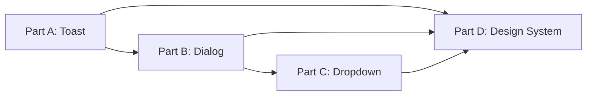

# PRD 21: shadcn/ui Integration & Toast System

> **Order:** 21 of 21  
> **Previous:** [PRD 20: Expandable Cards](./PRD_20_Expandable_Cards_Image_Paste.md)
> **Status:** 🟡 In Progress (Foundation complete)

---

## ⚠️ Agent Instructions (MANDATORY)

Before starting work on this PRD, the implementing agent MUST:

1. **Read these files for context:**
   - `AGENTS.md` - Critical rules, patterns, and documentation requirements
   - `src/components/ui/*.tsx` - Existing shadcn components
   - `src/hooks/use-toast.ts` - Toast hook
   - `components.json` - shadcn configuration
   - `CHANGELOG.md [2026-01-04]` - What was already done

2. **Follow documentation rules:**
   - Update `CHANGELOG.md` with all changes
   - Use date format `YYYY-MM-DD` (current year is 2026)
   - Store artifacts in `docs/artifacts/`
   - Update roadmap when complete

3. **After completion:**
   - Commit with message format: `feat(PRD-21): Brief description`
   - Mark this PRD as done on the Kanban board

---

## Outcome

A unified, accessible notification and dialog system throughout the app, replacing ad-hoc `alert()` calls with shadcn toast and dialog components.

---

## What Has Been Done (Foundation)

✅ **[2026-01-04] shadcn/ui initialized:**
- `components.json` configuration
- New York style, neutral base color, CSS variables
- Dark mode as default (matching app theme)

✅ **Components added:**
- `toast.tsx` + `toaster.tsx` + `use-toast.ts` - Toast system
- `sonner.tsx` - Alternative toast (simpler API)
- `dialog.tsx` - Modal dialogs
- `dropdown-menu.tsx` - Accessible dropdown menus

✅ **Compatibility fixes:**
- Dark mode default in `:root` CSS variables
- Light mode via `[data-theme="light"]`
- Body style override removed
- Date utilities restored in `utils.ts`

---

## What is Needed (Remaining Work)

### Part A: Toast System Integration

| Task | Description |
|------|-------------|
| Add `<Toaster />` to layout | Add component to `src/app/layout.tsx` |
| Replace `alert()` calls | Find all `alert()` and replace with `toast()` |
| Success notifications | Submission success, settings saved, etc. |
| Error notifications | API errors, validation errors |
| Add to Design System | Document toast variants on `/admin/design-system` |

**Files to search for `alert()`:**
```bash
grep -r "alert(" src/ --include="*.tsx" --include="*.ts"
```

### Part B: Dialog Integration  

| Task | Description |
|------|-------------|
| Confirmation dialogs | Replace `confirm()` with shadcn Dialog |
| Delete confirmations | League delete, feedback archive, etc. |
| Modal standardization | Use Dialog as base for existing modals |

### Part C: Dropdown Migration (Optional)

| Task | Description |
|------|-------------|
| Audit existing dropdowns | NavHeader, settings, filters |
| Evaluate migration | Only migrate if accessibility benefits |
| Preserve behavior | Maintain existing UX patterns |

### Part D: Design System Update

| Task | Description |
|------|-------------|
| Add shadcn section | New section on `/admin/design-system` |
| Document Toast variants | Success, error, warning, info |
| Document Dialog patterns | Confirmation, alert, form |
| Document DropdownMenu | Basic, with icons, nested |

---

## Implementation Order



**Recommended flow:**
1. Start with Toast (highest impact, easiest)
2. Add Dialog for confirmations
3. Dropdown migration only if beneficial
4. Update Design System throughout

---

## Success Criteria

### Part A (Toast)
- [ ] `<Toaster />` added to root layout
- [ ] No `alert()` calls in codebase
- [ ] Toast shown on submission success
- [ ] Toast shown on API errors
- [ ] Toast variants documented

### Part B (Dialog)
- [ ] No `confirm()` calls in codebase  
- [ ] Delete actions use Dialog confirmation
- [ ] Dialog patterns documented

### Part C (Dropdown - Optional)
- [ ] Evaluated existing dropdowns
- [ ] Migration decision documented
- [ ] If migrated: accessibility verified

### Part D (Design System)
- [ ] shadcn section added
- [ ] All new components documented
- [ ] Code examples included

---

## Files to Create/Modify

| File | Action |
|------|--------|
| `src/app/layout.tsx` | MODIFY - Add `<Toaster />` |
| `src/app/admin/design-system/page.tsx` | MODIFY - Add shadcn section |
| Various `*.tsx` files | MODIFY - Replace alert/confirm |
| `CHANGELOG.md` | UPDATE - Per section completed |

---

## Dependencies

- **Builds on:** shadcn/ui foundation (completed 2026-01-04)
- **Related to:** PRD 20 (Expandable Cards can use Dialog)
- **Enhances:** All user-facing notifications

---

## Out of Scope

- Custom toast styling beyond variants
- Complex multi-step dialogs
- Tooltip component (add separately if needed)
- Form components (input, select, etc.)

---

## Notes

This PRD can be implemented incrementally:
- Part A alone provides immediate value
- Parts B, C, D can be done in separate commits
- Each part is independently deployable

---

## Changelog

| Date | Section | Change |
|------|---------|--------|
| 2026-01-04 | Initial | Created PRD with foundation complete, remaining work outlined |
