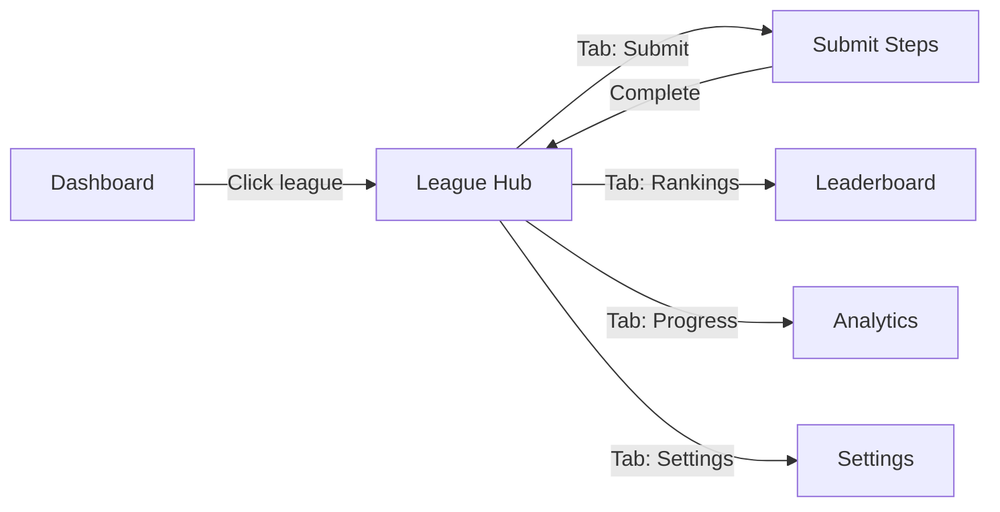

# PRD 24: League Hub & Navigation Redesign

> **Order:** 24 of 30  
> **Previous:** [PRD 23: SuperAdmin Settings](./PRD_23_SuperAdmin_Settings.md)  
> **Next:** [PRD 25: Smart Step Reminder](./PRD_25_Step_Reminder.md)  
> **Status:** 📋 Proposed

---

## ⚠️ Agent Instructions (MANDATORY)

Before starting work on this PRD, the implementing agent MUST:

1. **Read these files for context:**
   - `AGENTS.md` - Critical rules, patterns, and documentation requirements
   - `src/app/(dashboard)/league/[id]/page.tsx` - Current league page (to be refactored)
   - `src/app/(dashboard)/dashboard/page.tsx` - Dashboard for context
   - `src/components/navigation/NavHeader.tsx` - Existing nav patterns

2. **Follow documentation rules:**
   - Update `CHANGELOG.md` with all changes
   - Use date format `YYYY-MM-DD` (current year is 2026)
   - Update ROADMAP.md when complete

3. **After completion:**
   - Commit with message format: `feat(PRD-22): Brief description`
   - Mark this PRD as done on the Kanban board

---

## Problem Statement

**Current:** Clicking a league card on Dashboard → Goes directly to step submission form

**Issues:**
1. Step submissions are **cross-league** (same form for all leagues)
2. User expects to see **league-specific** content when clicking a league
3. No league "home" that shows standings, activity, or quick stats
4. Confusing mental model: "I clicked League X, why am I on a generic submit page?"

---

## Outcome

When users click a league, they arrive at a **League Hub** showing:
- League name, description, member count
- User's current rank and quick stats
- Today's submission status
- Navigation tabs: Submit Steps | Rankings | My Progress | Settings
- Missing step reminder CTA (if applicable)

---

## Proposed Architecture

### URL Structure

| Current | Proposed |
|---------|----------|
| `/league/[id]` → Submit form | `/league/[id]` → **Hub overview** |
| `/league/[id]/leaderboard` → Rankings | Keep as-is |
| `/league/[id]/analytics` → Personal stats | Rename to `/league/[id]/progress` (optional) |
| _(none)_ | `/league/[id]/submit` → **New submit page** |
| `/league/[id]/settings` → Settings | Keep as-is |

### Component Structure

```
src/components/league/
├── LeagueHub.tsx          # NEW - Main hub content
├── LeagueQuickStats.tsx   # NEW - Rank, streak, today status
├── LeagueNav.tsx          # NEW - Tab navigation
├── SubmissionStatusCard.tsx  # NEW - "Submit Steps" CTA
└── [existing components]
```

---

## What is Needed

### 1. League Hub Page

Refactor `/league/[id]/page.tsx` to become the hub:

**Content:**
- Header: League name, member count, invite code
- Quick stats card: User's rank, steps this week, streak
- Today's submission status: ✅ Submitted or 🔴 Missing
- Navigation tabs to sub-pages
- Recent activity (optional, Phase 2)

### 2. Move Submit Form to Dedicated Page

Create `/league/[id]/submit/page.tsx`:
- Move existing `SubmissionForm` component here
- Keep "Your Recent Submissions" table
- Add "← Back to League" link

### 3. Tab Navigation Component

Create `LeagueNav.tsx` - horizontal tabs:

```
[ Submit Steps ] [ Rankings ] [ My Progress ] [ ⚙️ ]
```

- Active tab highlighted
- Mobile-responsive (horizontal scroll or stack)
- Visible on all league sub-pages

### 4. Quick Stats Component

Create `LeagueQuickStats.tsx`:

| Stat | Display |
|------|---------|
| Rank | "#3 of 12" with badge color by position |
| Steps | "8,420 this week" |
| Streak | "🔥 5 days" |
| Today | "✅ Submitted" or "⚠️ Missing" |

---

## User Flow



---

## Files to Create/Modify

| File | Action |
|------|--------|
| `src/app/(dashboard)/league/[id]/page.tsx` | **MODIFY** - Become hub overview |
| `src/app/(dashboard)/league/[id]/submit/page.tsx` | **NEW** - Move submit form here |
| `src/components/league/LeagueHub.tsx` | **NEW** - Hub content component |
| `src/components/league/LeagueQuickStats.tsx` | **NEW** - Quick stats card |
| `src/components/league/LeagueNav.tsx` | **NEW** - Tab navigation |
| `src/components/league/SubmissionStatusCard.tsx` | **NEW** - Today status CTA |

---

## Success Criteria

- [ ] Clicking league card goes to Hub, not submit form
- [ ] Hub shows league name, rank, quick stats
- [ ] Tab navigation works on all league pages
- [ ] Submit page accessible via tab
- [ ] Mobile-responsive (tabs scroll or stack)
- [ ] Analytics tracking added for navigation
- [ ] Build passes (`npm run build`)

---

## Mobile Design (MANDATORY)

Per AGENTS.md, design mobile-first:

```
┌─────────────────────────────┐
│ ← Dashboard    League Name  │
├─────────────────────────────┤
│ [ Submit ] [ Ranks ] [ ... ]│  ← Horizontal scroll
├─────────────────────────────┤
│  ┌───────────────────────┐  │
│  │ #3 of 12 • 8,420 steps│  │  ← Quick stats
│  │ 🔥 5 day streak       │  │
│  └───────────────────────┘  │
│                             │
│  ┌───────────────────────┐  │
│  │ ⚠️ You haven't        │  │  ← Missing step CTA
│  │ submitted today       │  │
│  │ [Submit Steps →]      │  │
│  └───────────────────────┘  │
└─────────────────────────────┘
```

---

## Proactive Enhancements

> These enhancements go beyond the basic requirements to deliver exceptional UX.

### 1. Quick Submit Widget

Add a floating "➕ Submit" FAB (Floating Action Button) visible on all league sub-pages:

```
┌─────────────────────────────┐
│                             │
│      [Any league page]      │
│                             │
│                       [➕]  │  ← FAB bottom-right
└─────────────────────────────┘
```

- Tapping opens quick submit modal (no page navigation)
- Reduces friction for primary action
- Badge shows if today not yet submitted

### 2. League Card Badges on Hub

Show visual badges on the Hub header:

| Badge | Meaning |
|-------|---------|
| 🏆 | User is currently #1 |
| 📈 | User moved up in rank |
| 🔥 5 | Current streak count |
| ⚠️ | Steps missing today |

### 3. Keyboard Shortcuts

| Shortcut | Action |
|----------|--------|
| `S` | Go to Submit |
| `R` | Go to Rankings |
| `P` | Go to Progress |
| `?` | Show shortcuts help |

Implement via `useHotkeys` hook (already pattern in admin area).

### 4. Deep-Link Sharing

Enable sharing links to specific tabs:
- URLs like `/league/x?tab=rankings` work
- Share button copies deep link
- Social previews show tab context

### 5. Last Visited Tab Memory

Remember user's last active tab per league:
- Store in `localStorage` per league ID
- Return to same tab on next visit
- Graceful fallback to Hub if tab invalid

---

## Theme Awareness

All UI components must:
- Use CSS variables (`--background`, `--foreground`, etc.) from PRD 21
- Work in both light and dark modes (PRD 21 Part G)
- Avoid hardcoded colors
- Test in both themes before marking complete

---

## Out of Scope

- League activity feed (Phase 2)
- Member list with profiles
- Chat/comments

---

## Changelog

| Date | Section | Change |
|------|---------|--------|
| 2026-01-05 | Initial | Created PRD based on UX analysis |
