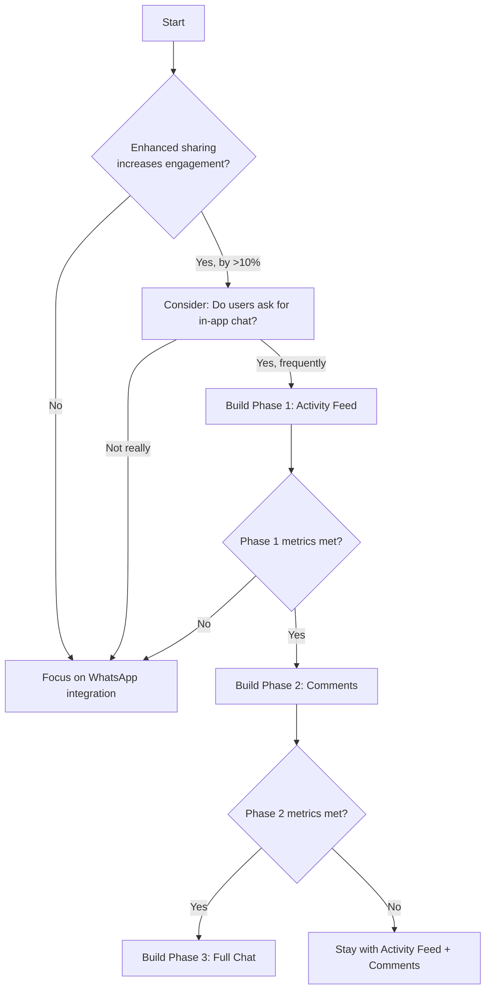

# PRD 37: In-App Chat & Social Messaging - Database Foundation

> **Order:** 37 of 37
> **Previous:** [PRD 36: Technical Debt](./PRD_36_Technical_Debt.md)
> **Depends on:** PRD 26 (feature flags), PRD 31 (social encouragement for high-fives/badges integration)
> **Status:** 📋 Proposed
> **Priority:** Database schema NOW, feature implementation LATER

---

## ⚠️ Agent Instructions (MANDATORY)

Before starting work on this PRD, the implementing agent MUST:

1. **Read these files for context:**
   - `AGENTS.md` - Critical rules, patterns, and documentation requirements
   - `src/types/database.ts` - Existing types
   - `docs/prds/admin-feedback-system/PRD_31_Social_Encouragement.md` - High-fives system for integration

2. **Scope clarification:**
   - **Phase A (NOW):** Create database schema/migration ONLY
   - **Phase B (LATER):** API endpoints and UI implementation (future PRD)

3. **After completion:**
   - Commit with message format: `feat(PRD-37): Database foundation for chat`
   - Mark Phase A as done on the Kanban board

---

## Executive Summary

This PRD lays the **database foundation** for a future in-app chat feature. The actual chat UI and API implementation will come much later, but setting up the correct database schema NOW prevents painful migrations later.

> [!IMPORTANT]
> **Why now?** Database schema changes become progressively harder as data accumulates. Foreign key relationships, RLS policies, and indexes are much easier to design upfront than retrofit. Empty tables cost nothing but save migration headaches.

### What This PRD Delivers
- ✅ Database tables for chat, messages, reactions, images
- ✅ Proper foreign keys to users, leagues
- ✅ RLS policies ready for when feature is enabled
- ✅ Schema supports emojis, images, mobile-first design
- ✅ Types added to `database.ts`
- ❌ Does NOT implement any UI or APIs yet

---

## 🗄️ Why Set Up Database Schema NOW?

You're absolutely right to prioritize this. Here's the technical reasoning:

### Problems with Late Schema Changes

| Issue | Why It Hurts | Prevention |
|-------|--------------|------------|
| **Foreign Key Pain** | Adding FK to `users` table after millions of rows = slow migration | Define relationships now |
| **RLS Policy Complexity** | Row-Level Security is easier to design upfront than retrofit | Create policies with tables |
| **Index Strategy** | Wrong indexes = slow queries at scale; changing indexes = table locks | Plan query patterns now |
| **Type Changes** | Changing column types (e.g., TEXT → JSONB) requires data migration | Choose correct types first |
| **Breaking Changes** | Renaming tables/columns breaks existing code | Name things right initially |

### What Empty Tables Cost

- **Storage**: ~0 bytes (empty tables are negligible)
- **Maintenance**: None until data exists
- **Risk**: Very low - unused tables can be dropped

### The Strategy

1. **Create tables NOW** with all foreign keys, constraints, indexes
2. **Add RLS policies NOW** (even though feature is disabled)
3. **Add types to `database.ts`** for TypeScript awareness
4. **Feature flag keeps it dormant** until implementation phase

---

## 📋 Complete Foundation Schema (Phase A - Implement NOW)

This is the complete database migration to run now. Tables will sit empty until feature implementation.

### Core Schema Features

| Requirement | Support |
|-------------|---------|
| **Text messages** | ✅ `content` TEXT with 2000 char limit |
| **Image attachments** | ✅ `chat_attachments` table + Supabase Storage |
| **Emoji reactions** | ✅ `message_reactions` table with emoji column |
| **Mobile-friendly** | ✅ Pagination via cursors, lightweight queries |
| **Badge/achievement sharing** | ✅ `message_type` + `metadata` JSONB |
| **High-five integration** | ✅ Links to PRD 31 `high_fives` table |

### Migration SQL

```sql
-- =============================================================================
-- PRD 37: Chat Foundation Schema
-- Run: NOW (Phase A)
-- Purpose: Lay foundation for future chat features
-- =============================================================================

-- -----------------------------------------------------------------------------
-- 1. CONVERSATIONS (Direct messages & League group chats)
-- -----------------------------------------------------------------------------
CREATE TABLE chat_conversations (
  id UUID PRIMARY KEY DEFAULT gen_random_uuid(),
  conversation_type TEXT NOT NULL CHECK (conversation_type IN ('direct', 'league_group')),
  league_id UUID REFERENCES leagues(id) ON DELETE CASCADE,  -- NULL for DMs
  name TEXT,                                                 -- For group chats
  avatar_path TEXT,                                          -- Group chat avatar
  created_by UUID REFERENCES users(id) ON DELETE SET NULL,
  created_at TIMESTAMPTZ DEFAULT NOW(),
  updated_at TIMESTAMPTZ DEFAULT NOW(),
  
  -- League group chats must have a league_id
  CONSTRAINT league_group_requires_league CHECK (
    conversation_type != 'league_group' OR league_id IS NOT NULL
  )
);

CREATE INDEX idx_chat_conversations_league ON chat_conversations(league_id);
CREATE INDEX idx_chat_conversations_updated ON chat_conversations(updated_at DESC);

-- -----------------------------------------------------------------------------
-- 2. PARTICIPANTS (Who is in each conversation)
-- -----------------------------------------------------------------------------
CREATE TABLE chat_participants (
  conversation_id UUID NOT NULL REFERENCES chat_conversations(id) ON DELETE CASCADE,
  user_id UUID NOT NULL REFERENCES users(id) ON DELETE CASCADE,
  role TEXT DEFAULT 'member' CHECK (role IN ('owner', 'admin', 'member')),
  joined_at TIMESTAMPTZ DEFAULT NOW(),
  last_read_at TIMESTAMPTZ DEFAULT NOW(),
  muted BOOLEAN DEFAULT FALSE,
  notifications_enabled BOOLEAN DEFAULT TRUE,
  PRIMARY KEY (conversation_id, user_id)
);

CREATE INDEX idx_chat_participants_user ON chat_participants(user_id);

-- -----------------------------------------------------------------------------
-- 3. MESSAGES (The actual chat content)
-- -----------------------------------------------------------------------------
CREATE TABLE chat_messages (
  id UUID PRIMARY KEY DEFAULT gen_random_uuid(),
  conversation_id UUID NOT NULL REFERENCES chat_conversations(id) ON DELETE CASCADE,
  sender_id UUID NOT NULL REFERENCES users(id) ON DELETE CASCADE,
  
  -- Message content
  content TEXT CHECK (content IS NULL OR char_length(content) BETWEEN 1 AND 2000),
  message_type TEXT DEFAULT 'text' CHECK (message_type IN (
    'text',           -- Plain text message
    'image',          -- Image attachment (content can be caption)
    'badge_share',    -- Sharing an earned badge
    'high_five',      -- High-five sent in chat
    'achievement',    -- Achievement announcement
    'system'          -- System message (user joined, etc.)
  )),
  
  -- Rich content metadata (badges, achievements, etc.)
  metadata JSONB DEFAULT '{}',
  
  -- Message state
  edited_at TIMESTAMPTZ,
  deleted_at TIMESTAMPTZ,  -- Soft delete for moderation
  
  created_at TIMESTAMPTZ DEFAULT NOW(),
  
  -- At least content OR an attachment must exist (enforced at app level)
  CONSTRAINT message_has_content CHECK (
    content IS NOT NULL OR message_type IN ('image', 'badge_share', 'high_five', 'achievement', 'system')
  )
);

CREATE INDEX idx_chat_messages_conversation_date ON chat_messages(conversation_id, created_at DESC);
CREATE INDEX idx_chat_messages_sender ON chat_messages(sender_id);
-- For efficient "unread since X" queries
CREATE INDEX idx_chat_messages_conversation_created ON chat_messages(conversation_id, created_at);

-- -----------------------------------------------------------------------------
-- 4. ATTACHMENTS (Images, files - stored in Supabase Storage)
-- -----------------------------------------------------------------------------
CREATE TABLE chat_attachments (
  id UUID PRIMARY KEY DEFAULT gen_random_uuid(),
  message_id UUID NOT NULL REFERENCES chat_messages(id) ON DELETE CASCADE,
  
  -- Storage reference
  storage_path TEXT NOT NULL,           -- Path in Supabase Storage bucket
  file_name TEXT NOT NULL,              -- Original filename
  file_size INTEGER NOT NULL,           -- Bytes
  mime_type TEXT NOT NULL,              -- e.g., 'image/jpeg', 'image/png'
  
  -- Image-specific (for thumbnails, display)
  width INTEGER,
  height INTEGER,
  thumbnail_path TEXT,                   -- Smaller version for mobile
  
  created_at TIMESTAMPTZ DEFAULT NOW()
);

CREATE INDEX idx_chat_attachments_message ON chat_attachments(message_id);

-- -----------------------------------------------------------------------------
-- 5. EMOJI REACTIONS (👍 🎉 🙌 ❤️ etc.)
-- -----------------------------------------------------------------------------
CREATE TABLE message_reactions (
  id UUID PRIMARY KEY DEFAULT gen_random_uuid(),
  message_id UUID NOT NULL REFERENCES chat_messages(id) ON DELETE CASCADE,
  user_id UUID NOT NULL REFERENCES users(id) ON DELETE CASCADE,
  emoji TEXT NOT NULL CHECK (char_length(emoji) BETWEEN 1 AND 10),  -- Single emoji or short sequence
  created_at TIMESTAMPTZ DEFAULT NOW(),
  
  -- One reaction type per user per message
  UNIQUE (message_id, user_id, emoji)
);

CREATE INDEX idx_message_reactions_message ON message_reactions(message_id);
CREATE INDEX idx_message_reactions_user ON message_reactions(user_id);

-- -----------------------------------------------------------------------------
-- 6. ACTIVITY FEED (League member activity)
-- -----------------------------------------------------------------------------
CREATE TABLE league_activity (
  id UUID PRIMARY KEY DEFAULT gen_random_uuid(),
  league_id UUID NOT NULL REFERENCES leagues(id) ON DELETE CASCADE,
  user_id UUID NOT NULL REFERENCES users(id) ON DELETE CASCADE,
  
  activity_type TEXT NOT NULL CHECK (activity_type IN (
    'submission',       -- Posted steps
    'achievement',      -- Earned badge/streak
    'milestone',        -- Hit X total steps
    'streak',           -- N-day streak achieved
    'joined',           -- Joined the league
    'high_five_batch',  -- Received multiple high-fives
    'custom'            -- Manual celebration post
  )),
  
  content JSONB NOT NULL,               -- Type-specific data
  visibility TEXT DEFAULT 'league' CHECK (visibility IN ('league', 'public')),
  
  created_at TIMESTAMPTZ DEFAULT NOW()
);

CREATE INDEX idx_league_activity_league_date ON league_activity(league_id, created_at DESC);
CREATE INDEX idx_league_activity_user ON league_activity(user_id);

-- -----------------------------------------------------------------------------
-- 7. ACTIVITY COMMENTS (Comments on feed items)
-- -----------------------------------------------------------------------------
CREATE TABLE activity_comments (
  id UUID PRIMARY KEY DEFAULT gen_random_uuid(),
  activity_id UUID NOT NULL REFERENCES league_activity(id) ON DELETE CASCADE,
  user_id UUID NOT NULL REFERENCES users(id) ON DELETE CASCADE,
  parent_id UUID REFERENCES activity_comments(id) ON DELETE CASCADE,  -- Threading
  content TEXT NOT NULL CHECK (char_length(content) BETWEEN 1 AND 500),
  created_at TIMESTAMPTZ DEFAULT NOW(),
  edited_at TIMESTAMPTZ
);

CREATE INDEX idx_activity_comments_activity ON activity_comments(activity_id);
CREATE INDEX idx_activity_comments_parent ON activity_comments(parent_id);

-- -----------------------------------------------------------------------------
-- 8. USER BLOCKS (Safety feature)
-- -----------------------------------------------------------------------------
CREATE TABLE user_blocks (
  blocker_id UUID NOT NULL REFERENCES users(id) ON DELETE CASCADE,
  blocked_id UUID NOT NULL REFERENCES users(id) ON DELETE CASCADE,
  created_at TIMESTAMPTZ DEFAULT NOW(),
  PRIMARY KEY (blocker_id, blocked_id)
);

CREATE INDEX idx_user_blocks_blocked ON user_blocks(blocked_id);

-- -----------------------------------------------------------------------------
-- 9. MESSAGE REPORTS (Moderation)
-- -----------------------------------------------------------------------------
CREATE TABLE message_reports (
  id UUID PRIMARY KEY DEFAULT gen_random_uuid(),
  message_id UUID NOT NULL REFERENCES chat_messages(id) ON DELETE CASCADE,
  reporter_id UUID NOT NULL REFERENCES users(id) ON DELETE CASCADE,
  reason TEXT NOT NULL CHECK (reason IN (
    'spam', 'harassment', 'inappropriate', 'other'
  )),
  details TEXT,
  status TEXT DEFAULT 'pending' CHECK (status IN ('pending', 'reviewed', 'actioned', 'dismissed')),
  reviewed_by UUID REFERENCES users(id),
  reviewed_at TIMESTAMPTZ,
  created_at TIMESTAMPTZ DEFAULT NOW()
);

CREATE INDEX idx_message_reports_status ON message_reports(status) WHERE status = 'pending';

-- -----------------------------------------------------------------------------
-- 10. EXTEND USER PREFERENCES (Chat settings)
-- -----------------------------------------------------------------------------
ALTER TABLE user_preferences ADD COLUMN IF NOT EXISTS chat_settings JSONB DEFAULT '{
  "allow_dm_from": "mutuals",
  "show_in_activity_feed": true,
  "activity_notifications": true,
  "comment_notifications": true,
  "message_notifications": true
}'::jsonb;

-- -----------------------------------------------------------------------------
-- RLS POLICIES (Ready but won't block anything until feature is enabled)
-- -----------------------------------------------------------------------------

ALTER TABLE chat_conversations ENABLE ROW LEVEL SECURITY;
ALTER TABLE chat_participants ENABLE ROW LEVEL SECURITY;
ALTER TABLE chat_messages ENABLE ROW LEVEL SECURITY;
ALTER TABLE chat_attachments ENABLE ROW LEVEL SECURITY;
ALTER TABLE message_reactions ENABLE ROW LEVEL SECURITY;
ALTER TABLE league_activity ENABLE ROW LEVEL SECURITY;
ALTER TABLE activity_comments ENABLE ROW LEVEL SECURITY;
ALTER TABLE user_blocks ENABLE ROW LEVEL SECURITY;
ALTER TABLE message_reports ENABLE ROW LEVEL SECURITY;

-- Users can see conversations they're part of
CREATE POLICY conversation_participant_access ON chat_conversations
  FOR SELECT USING (
    id IN (SELECT conversation_id FROM chat_participants WHERE user_id = auth.uid())
  );

-- Users can see messages in their conversations (if not deleted)
CREATE POLICY message_participant_access ON chat_messages
  FOR SELECT USING (
    conversation_id IN (SELECT conversation_id FROM chat_participants WHERE user_id = auth.uid())
    AND deleted_at IS NULL
  );

-- Users can send messages to conversations they're in
CREATE POLICY message_send_access ON chat_messages
  FOR INSERT WITH CHECK (
    conversation_id IN (SELECT conversation_id FROM chat_participants WHERE user_id = auth.uid())
    AND sender_id = auth.uid()
  );

-- Users can see league activity for their leagues
CREATE POLICY league_activity_member_access ON league_activity
  FOR SELECT USING (
    league_id IN (SELECT league_id FROM memberships WHERE user_id = auth.uid())
  );

-- Users can manage their own blocks
CREATE POLICY user_blocks_own ON user_blocks
  FOR ALL USING (blocker_id = auth.uid());

-- -----------------------------------------------------------------------------
-- HELPER VIEW: Unread counts per conversation
-- -----------------------------------------------------------------------------
CREATE OR REPLACE VIEW user_unread_counts AS
SELECT 
  cp.user_id,
  cp.conversation_id,
  COUNT(cm.id) FILTER (WHERE cm.created_at > cp.last_read_at AND cm.sender_id != cp.user_id) as unread_count,
  MAX(cm.created_at) as last_message_at
FROM chat_participants cp
LEFT JOIN chat_messages cm ON cm.conversation_id = cp.conversation_id AND cm.deleted_at IS NULL
GROUP BY cp.user_id, cp.conversation_id;

-- Grant access to the view
GRANT SELECT ON user_unread_counts TO authenticated;
```

---

## 🔬 Research Findings (Context for Future Decisions)

> [!NOTE]
> This research informs WHEN to implement features, not the database schema. Schema is designed to support all scenarios.

### Evidence FOR In-App Chat

| Finding | Source | Impact |
|---------|--------|--------|
| In-app messaging can boost retention by **~30%** | geared app research | High |
| Strava added in-app messaging (Dec 2023) to 135M+ athletes | Strava official | Validation |
| **59% increase** in running club participation after social features | Strava 2024 report | High |

### Evidence AGAINST (or for WhatsApp integration instead)

| Finding | Source | Impact |
|---------|--------|--------|
| **WhatsApp has 98% open rates** vs lower for in-app | keepme.ai | Critical |
| External messaging had **76% response rate** vs 40% in-app | mHealth study | High |
| **Fitness apps have only 7.88% 30-day retention** | orangesoft.co | Sobering |

> [!WARNING]
> **Key Takeaway**: Even Strava only added messaging in late 2023. Peloton uses high-fives instead of general chat. The schema supports either path—in-app chat OR enhanced WhatsApp integration.

---

## 📊 Strategic Recommendation

Based on research, we recommend a **phased "bottom-up" approach**:

### Phase 0: Enhance External Integration (LOW RISK) ✅
Before building chat, maximize WhatsApp/external integrations:
- Deep-link sharing to WhatsApp groups
- "Share to WhatsApp" with rich previews for achievements/badges
- WhatsApp webhook for step submission reminders
- **Measure**: Does enhanced sharing increase engagement?

### Phase 1: Activity Feed with Reactions (MEDIUM RISK) 🟡
A Strava-like activity feed per league:
- See league members' submissions
- React with high-fives (from PRD 31)
- Share achievements/badges to the feed
- **No direct messaging yet**
- **Exit Criteria**: If feed usage is <10% weekly active users after 4 weeks, pause Phase 2

### Phase 2: Threaded Comments (MEDIUM RISK) 🟡
Add comments to feed items:
- Comment on submissions ("Great job!", "How'd you hit 20k?")
- Simple threading, not real-time chat
- **Exit Criteria**: If comments/user/week < 0.5 average, reconsider Phase 3

### Phase 3: Direct & Group Messaging (HIGH RISK) 🔴
Full chat implementation:
- 1:1 direct messages
- League group chat
- Real-time with WebSockets or external service
- **Only if Phase 2 shows strong engagement**

---

## 💡 Problem Statement

**Current:** StepLeague users rely on external messaging (WhatsApp, iMessage) to:
- Encourage each other
- Remind members to submit steps
- Share achievements
- Coordinate fitness activities

**Issues with current state:**
1. Context-switching reduces app engagement
2. Achievements/badges can't be easily shared with context
3. New members may not be added to external groups
4. High-fives (PRD 31) can't be expanded into conversations

**Opportunity:** Consolidate fitness-related social activity into StepLeague itself.

**Risk:** Users may prefer existing WhatsApp groups and forget about in-app features.

---

## What is Needed

### Core Feature: Activity Feed (Phase 1)

A league-scoped feed showing member activity.

**Database Schema:**

```sql
-- League activity feed
CREATE TABLE league_activity (
  id UUID PRIMARY KEY DEFAULT gen_random_uuid(),
  league_id UUID NOT NULL REFERENCES leagues(id) ON DELETE CASCADE,
  user_id UUID NOT NULL REFERENCES users(id) ON DELETE CASCADE,
  activity_type TEXT NOT NULL CHECK (activity_type IN (
    'submission',      -- Posted steps
    'achievement',     -- Earned badge/streak
    'milestone',       -- Hit X total steps
    'streak',          -- N-day streak achieved
    'joined',          -- Joined the league
    'high_five_batch', -- Received multiple high-fives
    'custom'           -- Manual celebration post
  )),
  content JSONB,       -- Type-specific content
  visibility TEXT DEFAULT 'league' CHECK (visibility IN ('league', 'public')),
  created_at TIMESTAMPTZ DEFAULT NOW(),
  
  CONSTRAINT valid_content CHECK (content IS NOT NULL)
);

CREATE INDEX idx_league_activity_league_date ON league_activity(league_id, created_at DESC);
CREATE INDEX idx_league_activity_user ON league_activity(user_id);
```

### Comments System (Phase 2)

```sql
-- Comments on activity items
CREATE TABLE activity_comments (
  id UUID PRIMARY KEY DEFAULT gen_random_uuid(),
  activity_id UUID NOT NULL REFERENCES league_activity(id) ON DELETE CASCADE,
  user_id UUID NOT NULL REFERENCES users(id) ON DELETE CASCADE,
  parent_id UUID REFERENCES activity_comments(id) ON DELETE CASCADE, -- For threading
  content TEXT NOT NULL CHECK (char_length(content) BETWEEN 1 AND 500),
  created_at TIMESTAMPTZ DEFAULT NOW(),
  edited_at TIMESTAMPTZ
);

CREATE INDEX idx_activity_comments_activity ON activity_comments(activity_id);
CREATE INDEX idx_activity_comments_parent ON activity_comments(parent_id);
```

### Direct Messaging (Phase 3)

```sql
-- Chat conversations
CREATE TABLE chat_conversations (
  id UUID PRIMARY KEY DEFAULT gen_random_uuid(),
  conversation_type TEXT NOT NULL CHECK (conversation_type IN ('direct', 'league_group')),
  league_id UUID REFERENCES leagues(id) ON DELETE CASCADE, -- NULL for direct messages
  name TEXT, -- For group chats
  created_at TIMESTAMPTZ DEFAULT NOW(),
  updated_at TIMESTAMPTZ DEFAULT NOW()
);

-- Conversation participants
CREATE TABLE chat_participants (
  conversation_id UUID NOT NULL REFERENCES chat_conversations(id) ON DELETE CASCADE,
  user_id UUID NOT NULL REFERENCES users(id) ON DELETE CASCADE,
  joined_at TIMESTAMPTZ DEFAULT NOW(),
  last_read_at TIMESTAMPTZ DEFAULT NOW(),
  muted BOOLEAN DEFAULT FALSE,
  PRIMARY KEY (conversation_id, user_id)
);

-- Chat messages
CREATE TABLE chat_messages (
  id UUID PRIMARY KEY DEFAULT gen_random_uuid(),
  conversation_id UUID NOT NULL REFERENCES chat_conversations(id) ON DELETE CASCADE,
  sender_id UUID NOT NULL REFERENCES users(id) ON DELETE CASCADE,
  content TEXT NOT NULL CHECK (char_length(content) BETWEEN 1 AND 2000),
  message_type TEXT DEFAULT 'text' CHECK (message_type IN (
    'text',
    'badge_share',    -- Sharing an earned badge
    'high_five',      -- High-five in chat
    'achievement',    -- Achievement announcement
    'image'           -- Image attachment
  )),
  metadata JSONB,     -- For badge_share, achievement, etc.
  created_at TIMESTAMPTZ DEFAULT NOW(),
  edited_at TIMESTAMPTZ
);

CREATE INDEX idx_chat_messages_conversation ON chat_messages(conversation_id, created_at DESC);
CREATE INDEX idx_chat_messages_sender ON chat_messages(sender_id);

-- Unread count view
CREATE OR REPLACE VIEW user_unread_counts AS
SELECT 
  cp.user_id,
  cp.conversation_id,
  COUNT(cm.id) FILTER (WHERE cm.created_at > cp.last_read_at) as unread_count
FROM chat_participants cp
LEFT JOIN chat_messages cm ON cm.conversation_id = cp.conversation_id
WHERE cm.sender_id != cp.user_id OR cm.sender_id IS NULL
GROUP BY cp.user_id, cp.conversation_id;
```

### Badge/Achievement Sharing in Chat

Integration with PRD 31 high-fives and achievement system:

```sql
-- Shareable badges catalog (for chat sharing)
CREATE TABLE shareable_achievements (
  id UUID PRIMARY KEY DEFAULT gen_random_uuid(),
  user_id UUID NOT NULL REFERENCES users(id) ON DELETE CASCADE,
  achievement_type TEXT NOT NULL,  -- 'streak_7', 'total_100k', etc.
  earned_at TIMESTAMPTZ DEFAULT NOW(),
  share_token TEXT UNIQUE DEFAULT encode(gen_random_bytes(8), 'hex'),
  UNIQUE (user_id, achievement_type)
);
```

---

## Implementation Options

### Option A: Build In-House with Supabase Realtime

**Pros:**
- Full control over data and UX
- Integrates seamlessly with existing auth
- Lower ongoing costs
- Can build exactly what's needed

**Cons:**
- Significant development time (4-8 weeks for basic chat)
- Need to handle scaling, presence, push notifications
- Maintenance burden

**Stack:**
- Supabase Realtime for presence and live updates
- PostgreSQL for message storage
- React components for UI

### Option B: Integrate Open Source Solution

**Recommended Options:**

| Solution | Tech | Self-Host | Features | Complexity |
|----------|------|-----------|----------|------------|
| **Rocket.Chat** | Node.js/MongoDB | ✅ | Full Slack-like | High |
| **Mattermost** | Go/React | ✅ | Slack alternative | High |
| **Matrix/Element** | Python | ✅ | Decentralized, E2E encrypted | Very High |
| **Stream Chat** | SaaS | ❌ | SDKs, real-time | Medium |

**For StepLeague, recommend: Supabase-native approach (Option A)** for Phase 1-2, evaluate Stream Chat or similar for Phase 3 if needed.

### Option C: Deep WhatsApp Integration Instead

Rather than building chat, enhance WhatsApp integration:
- WhatsApp Business API for automated reminders
- Rich sharing cards with badges/achievements
- Pre-formatted messages for easy sharing
- Track engagement via UTM parameters

---

## API Endpoints

### Activity Feed APIs

```
GET /api/leagues/[id]/activity
  ?limit=20&before=<cursor>
  
POST /api/leagues/[id]/activity
  { activity_type: 'custom', content: { message: '...' } }
  
POST /api/activity/[id]/react
  { reaction: 'high_five' }  // Uses PRD 31 high-fives
```

### Comments APIs

```
GET /api/activity/[id]/comments
POST /api/activity/[id]/comments
  { content: 'Great job!' }
  
PATCH /api/comments/[id]
  { content: 'Updated message' }
  
DELETE /api/comments/[id]
```

### Messaging APIs (Phase 3)

```
GET /api/conversations
  ?type=direct|league_group
  
POST /api/conversations
  { type: 'direct', participant_id: '...' }
  
GET /api/conversations/[id]/messages
  ?limit=50&before=<cursor>
  
POST /api/conversations/[id]/messages
  { content: '...', message_type: 'text' }
  
POST /api/conversations/[id]/messages
  { message_type: 'badge_share', metadata: { badge_type: 'streak_7' } }
```

---

## UI Components

### ActivityFeed Component

```tsx
<ActivityFeed 
  leagueId={leagueId}
  currentUserId={user.id}
/>
```

Displays:
- Member step submissions with high-five button
- Achievements earned by members
- Streak milestones
- Custom celebration posts
- "X gave Y a high-five" aggregated updates

### CommentThread Component (Phase 2)

```tsx
<CommentThread 
  activityId={activity.id}
  maxDepth={2}
/>
```

### ChatInterface Component (Phase 3)

```tsx
<ChatInterface 
  conversationId={conversation.id}
  showBadgeSharing={true}
/>
```

---

## User Preferences

Add to `user_preferences` table:

```sql
ALTER TABLE user_preferences ADD COLUMN chat_settings JSONB DEFAULT '{
  "allow_dm_from": "mutuals",
  "show_in_activity_feed": true,
  "activity_notifications": true,
  "comment_notifications": true,
  "message_notifications": true
}'::jsonb;
```

Options for `allow_dm_from`:
- `"no_one"` - Disable DMs
- `"mutuals"` - Only people in same leagues (default)
- `"all"` - Anyone on platform

---

## Safety & Moderation

> [!CAUTION]
> In-app messaging introduces moderation challenges. Strava faced criticism for enabling unwanted messages.

### Required Safety Features

1. **Privacy Controls:**
   - Who can message me: No one / Mutuals / All
   - Block user functionality
   - Report message functionality

2. **Content Moderation:**
   - Automated scanning for harmful content (optional)
   - Admin ability to moderate league chat
   - League owner can disable chat for their league

3. **Audit Trail:**
   - Log all moderation actions
   - Retain deleted messages for 30 days (compliance)

---

## Feature Flag

This feature is gated by `feature_chat` (PRD 26):

```json
{
  "feature_chat_activity_feed": true,
  "feature_chat_comments": false,
  "feature_chat_direct_messages": false
}
```

Roll out phases independently.

---

## Success Metrics

### Phase 1: Activity Feed
- **Target**: 25% of WAU view feed at least once
- **Target**: 10% of users interact (high-five or like)

### Phase 2: Comments
- **Target**: 5% of activity items receive comments
- **Target**: Average 0.3 comments per active user per week

### Phase 3: Chat
- **Target**: 15% of users send at least one message per week
- **Comparison**: Step submission rate should not decrease

> [!IMPORTANT]
> **Exit Criteria**: If Phase 1 metrics aren't met within 6 weeks, pause further development and invest in WhatsApp integration instead.

---

## Verification Checklist

> **IMPORTANT:** After implementation, verify at these specific locations.

### Frontend Checks

| Check | URL/Location | Expected Result |
|-------|--------------|-----------------|
| Activity feed | `/league/[id]/activity` | Feed renders with items |
| High-five on feed | Activity item | PRD 31 high-five works |
| Comment button | Activity item | Opens comment thread |
| Send message | Chat interface | Message appears in real-time |
| Badge share | Chat composer | Can share earned badge |

### Backend Checks

| Check | Method | Expected Result |
|-------|--------|-----------------|
| Tables exist | Query `league_activity` | Table found |
| RLS policies | Query as non-member | Cannot see other league's feed |
| Message delivery | Send via API | Recipient sees message |
| Unread counts | Query view | Accurate count returned |

### Documentation Checks

- [ ] CHANGELOG.md updated
- [ ] AGENTS.md updated with chat patterns
- [ ] Types added to `database.ts`

---

## Alternative: WhatsApp Deep Integration

If research suggests in-app chat is too risky, consider this alternative:

### WhatsApp Business API Integration

1. **Automated Reminders**: Send step submission reminders via WhatsApp
2. **Rich Achievement Sharing**: Pre-formatted WhatsApp messages with achievement cards
3. **Group Webhook**: Allow league owners to connect a WhatsApp group for automated posts
4. **Click-to-WhatsApp**: "Share to WhatsApp" with UTM tracking

**Benefits:**
- 98% open rates
- Users already have WhatsApp installed
- No moderation burden
- Lower development cost

**Costs:**
- WhatsApp Business API pricing (~$0.01-0.05 per message)
- Less control over experience
- User data stays on WhatsApp

---

## Recommended Decision Path



---

## Dependencies

1. **PRD 26: SuperAdmin Settings** - Feature flags for phased rollout
2. **PRD 31: Social Encouragement** - High-fives system to integrate
3. **Supabase Realtime** - For real-time chat delivery (Phase 3)

---

## Changelog

| Date | Section | Change |
|------|---------|--------|
| 2026-01-10 | Initial | Created PRD with comprehensive research findings |
| 2026-01-10 | Research | Added Strava, Peloton case studies |
| 2026-01-10 | Strategy | Recommended phased approach with exit criteria |
